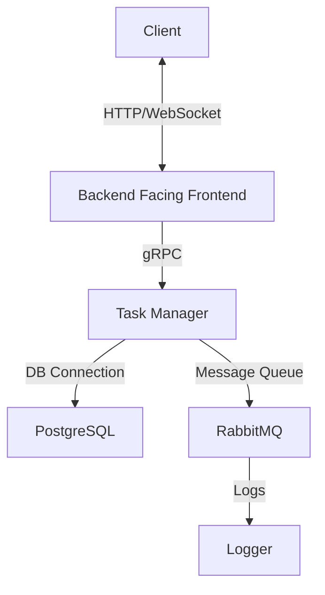

In this blog post, we will walk you through the process of setting up a task manager application using NestJS and RabbitMQ. This application is composed of multiple microservices, each with a specific responsibility. We will cover the installation, configuration, and usage of these microservices.

## Microservices Overview

Our task manager application consists of the following microservices —

* **Nashville (Backend Facing Frontend) Microservice**: Handles incoming requests from the client and forwards them to the Gallatin microservice.
    
* **Gallatin (Task Manager) Microservice**: Handles task-related operations (CRUD) and emits events to the Ashland microservice.
    
* **Ashland (Logger) Microservice**: Listens for events from the Gallatin microservice and logs them to the console.
    
* **Client Microservice**: A simple client that interacts with the Nashville microservice over [WebSocket.io](http://WebSocket.io).
    



### **How It Works:**

1. **Client ↔ Backend Facing Frontend**: Communicates via **HTTP/WebSocket**.
    
2. **Backend Facing Frontend ↔ Task Manager**: Uses **gRPC** for communication.
    
3. **Task Manager ↔ PostgreSQL**: Stores data.
    
4. **Task Manager ↔ RabbitMQ**: Sends tasks for processing.
    
5. **RabbitMQ ↔ Logger**: Logs task information.
    

## **Features**

The task manager application provides the following features —

* Add new tasks
    
* Delete existing tasks
    
* Event-driven architecture using RabbitMQ
    

## Prerequisites

Before you begin, ensure you have met the following requirements —

* NodeJS (&gt;= 20.16.0)
    
* Yarn (&gt;= 1.22.19)
    
* Docker (for RabbitMQ & PostgreSQL)
    

## Installation

Follow these steps to set up the task manager application —

1. Clone the repository —
    

```bash
git clone https://github.com/faizahmedfarooqui/nestjs-rabbitmq-task-manager.git
cd nestjs-rabbitmq-task-manager
```

2. Install dependencies —
    

```bash
yarn install
```

3. Setup RabbitMQ —
    

```bash
docker run -d --name rabbitmq -p 5672:5672 -p 15672:15672 rabbitmq:3-management
# Access the RabbitMQ management console at http://localhost:15672
# Username: guest
# Password: guest
```

4. Setup PostgreSQL —
    

```bash
docker run -d --name postgres -e POSTGRES_PASSWORD=yourpassword -p 5432:5432 postgres
# Access the PostgreSQL database at localhost:5432
# Username: postgres
# Password: yourpassword
```

5. Configure Variables —
    

* Update the RabbitMQ and PostgreSQL configurations in `services/gallatin-task-manager/src/app.module.ts`
    
* Update the RabbitMQ configurations in `services/ashland-logger/src/main.ts`
    

6. Run the Nashville (Backend Facing Frontend) Microservice —
    

```bash
yarn start:nashville
```

7. Run the Gallatin (Task Manager) Microservice —
    

```bash
yarn start:gallatin
```

8. Run the Ashland (Logger) Microservice —
    

```bash
yarn start:ashland
```

9. Run the Client Microservice —
    

```bash
yarn start:client
```

## Running Tests

To ensure everything is working correctly, you can tests for each microservice —

1. Run all tests of Gallatin Task Manager Microservice —
    

```bash
yarn test:gallatin
```

2. Run all tests for Nashville BFF Microservice —
    

```bash
yarn test:nashville
```

3. Run all tests for Ashland Logger Microservice —
    

```bash
yarn test:ashland
```

## Conclusion

In this blog post, we have covered the setup and configuration of a task manager application using NestJS, RabbitMQ and PostgreSQL.

By following the steps outlined above, you should be able to get the application up and running, and understand the role of each microservice in the system.

You can find the codebase here —

%[https://github.com/faizahmedfarooqui/nestjs-rabbitmq-task-manager] 

Happy coding!

---

# **About Me 👨‍💻**

I'm Faiz A. Farooqui. Software Engineer from Bengaluru, India.  
Find out more about me @ [**faizahmed.in**](http://faizahmed.in/)