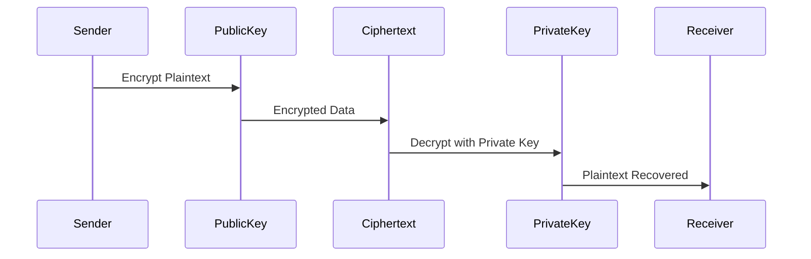

## Introduction

Encryption is a fundamental concept in cybersecurity that protects data from unauthorized access. When data is encrypted, it is converted into an unreadable format that can only be deciphered with a specific key.

There are two main types of encryption: **Symmetric Encryption** and **Asymmetric Encryption**.

Understanding the differences between these methods is crucial for implementing secure systems.

## What is Symmetric Encryption?

Symmetric encryption uses a **single key** for both encryption and decryption. This means that the sender and receiver must have access to the same secret key.

### How It Works:

1. The sender encrypts the data using a secret key.
    
2. The encrypted data is transmitted.
    
3. The receiver decrypts the data using the same secret key.
    

### Diagram:

* **One Key** used for both encryption and decryption.
    
* Both sender & receiver must have the same key.
    

### Common Algorithms:

* AES (Advanced Encryption Standard)
    
* DES (Data Encryption Standard)
    
* Blowfish
    

### Pros & Cons of Symmetric Encryption:

| **Pros** | **Cons** |
| --- | --- |
| Faster encryption & decryption | Key distribution is challenging |
| Requires less computational power | If the key is compromised, data is at risk |

## What is Asymmetric Encryption?

### How It Works:

1. The sender encrypts the data using the recipient’s public key.
    
2. The encrypted data is transmitted.
    
3. The recipient decrypts the data using their private key.
    

### Diagram:

* **Public Key** encrypts the data.
    
* **Private Key** decrypts the data.
    

### Common Algorithms:

* RSA (Rivest-Shamir-Adleman)
    
* ECC (Elliptic Curve Cryptography)
    
* Diffie-Hellman
    

### Pros & Cons of Asymmetric Encryption:

| **Pros** | **Cons** |
| --- | --- |
| More secure as keys are separate | Slower due to complex computations |
| Easier key management (public key can be shared) | Higher computational overhead |

## Key Differences: Symmetric vs Asymmetric Encryption

| **Feature** | **Symmetric Encryption** | **Asymmetric Encryption** |
| --- | --- | --- |
| Key Usage | One key for both encryption & decryption | Two keys: Public for encryption, Private for decryption |
| Speed | Faster | Slower |
| Security | Less secure (if the key is compromised) | More secure (separate keys) |
| Key Management | Hard to distribute securely | Easier (public key can be shared) |
| Example Algorithms | AES, DES, Blowfish | RSA, ECC, Diffie-Hellman |
| Best Use Cases | Disk encryption, VPNs, file storage | SSL/TLS, digital signatures, email encryption |

## Which One Should You Use?

* If speed and efficiency are your priority (e.g., encrypting large files, disk encryption), **symmetric encryption** is ideal.
    
* If security and secure communication are the main concerns (e.g., online transactions, authentication), **asymmetric encryption** is preferred.
    
* In many cases, **both methods are used together** in hybrid encryption systems, such as SSL/TLS, where asymmetric encryption secures the initial key exchange, and symmetric encryption encrypts data in transit.
    

## Conclusion

Both symmetric and asymmetric encryption play a vital role in cybersecurity. While symmetric encryption is faster and efficient for encrypting large amounts of data, asymmetric encryption provides stronger security and is widely used for secure communication. Understanding their differences helps in choosing the right encryption technique for various applications.

Have questions? Drop them in the comments below!

---

# **About Me 👨‍💻**

I'm Faiz A. Farooqui. Software Engineer from Bengaluru, India.  
Find out more about me @ [**faizahmed.in**](http://faizahmed.in/)