## Introduction

Encryption is essential for securing data, but managing encryption keys securely can be challenging.

**Envelope Encryption** is a widely used technique that enhances security by encrypting encryption keys rather than encrypting large amounts of data directly. It is commonly used in cloud security frameworks like **AWS KMS, Google Cloud KMS, and Azure Key Vault**.

## What is Envelope Encryption?

Envelope encryption is a method where:

1. A **Data Encryption Key (DEK)** is generated to encrypt the actual data.
    
2. The **DEK is encrypted** using a **Key Encryption Key (KEK)**.
    
3. The encrypted DEK is stored alongside the encrypted data.
    
4. When decryption is needed, the KEK decrypts the DEK, and then the DEK decrypts the actual data.
    

### **Diagram: How Envelope Encryption Works**

```mermaid
graph TD;
    A[Plaintext Data] -->|🔐 Encrypt with DEK| B[🔒 Encrypted Data];
    C[🗝️ DEK] -->|🔐 Encrypt with KEK| D[🔒 Encrypted DEK];
    D -->|📦 Store Encrypted DEK| E[Secure Key Storage];
    
    subgraph Decryption Process
        E -->|📤 Retrieve Encrypted DEK| D;
        D -->|🔓 Decrypt with KEK| C;
        B -->|🔓 Decrypt with DEK| A;
    end
```

## Why Use Envelope Encryption?

### **Pros & Cons**

| Pros | Cons |
| --- | --- |
| Enhanced security: DEKs are never stored in plaintext | Adds complexity in key management |
| Faster performance: Only encrypts small DEKs | Requires an external Key Management Service (KMS) |
| Simplifies key rotation | If KEK is compromised, all DEKs are at risk |

## Real-World Use Cases

* **Cloud Storage Encryption** – AWS S3, Google Cloud Storage, and Azure Storage all use Envelope Encryption.
    
* **Database Encryption** – Transparent Data Encryption (TDE) in databases like MySQL, PostgreSQL, and SQL Server.
    
* **Application Security** – Secure API keys, secrets, and credentials in cloud environments.
    

## How to Use AWS KMS for Envelope Encryption

AWS Key Management Service (KMS) supports Envelope Encryption with **asymmetric keys** (RSA, ECC) and **symmetric keys** (AES).

### **Steps to Encrypt Data using AWS KMS**

1. **Generate a Data Encryption Key (DEK)** using AWS KMS.
    
2. **Encrypt the Data** using the DEK.
    
3. **Encrypt the DEK** using an AWS KMS-managed Key Encryption Key (KEK).
    
4. **Store the Encrypted DEK** alongside the encrypted data.
    
5. **For decryption**, retrieve and decrypt the DEK using KMS, then use the DEK to decrypt the actual data.
    

### **Mermaid Diagram: AWS KMS Envelope Encryption Workflow**

```mermaid
sequenceDiagram
    participant App
    participant AWS KMS
    participant Storage

    App->>AWS KMS: 🗝️ Generate DEK
    AWS KMS-->>App: 🔑 Return DEK & Encrypted DEK
    App->>Storage: 🔐 Encrypt Data with DEK
    App->>Storage: 📦 Store Encrypted Data & Encrypted DEK
    
    App->>AWS KMS: 📤 Decrypt Encrypted DEK
    AWS KMS-->>App: 🔑 Return Decrypted DEK
    App->>Storage: 🔓 Decrypt Data with DEK
```

## AWS KMS Asymmetric Key Details

* **RSA Key Pairs** (2048, 3072, 4096-bit) for encryption & digital signatures.
    
* **ECC Key Pairs** (P-256, P-384, P-521) for lightweight cryptography.
    
* **IAM Policies & Grants** control key access for security.
    
* **Use Cases**: Secure API access, file encryption, authentication.
    

## Conclusion

Envelope Encryption improves security and scalability by encrypting small encryption keys rather than large datasets.

**AWS KMS, Google Cloud KMS, and Azure Key Vault** provide built-in support for managing KEKs and automating encryption processes.

Implementing Envelope Encryption helps organisations enhance **data protection, performance, and compliance**.

Want a hands-on guide for AWS KMS implementation? Drop a comment below! 🚀

---

# **About Me 👨‍💻**

I'm Faiz A. Farooqui. Software Engineer from Bengaluru, India.  
Find out more about me @ [**faizahmed.in**](http://faizahmed.in/)