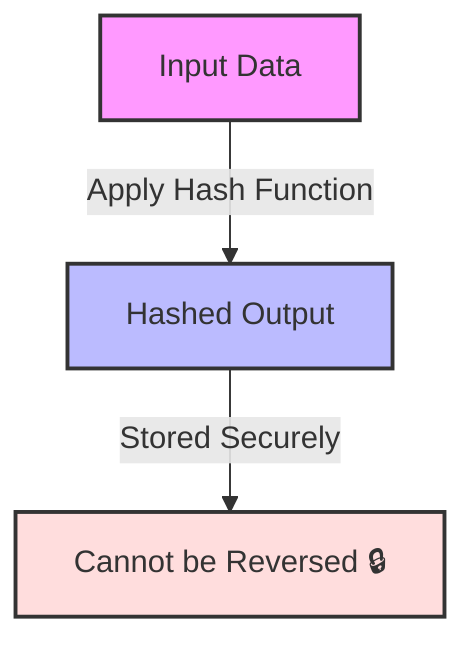
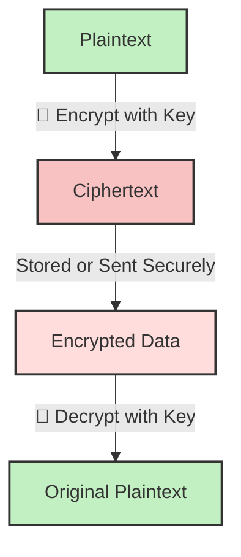

In the world of cybersecurity, **hashing** and **encryption** are two fundamental techniques used to secure data. While they may seem similar, they serve different purposes and are used in different scenarios.

In this article, we’ll break down the **key differences**, **use cases**, and when to use **hashing vs encryption** in real-world applications.

## **What is Hashing?**

Hashing is a **one-way** cryptographic function that converts input data into a fixed-length value (hash). Unlike encryption, hashing is irreversible, meaning you cannot convert the hash back to the original data.

🔹 **Key Characteristics of Hashing:**

* **One-way function** – Cannot be reversed to retrieve original data.
    
* **Fixed-length output** – No matter the input size, the hash length remains constant.
    
* **Deterministic** – The same input always produces the same hash.
    
* **Collision-resistant** – Hard to find two different inputs producing the same hash.
    

🔹 **Common Hashing Algorithms:**

* **MD5 (Message Digest Algorithm 5)** – **Deprecated** due to vulnerabilities.
    
* **SHA-1 (Secure Hash Algorithm 1)** – **Weak and not recommended** for security.
    
* **SHA-256 & SHA-512** – **Stronger** and widely used for security (e.g., Bitcoin, TLS).
    
* **Bcrypt, Argon2, PBKDF2** – **Password hashing algorithms** that include salting and stretching.
    

### **📌 Example of Hashing in Action (SHA-256)**

```json
Input:  "HelloWorld"
SHA-256 Hash:  a591a6d40bf420404a011733cfb7b190d62c65bf0bcda32b53e17e38e5f6f17f
```

### **Diagram: Hashing Process - One-Way Transformation**



💡 **Explanation:**

* Data is passed through a **hash function** (e.g., SHA-256).
    
* The output is a **fixed-length hash** that cannot be reversed.
    
* Commonly used for **password storage** and **data integrity**.
    

## **What is Encryption?**

Encryption is a **two-way** process that converts plaintext into ciphertext using a cryptographic key. Unlike hashing, **encryption is reversible**—with the correct key, the original data can be decrypted.

🔹 **Key Characteristics of Encryption:**

* **Two-way function** – Data can be encrypted and decrypted with a key.
    
* **Variable output size** – The ciphertext length can vary.
    
* **Used for confidentiality** – Ensures only authorized users can access the data.
    

🔹 **Types of Encryption:**

1. **Symmetric Encryption** – Uses the same key for encryption and decryption.
    
    * 🔑 Algorithms: **AES, DES, Blowfish**
        
    * 🚀 Use case: **Disk encryption, VPNs, file encryption**
        
2. **Asymmetric Encryption** – Uses a **public key** to encrypt and a **private key** to decrypt.
    
    * 🔑 Algorithms: **RSA, ECC, Diffie-Hellman**
        
    * 🚀 Use case: **TLS/SSL, digital signatures, secure email**
        

### **📌 Example of AES Encryption (Symmetric)**

```json
Input:  "HelloWorld"
Key:    "MySecretKey123"
Ciphertext:  3ad77bb40d7a3660a89ecaf32466ef97
```

### **Diagram: Encryption Process - Two-Way Transformation**



💡 **Explanation:**

* **Encryption Key** is used to convert plaintext into **ciphertext**.
    
* Ciphertext is stored or transmitted **securely**.
    
* With the **correct decryption key**, the original plaintext is recovered.
    
* Commonly used for **secure messaging, file encryption, and TLS**.
    

## **🔍 Key Differences: Hashing vs Encryption**

| **Feature** | **Hashing** | **Encryption** |
| --- | --- | --- |
| **Reversibility** | ❌ Irreversible | ✅ Reversible (with key) |
| **Purpose** | Data integrity (e.g., password storage) | Data confidentiality (e.g., secure communication) |
| **Output Length** | Fixed-length (e.g., 256-bit for SHA-256) | Variable (depends on algorithm & key size) |
| **Security Concern** | **Collisions** (rare but possible) | **Key management** (keeping keys secure) |
| **Use Cases** | Password hashing, checksums, digital signatures | Secure messaging, file encryption, TLS |

## **📌 When to Use Hashing vs Encryption?**

✅ **Use Hashing when:**  
✔️ Storing passwords securely (Bcrypt, Argon2).  
✔️ Verifying data integrity (SHA-256, SHA-512).  
✔️ Checking for duplicate files (MD5, SHA-1).

✅ **Use Encryption when:**  
✔️ Transmitting sensitive data securely (AES, RSA).  
✔️ Protecting stored files or databases.  
✔️ Implementing secure messaging (TLS, end-to-end encryption).

## **🛠️ Hashing & Encryption in Real-World Applications**

1️⃣ **Password Security** → 🔐 **Hashing** (Bcrypt, Argon2)

* Storing **hashed passwords** prevents attackers from reversing them.  
    2️⃣ **Secure File Storage** → 🔏 **Encryption** (AES-256)
    
* Protects **data at rest** from unauthorized access.  
    3️⃣ **Website Security (HTTPS)** → 🌍 **Encryption** (TLS with RSA)
    
* Ensures **end-to-end encryption** between clients & servers.  
    4️⃣ **Blockchain & Digital Signatures** → 🔄 **Hashing** (SHA-256)
    
* Used in **Bitcoin mining** and **data integrity verification**.
    

## **🚀 Final Thoughts**

Both **hashing** and **encryption** are essential for securing data, but they serve different purposes. Hashing is ideal for **data integrity and password security**, while encryption is critical for **confidentiality and secure communication**. Understanding when to use each technique ensures your data remains **safe from cyber threats**.

Do you have any questions about **hashing or encryption**? Let’s discuss in the comments! 👇

---

# **About Me 👨‍💻**

I'm Faiz A. Farooqui. Software Engineer from Bengaluru, India.  
Find out more about me @ [**faizahmed.in**](http://faizahmed.in/)