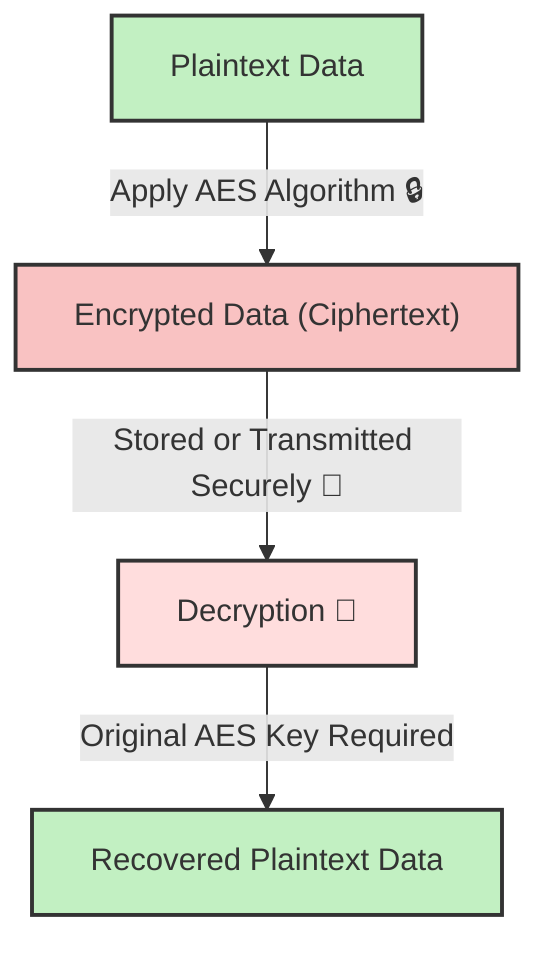
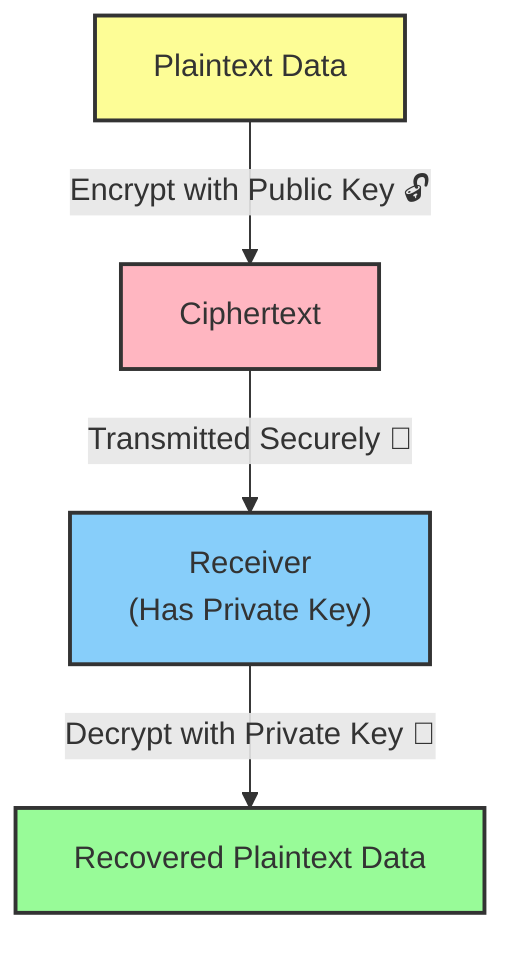

## **Understanding the Two Giants of Encryption**

In modern cryptography, **AES (Advanced Encryption Standard)** and **RSA (Rivest-Shamir-Adleman)** are two of the most widely used encryption algorithms.

They serve different purposes, with **AES used for fast symmetric encryption** and **RSA for secure key exchange in asymmetric encryption**.

In this article, we’ll break down **how AES and RSA work**, their **differences**, and when to use each.

## **🛠 How AES Encryption Works**

**AES (Advanced Encryption Standard)** is a **symmetric encryption algorithm**, meaning it uses the **same key for both encryption and decryption**.

### **🔹 AES Key Features:**

✔ **Fast** – AES is optimised for speed and efficiency.  
✔ **Secure** – AES-256 is considered unbreakable with today’s technology.  
✔ **Used for** – File encryption, disk encryption, VPNs, secure data storage.

### **🔑 AES Encryption Process:**

**🔍 How It Works:**  
1️⃣ Data is encrypted using a **secret key** and the **AES algorithm**.  
2️⃣ The **ciphertext** is securely **stored or transmitted**.  
3️⃣ Only someone with the **correct AES key** can **decrypt and retrieve** the original data.

### **AES Encryption Strength:**

AES supports **128-bit, 192-bit, and 256-bit** key lengths.

* **AES-128**: Fast but moderately secure.
    
* **AES-256**: Strongest security, used in military-grade encryption.
    

## **🔐 How RSA Encryption Works**

**RSA (Rivest-Shamir-Adleman)** is an **asymmetric encryption algorithm**, meaning it uses **two keys**:

* **Public Key** (🔓) – Used to encrypt data.
    
* **Private Key** (🔑) – Used to decrypt data.
    

### **🔹 RSA Key Features:**

✔ **Highly Secure** – Based on prime factorization, very difficult to break.  
✔ **Slower than AES** – Used for **secure key exchanges**, not large data encryption.  
✔ **Used for** – SSL/TLS certificates, secure email, digital signatures.

### **🔑 RSA Encryption Process:**

**🔍 How It Works:**  
1️⃣ The **public key encrypts** the plaintext into ciphertext.  
2️⃣ The ciphertext is **sent to the receiver**.  
3️⃣ The **private key is used** to decrypt the data back into plaintext.

### **RSA Key Sizes & Security:**

RSA typically uses **2048-bit or 4096-bit** keys.

* **2048-bit**: Standard for modern security.
    
* **4096-bit**: More secure but slower.
    

## **📌 AES vs RSA: Key Differences**

| **Feature** | **AES (Symmetric)** | **RSA (Asymmetric)** |
| --- | --- | --- |
| **Keys Used** | One secret key | Public & Private key pair |
| **Speed** | Very fast 🚀 | Slow due to complex math ⏳ |
| **Security** | Strong but requires secure key storage 🔐 | Strong, but longer keys needed for future security 🏰 |
| **Use Cases** | Encrypting large data files, secure storage, VPNs | Secure key exchange, digital signatures, SSL/TLS |
| **Key Lengths** | 128-bit, 192-bit, 256-bit | 2048-bit, 4096-bit |

## **📌 When to Use AES vs RSA?**

✅ **Use AES when:**  
✔ You need **fast** encryption for **large files or databases**.  
✔ Data needs to be stored **securely** (e.g., disk encryption, cloud storage).  
✔ You can securely share the AES key.

✅ **Use RSA when:**  
✔ You need **secure communication between two parties**.  
✔ Data is exchanged **over the internet** (e.g., HTTPS, SSL/TLS).  
✔ You want to **digitally sign** documents or verify authenticity.

## **🚀 Final Thoughts**

AES and RSA are both **powerful encryption methods**, but they serve **different purposes**:

* **AES** is used for **fast and secure data encryption**.
    
* **RSA** is used for **secure key exchanges and digital signatures**.
    

In **real-world applications**, **AES and RSA are often used together**! For example, in **TLS (SSL encryption)**, RSA is used to **securely exchange** an AES encryption key, and then AES encrypts the actual data.

Would you like a **deep dive into AES-256 encryption or TLS key exchange**? Let’s discuss in the comments! 👇