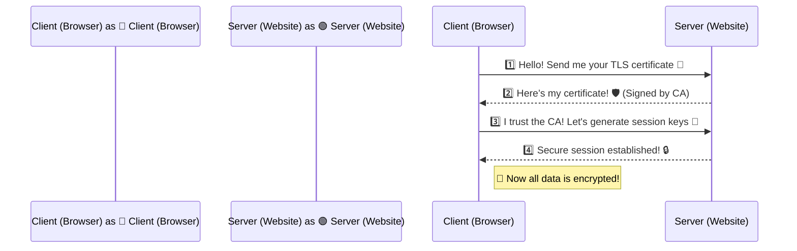

## **Understanding the Security Behind HTTPS**

Have you ever noticed the **padlock icon 🔒** in your browser’s address bar? That’s because **TLS/SSL encryption** is securing your connection! Without **TLS (Transport Layer Security)**, attackers could **eavesdrop** on your data, steal credentials, or perform **man-in-the-middle (MITM) attacks**.

In this article, we’ll **break down how TLS/SSL works**, why it’s essential, and how it **secures modern internet communication**.

## **🌍 What is TLS/SSL Encryption?**

**TLS (Transport Layer Security)** and its predecessor, **SSL (Secure Sockets Layer)**, are **cryptographic protocols** that provide **secure communication** between clients (browsers, apps) and servers (websites, APIs).

### **🔹 Why Do We Need TLS/SSL?**

✔ **Confidentiality** – Data is **encrypted**, preventing unauthorized access.  
✔ **Integrity** – Ensures data is not **altered** during transmission.  
✔ **Authentication** – Verifies that you’re **connecting to the real website**, not an imposter.

## **🔑 How TLS/SSL Works: The Handshake Process**

When you visit a website using **HTTPS**, your browser and the server perform a **TLS handshake** before data transmission begins.



## **📌 Step-by-Step Breakdown of the TLS Handshake**

1️⃣ **Client Hello:**

* The browser (client) requests a **secure connection** from the server.
    
* It sends **supported encryption algorithms (ciphers)** and a **random number**.
    

2️⃣ **Server Hello & Certificate Exchange:**

* The server responds with its **TLS certificate**, containing:  
    ✔ The server’s **public key** 🔑  
    ✔ The **Certificate Authority (CA) signature** 🛡️  
    ✔ The **domain name** it’s issued for
    

3️⃣ **Key Exchange:**

* The client **validates** the certificate with the **CA’s public key**.
    
* A **session key** is generated for encryption.
    

4️⃣ **Secure Connection Established:**

* All further communication is **encrypted using symmetric encryption (AES)**.
    

## **🔍 TLS vs SSL: What’s the Difference?**

| Feature | SSL (Deprecated) | TLS (Modern Standard) |
| --- | --- | --- |
| **Security** | Weak, vulnerable to attacks | Stronger encryption & protection |
| **Performance** | Slower | Faster, optimized handshakes |
| **Supported Versions** | SSL 2.0, SSL 3.0 (Deprecated) | TLS 1.2, TLS 1.3 (Latest) |
| **Used In** | Older web apps | Modern HTTPS websites, APIs |

📌 **TLS 1.3** is the latest version, offering **faster performance and stronger encryption**.

## **🔒 Why is TLS/SSL Important for Security?**

✅ **Prevents MITM Attacks** – Ensures **no one can intercept or modify data**.  
✅ **Encrypts Sensitive Data** – Protects **passwords, credit card info, API requests**.  
✅ **Builds Trust & SEO Benefits** – Google ranks **HTTPS sites higher** than HTTP.

## **🌍 Where is TLS/SSL Used?**

📌 **Websites & Browsers (HTTPS)** – Protects **login pages, payments, personal data**.  
📌 **APIs & Web Services** – Ensures **secure data exchange** between systems.  
📌 **Emails (SMTP over TLS)** – Encrypts email communications.  
📌 **VPNs & Secure Networks** – Protects corporate data over **public networks**.

## **🛠️ How to Implement TLS/SSL?**

1️⃣ **Obtain an SSL/TLS Certificate** from a trusted **Certificate Authority (CA)**.

* Free options: **Let’s Encrypt**
    
* Paid: **DigiCert, GlobalSign, GoDaddy**
    

2️⃣ **Enable HTTPS on Your Server**

* For **NGINX**:
    
    ```bash
    sudo certbot --nginx -d yourdomain.com
    ```
    
* For **Apache**:
    
    ```bash
    sudo certbot --apache -d yourdomain.com
    ```
    

3️⃣ **Use Strong TLS Versions & Ciphers**

* Disable weak protocols like **SSL 3.0, TLS 1.0**
    
* Enforce **TLS 1.2 or TLS 1.3**
    

4️⃣ **Check Your TLS Configuration**

* Use **SSL Labs Test** → https://www.ssllabs.com/ssltest/
    

## **🚀 Final Thoughts**

TLS/SSL **is the backbone of secure internet communication**. Without it, **hackers could intercept, modify, and steal sensitive data**.

✅ **Always use HTTPS** for websites & APIs.  
✅ **Upgrade to TLS 1.3** for better performance & security.  
✅ **Check your SSL certificate regularly** to avoid expiration.

Would you like a **tutorial on setting up TLS for Node.js or AWS API Gateway**? Let’s discuss in the comments! 👇

---

# **About Me 👨‍💻**

I'm Faiz A. Farooqui. Software Engineer from Bengaluru, India.  
Find out more about me @ [**faizahmed.in**](http://faizahmed.in/)