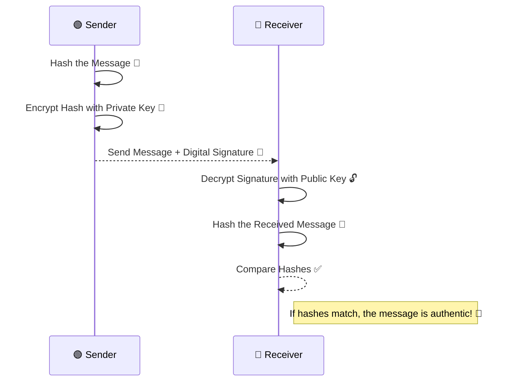

## **🧐 What is a Digital Signature?**

A **digital signature** is a cryptographic technique that ensures the **authenticity, integrity, and non-repudiation** of digital messages or documents.

When you digitally sign a document, you are providing a **unique fingerprint** that proves:  
✔ The **message is from you** (Authentication).  
✔ The **message was not altered** in transit (Integrity).  
✔ The **sender cannot deny signing it** (Non-Repudiation).

## **🔑 How Do Digital Signatures Work?**

A **digital signature** is created using **asymmetric encryption** (Public Key Cryptography). It involves:  
1️⃣ **Hashing the message** (to create a unique fingerprint).  
2️⃣ **Encrypting the hash** with the sender’s **private key**.  
3️⃣ **Sending the message & signature** to the receiver.  
4️⃣ **Verifying** the signature using the sender’s **public key**.



## **📌 Step-by-Step Breakdown of Digital Signature Process**

1️⃣ **Message Hashing**:

* The sender applies a **hashing algorithm** (e.g., SHA-256) to the original message.
    
* This creates a **fixed-length unique hash** (fingerprint).
    

2️⃣ **Signing the Hash**:

* The sender encrypts the hash using their **private key**.
    
* This **encrypted hash becomes the digital signature**.
    

3️⃣ **Message Transmission**:

* The original message + digital signature are sent to the receiver.
    

4️⃣ **Signature Verification**:

* The receiver **decrypts the signature** using the sender’s **public key**.
    
* The receiver **hashes the received message** using the same algorithm.
    
* If the **hashes match**, the message is authentic and unchanged!
    

## **🔍 Why Use Digital Signatures?**

✅ **Prevents Tampering** – Ensures the message wasn’t altered.  
✅ **Proves Authenticity** – Verifies the sender’s identity.  
✅ **Ensures Non-Repudiation** – The sender cannot deny sending the message.

## **🔹 Digital Signatures vs Electronic Signatures**

| **Feature** | **Digital Signature ✅** | **Electronic Signature ✍** |
| --- | --- | --- |
| **Security** | High (uses cryptography) | Low (image/text-based) |
| **Verification** | Can be mathematically verified | Usually cannot be verified |
| **Legality** | Strong legal backing | Varies by jurisdiction |
| **Use Case** | Secure documents, software signing | Online contract approvals |

📌 **Digital Signatures are cryptographically secured**, whereas **Electronic Signatures** are often just images of handwritten signatures.

## **🌍 Where Are Digital Signatures Used?**

📌 **Software Distribution** – Ensures apps & updates come from a trusted source.  
📌 **Secure Email (PGP, S/MIME)** – Verifies sender authenticity.  
📌 **Blockchain & Cryptocurrency** – Used for **secure transactions**.  
📌 **Legal Documents (e.g., DocuSign)** – Provides **legal validity**.

## **🛠️ How to Create a Digital Signature in Node.js?**

Want to see a digital signature in action? Here’s an example using **RSA encryption in Node.js** with the built-in `crypto`

```javascript
const crypto = require('crypto');

// Generate RSA Key Pair
const { publicKey, privateKey } = crypto.generateKeyPairSync('rsa', {
  modulusLength: 2048,
});

// Original Message
const message = "Secure Message";

// Create Digital Signature
const sign = crypto.createSign('SHA256');
sign.update(message);
sign.end();
const signature = sign.sign(privateKey, 'hex');

console.log("Signature:", signature);

// Verify the Signature
const verify = crypto.createVerify('SHA256');
verify.update(message);
verify.end();

const isValid = verify.verify(publicKey, signature, 'hex');
console.log(isValid ? "✅ Signature is valid!" : "❌ Signature is invalid!");
```

This **Node.js script**:  
✅ **Generates RSA key pairs**  
✅ **Creates a digital signature** for a message  
✅ **Verifies the signature** using the public key

## **🚀 Final Thoughts**

**Digital Signatures are essential** for security, providing:

* **Authenticity** – Verifies the sender.
    
* **Integrity** – Ensures data wasn’t altered.
    
* **Non-Repudiation** – The sender **cannot deny** signing.
    

Would you like a **tutorial on how to implement digital signatures in AWS KMS or OpenSSL?** Let’s discuss in the comments! 👇

---

# **About Me 👨‍💻**

I'm Faiz A. Farooqui. Software Engineer from Bengaluru, India.  
Find out more about me @ [**faizahmed.in**](http://faizahmed.in/)