## **🧐 What is End-to-End Encryption (E2EE)?**

**End-to-End Encryption (E2EE)** ensures that only the sender and the intended recipient can read messages—**not even the messaging platform can access them**.

Unlike traditional encryption, where messages might be encrypted **in transit** but **decrypted on the server**, E2EE **keeps messages encrypted at all times**.

### **🔹 Why is E2EE Important?**

✔ **Prevents Eavesdropping** – No third party (including hackers, governments, or service providers) can read your messages.  
✔ **Ensures Privacy** – Only the sender & recipient hold the decryption keys.  
✔ **Protects Sensitive Data** – Used for **private communications**, **financial transactions**, and **secure logins**.

## **🔑 How End-to-End Encryption Works in Messaging Apps**

E2EE uses **asymmetric encryption (public & private keys)** to secure messages.

```mermaid
sequenceDiagram
    participant Sender as 🟢 Sender (Alice)
    participant Server as 🌐 Messaging Server
    participant Receiver as 🔵 Receiver (Bob)

    Sender ->> Receiver: Request Bob's Public Key 🔑
    Receiver -->> Sender: Sends Public Key 📩
    
    Sender ->> Sender: Encrypt Message with Bob's Public Key 🔏
    Sender -->> Server: Send Encrypted Message 🚀
    Server -->> Receiver: Deliver Encrypted Message 🔐
    
    Receiver ->> Receiver: Decrypt Message with Private Key 🗝️
    Receiver -->> Sender: Sends Encrypted Reply 📨
    
    Note over Sender,Receiver: No one except Alice & Bob can read the message!
```



## **📌 Step-by-Step Breakdown of E2EE in Messaging Apps**

1️⃣ **Key Exchange**

* The sender requests the recipient’s **public key**.
    
* The recipient **shares their public key**.
    

2️⃣ **Message Encryption**

* The sender **encrypts the message** using the recipient’s **public key**.
    
* The encrypted message is sent **through the server** (but remains unreadable).
    

3️⃣ **Message Delivery**

* The **server cannot decrypt the message**—it simply **forwards** it.
    

4️⃣ **Message Decryption**

* The recipient uses their **private key** to **decrypt the message**.
    

## **🔹 Popular Messaging Apps Using E2EE**

| **Messaging App** | **End-to-End Encryption?** | **Encryption Protocol** |
| --- | --- | --- |
| **Signal** | ✅ Always Enabled | **Signal Protocol (X3DH + Double Ratchet)** |
| **WhatsApp** | ✅ Always Enabled (except backups) | **Signal Protocol** |
| **Telegram** | ⚠️ Only for "Secret Chats" | **MTProto Protocol** |
| **iMessage** | ✅ Enabled by Default | **Apple iMessage Encryption** |
| **Facebook Messenger** | ⚠️ Only for "Secret Conversations" | **Signal Protocol** |

📌 **Signal** and **WhatsApp** provide the **strongest E2EE** since they use the **Signal Protocol**, while **Telegram & Facebook Messenger** require **manual activation**.

## **E2EE vs Traditional Encryption**

| **Feature** | **End-to-End Encryption (E2EE)** | **Traditional Encryption** |
| --- | --- | --- |
| **Who can decrypt?** | Only sender & recipient 🔑 | Service provider can access 🏢 |
| **Security** | Highly secure 🔐 | Less secure 🔓 |
| **Message storage** | Only on devices 📱 | Often stored on servers ☁️ |
| **Example Apps** | WhatsApp, Signal, iMessage | Gmail, Slack, Microsoft Teams |

📌 **E2EE ensures privacy**, while traditional encryption allows service providers to **access and analyze data**.

## **🛠️ How to Implement E2EE in Node.js (Using Crypto)**

Want to see how **E2EE works**? Here’s an example using **RSA encryption** in **Node.js**:

### **📌 Step 1: Generate RSA Key Pairs**

```javascript
const crypto = require('crypto');

// Generate RSA Key Pair for Alice
const aliceKeys = crypto.generateKeyPairSync('rsa', { modulusLength: 2048 });
const alicePublicKey = aliceKeys.publicKey.export({ type: 'pkcs1', format: 'pem' });
const alicePrivateKey = aliceKeys.privateKey.export({ type: 'pkcs1', format: 'pem' });

// Generate RSA Key Pair for Bob
const bobKeys = crypto.generateKeyPairSync('rsa', { modulusLength: 2048 });
const bobPublicKey = bobKeys.publicKey.export({ type: 'pkcs1', format: 'pem' });
const bobPrivateKey = bobKeys.privateKey.export({ type: 'pkcs1', format: 'pem' });

console.log("Alice's Public Key:", alicePublicKey);
console.log("Bob's Public Key:", bobPublicKey);
```

### **📌 Step 2: Encrypt the Message with Bob's Public Key**

```javascript
const message = "Hello, Bob! This is an end-to-end encrypted message.";

// Encrypt message using Bob's public key
const encryptedMessage = crypto.publicEncrypt({
  key: bobPublicKey,
  padding: crypto.constants.RSA_PKCS1_OAEP_PADDING,
}, Buffer.from(message));

console.log("🔐 Encrypted Message:", encryptedMessage.toString('base64'));
```

### **📌 Step 3: Decrypt the Message with Bob's Private Key**

```javascript
// Decrypt message using Bob's private key
const decryptedMessage = crypto.privateDecrypt({
  key: bobPrivateKey,
  padding: crypto.constants.RSA_PKCS1_OAEP_PADDING,
}, encryptedMessage);

console.log("✅ Decrypted Message:", decryptedMessage.toString());
```

## **🚀 Final Thoughts**

E2EE is essential for protecting **private messages**, **financial transactions**, and **sensitive data** from unauthorized access.

✅ **Use E2EE** whenever possible (WhatsApp, Signal, iMessage).  
✅ **Avoid storing sensitive chats on non-E2EE platforms** (Facebook Messenger, Telegram by default).  
✅ **Developers should implement strong E2EE protocols** like **Signal’s Double Ratchet Algorithm**.

Would you like a **deep dive into the Signal Protocol or implementing E2EE in WebSockets?** Let’s discuss in the comments! 👇

---

# **About Me 👨‍💻**

I'm Faiz A. Farooqui. Software Engineer from Bengaluru, India.  
Find out more about me @ [**faizahmed.in**](http://faizahmed.in/)