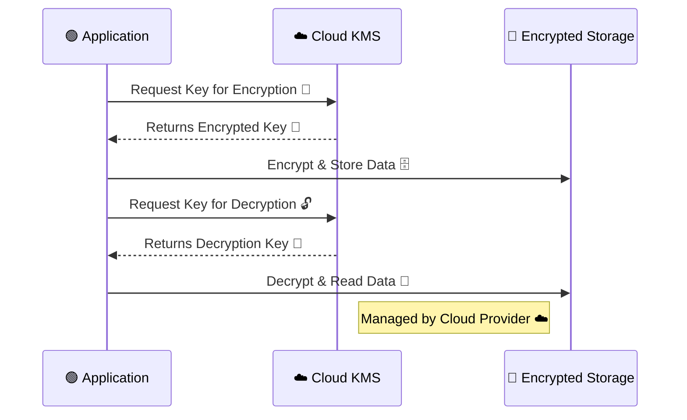
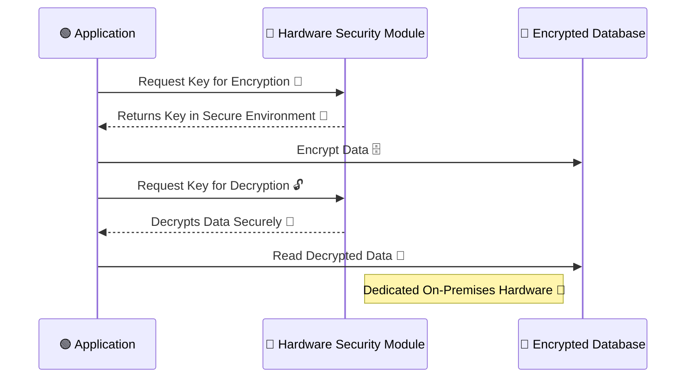

## **🧐 What is Key Management?**

Key Management Systems (KMS) and Hardware Security Modules (HSM) are **essential for securely generating, storing, and managing encryption keys**.

These systems are widely used for **data encryption, digital signatures, and authentication** in cloud and enterprise environments.

### **🔹 Why is Key Management Important?**

✔ **Ensures Secure Storage of Keys** – Protects against unauthorized access.  
✔ **Prevents Data Breaches** – Strong key policies help prevent leaks.  
✔ **Meets Compliance Standards** – Required for **PCI DSS, GDPR, and HIPAA**.

---

## **🔑 What is a KMS (Key Management Service)?**

A **KMS (Key Management Service)** is a **cloud-based** solution that **generates, manages, and controls encryption keys**. Cloud providers such as **AWS KMS, Azure Key Vault, and Google Cloud KMS** offer KMS solutions.

### **🔹 How KMS Works**



### **📌 Key Features of KMS**

✔ **Cloud-Managed** – No need for on-premises hardware.  
✔ **Highly Scalable** – Handles millions of requests.  
✔ **Access Control** – Uses **IAM roles & policies** for security.  
✔ **Automated Key Rotation** – Enhances security over time.  
✔ **Cost-Effective** – Pay-as-you-go pricing.

### **📌 When to Use KMS?**

✅ When you need **cloud-native encryption** (e.g., AWS S3, Google Cloud Storage).  
✅ When you want **automated key management** with minimal setup.  
✅ When compliance requires **encryption but not dedicated hardware**.

## **🔒 What is an HSM (Hardware Security Module)?**

A **HSM (Hardware Security Module)** is a **physical device** that securely generates, stores, and processes cryptographic keys. It is used in high-security environments like **banking, financial services, and government institutions**.

### **🔹 How HSM Works**



### **📌 Key Features of HSM**

✔ **Tamper-Resistant Hardware** – Prevents key extraction.  
✔ **Stronger Compliance** – Required for **banking, government, and military**.  
✔ **On-Premises or Cloud-Based** – Physical security for sensitive data.  
✔ **FIPS 140-2 & FIPS 140-3 Certified** – Meets **high-security standards**.  
✔ **High Performance** – Faster cryptographic processing than KMS.

### **📌 When to Use HSM?**

✅ When handling **highly sensitive cryptographic operations** (e.g., digital signing, payment processing).  
✅ When compliance requires **physical security** for encryption keys.  
✅ When you need **maximum control over cryptographic processes**.

## **📊 KMS vs HSM: Key Differences**

| **Feature** | **KMS (Cloud-Based)** | **HSM (Hardware)** |
| --- | --- | --- |
| **Deployment** | Cloud-based ☁️ | On-premises hardware 🏢 |
| **Security Level** | High 🔒 | Very High 🔐 (Tamper-proof) |
| **Performance** | Scalable, but slower ⚡ | Fast & optimized for crypto tasks 🚀 |
| **Access Control** | IAM-based permissions 🛠️ | Strict physical & network access 🏰 |
| **Compliance** | PCI DSS, GDPR, HIPAA ✅ | FIPS 140-2, FIPS 140-3 ✅ |
| **Cost** | Lower (pay-as-you-go) 💰 | Higher (hardware purchase) 💸 |

📌 **KMS is ideal for cloud-based applications**, while **HSM is best for on-premises security**.

## **🛠️ How to Use AWS KMS & AWS CloudHSM in Node.js**

### **📌 Using AWS KMS in Node.js**

```javascript
const AWS = require("aws-sdk");
const kms = new AWS.KMS({ region: "us-east-1" });

const encryptData = async (data) => {
  const params = {
    KeyId: "your-kms-key-id",
    Plaintext: Buffer.from(data),
  };

  const result = await kms.encrypt(params).promise();
  console.log("Encrypted Data:", result.CiphertextBlob.toString("base64"));
};

encryptData("Hello, KMS!");
```

### **📌 Using AWS CloudHSM in Node.js**

```javascript
const { Client } = require('hsm-client');

const client = new Client({ endpoint: "https://your-hsm-endpoint" });

async function encryptData(data) {
    const encrypted = await client.encrypt({
        keyId: "hsm-key-id",
        plaintext: data
    });
    console.log("Encrypted Data:", encrypted);
}

encryptData("Hello, CloudHSM!");
```

## **🚀 Final Thoughts**

Both **KMS and HSM provide strong encryption**, but they serve different purposes:

* **KMS** is **ideal for cloud applications** with managed security.
    
* **HSM** is **better for on-premises, high-security environments**.
    

✅ **Use KMS** for **cloud-native encryption** in AWS, Azure, or Google Cloud.  
✅ **Use HSM** when you need **physical security & high-compliance encryption**.

Would you like a **deep dive into setting up AWS KMS and HSM step-by-step?** Let’s discuss in the comments! 👇

---

# **About Me 👨‍💻**

I'm Faiz A. Farooqui. Software Engineer from Bengaluru, India.  
Find out more about me @ [**faizahmed.in**](http://faizahmed.in/)