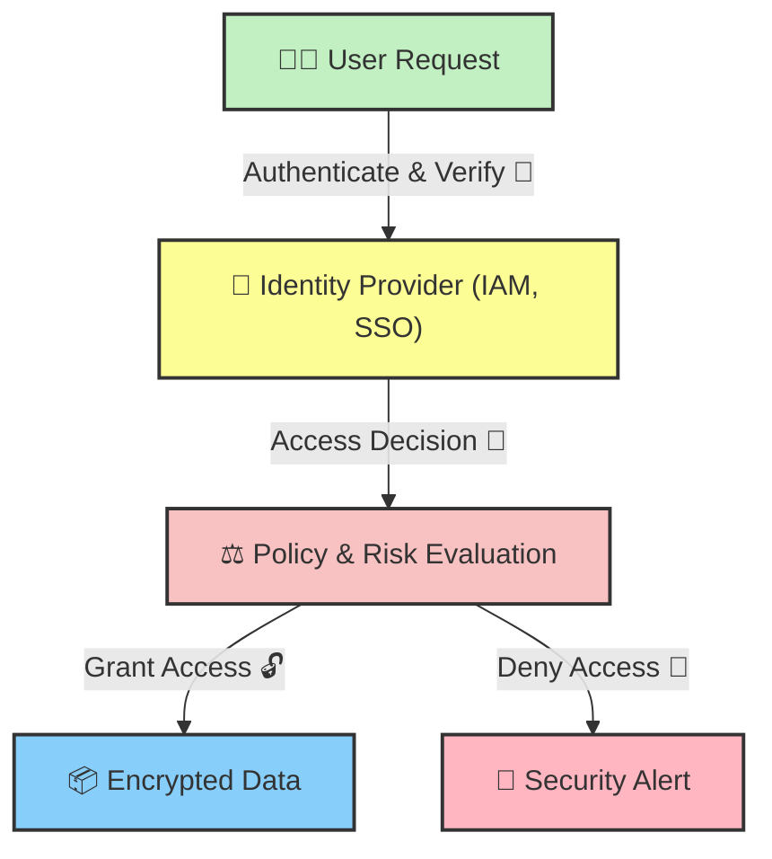

## **🧐 What is Zero Trust Encryption?**

**Zero Trust Encryption (ZTE)** is a security model that enforces **continuous verification and least privilege access** to encrypted data. Unlike traditional security models that assume trust within the network, **Zero Trust operates under the principle of "Never Trust, Always Verify."**

### **🔹 Why is Zero Trust Important?**

✔ **Prevents Insider Threats** – No implicit trust for internal users.  
✔ **Reduces Attack Surface** – Data remains encrypted end-to-end.  
✔ **Enforces Least Privilege Access** – Only authorized users can decrypt data.

## **🔑 How Zero Trust Encryption Works**

Zero Trust Encryption integrates **authentication, access control, and encryption** into a unified security approach.



### **📌 Key Components of Zero Trust Encryption**

✔ **Identity & Access Management (IAM)** – Authenticates users before granting access.  
✔ **Policy-Based Access Control (PBAC)** – Evaluates security policies before decryption.  
✔ **End-to-End Encryption (E2EE)** – Ensures data remains encrypted at all times.

## **🔒 Traditional Security vs Zero Trust Encryption**

| **Feature** | **Traditional Security** | **Zero Trust Encryption** |
| --- | --- | --- |
| **Access Model** | Implicit Trust ✅ | Continuous Verification 🔄 |
| **Data Protection** | Encrypt at Rest 📦 | Encrypt End-to-End 🔐 |
| **Threat Prevention** | Firewalls & VPNs 🌐 | Least Privilege Access 🚀 |
| **Insider Threats** | Higher Risk 🔓 | Stronger Protection 🔒 |
| **Compliance** | Limited Control 📑 | Full Encryption Compliance ✅ |

📌 **Zero Trust Encryption provides stronger security by eliminating implicit trust and enforcing encryption throughout the data lifecycle.**

## **🛠️ Implementing Zero Trust Encryption in Node.js**

Want to secure your application with **Zero Trust Encryption**? Here’s how to encrypt data **before storing it** in the database.

### **📌 Step 1: Generate AES Encryption Key**

```javascript
const crypto = require('crypto');

// Generate a secure 256-bit key
const encryptionKey = crypto.randomBytes(32).toString('hex');

console.log("Generated Encryption Key:", encryptionKey);
```

### **📌 Step 2: Encrypt Data Before Storing**

```javascript
function encryptData(data, key) {
    const iv = crypto.randomBytes(16);
    const cipher = crypto.createCipheriv('aes-256-cbc', Buffer.from(key, 'hex'), iv);

    let encrypted = cipher.update(data, 'utf8', 'hex');
    encrypted += cipher.final('hex');

    return iv.toString('hex') + ':' + encrypted;
}

const encryptedData = encryptData("Sensitive Data", encryptionKey);
console.log("🔐 Encrypted Data:", encryptedData);
```

### **📌 Step 3: Decrypt Data After Authorization**

```javascript
function decryptData(encryptedData, key) {
    const parts = encryptedData.split(':');
    const iv = Buffer.from(parts[0], 'hex');
    const encryptedText = Buffer.from(parts[1], 'hex');
    const decipher = crypto.createDecipheriv('aes-256-cbc', Buffer.from(key, 'hex'), iv);

    let decrypted = decipher.update(encryptedText, 'hex', 'utf8');
    decrypted += decipher.final('utf8');

    return decrypted;
}

console.log("✅ Decrypted Data:", decryptData(encryptedData, encryptionKey));
```

## **🚀 Final Thoughts**

Zero Trust Encryption **eliminates implicit trust and enhances security** by ensuring **data remains encrypted throughout its lifecycle**.

✅ **Use Zero Trust Encryption** to secure sensitive data.  
✅ **Implement IAM & PBAC** to restrict unauthorized access.  
✅ **Adopt End-to-End Encryption (E2EE)** for full security compliance.

Would you like a **deep dive into implementing Zero Trust with AWS IAM or Google Cloud?** Let’s discuss in the comments! 👇

---

# **About Me 👨‍💻**

I'm Faiz A. Farooqui. Software Engineer from Bengaluru, India.  
Find out more about me @ [**faizahmed.in**](http://faizahmed.in/)