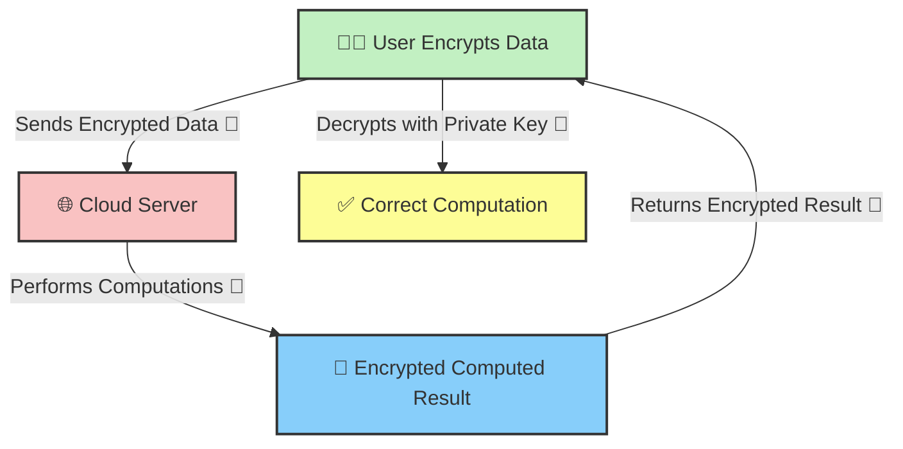

## **🧐 What is Homomorphic Encryption?**

**Homomorphic Encryption (HE)** is a revolutionary cryptographic technique that allows computations to be performed on **encrypted data without decrypting it**. The result, when decrypted, matches the outcome of operations performed on the original plaintext data.

### **🔹 Why is Homomorphic Encryption Important?**

✔ **Ensures Data Privacy** – No need to expose plaintext data for processing.  
✔ **Secure Cloud Computation** – Allows outsourced computations on encrypted data.  
✔ **Prevents Data Leaks** – Ideal for sensitive data like healthcare & finance.

## **🔑 How Homomorphic Encryption Works**

Unlike traditional encryption, where data must be **decrypted before processing**, HE enables **direct computation on encrypted data**.



### **📌 Key Steps in Homomorphic Encryption**

✔ **User encrypts the data before sending it** to a cloud or third-party service.  
✔ **Server performs computations** on the encrypted data without decryption.  
✔ **User decrypts the result** after receiving the processed encrypted output.

## **🔹 Types of Homomorphic Encryption**

| **Type** | **Operations Supported** | **Example Use Cases** |
| --- | --- | --- |
| **Partially Homomorphic (PHE)** | Supports either addition or multiplication, but not both | Encrypted authentication |
| **Somewhat Homomorphic (SHE)** | Supports limited operations before requiring decryption | Secure AI training |
| **Fully Homomorphic (FHE)** | Supports **any mathematical operation** on encrypted data | Cloud computing, healthcare analytics |

📌 **FHE is the ultimate goal**, but it’s computationally expensive.

## **🛠️ Implementing Homomorphic Encryption in Node.js**

Want to see **Homomorphic Encryption in action**? Here’s an example using the **Paillier cryptosystem**, a **Partially Homomorphic Encryption (PHE)** method that supports **addition on encrypted values**.

### **📌 Step 1: Install a Homomorphic Encryption Library**

```bash
npm install node-paillier
```

### **📌 Step 2: Generate Key Pair for Encryption**

```javascript
const paillier = require('node-paillier');

// Generate Public & Private Keys
const { publicKey, privateKey } = paillier.generateRandomKeys(2048);
console.log("🔑 Public Key:", publicKey);
console.log("🔐 Private Key:", privateKey);
```

### **📌 Step 3: Encrypt Two Numbers & Perform Addition on Encrypted Data**

```javascript
// Encrypt two numbers
const num1 = 15;
const num2 = 10;
const encryptedNum1 = publicKey.encrypt(num1);
const encryptedNum2 = publicKey.encrypt(num2);

console.log("🔐 Encrypted Number 1:", encryptedNum1.toString());
console.log("🔐 Encrypted Number 2:", encryptedNum2.toString());

// Perform Addition on Encrypted Data
const encryptedSum = publicKey.addition(encryptedNum1, encryptedNum2);
console.log("➕ Encrypted Sum:", encryptedSum.toString());
```

### **📌 Step 4: Decrypt the Computed Result**

```javascript
// Decrypt the computed sum
const decryptedSum = privateKey.decrypt(encryptedSum);
console.log("✅ Decrypted Sum:", decryptedSum); // Output: 25
```

## **🚀 Final Thoughts**

Homomorphic Encryption **enables secure computation on encrypted data**, opening the door for **privacy-preserving AI, secure cloud computing, and confidential financial operations**.

✅ **Use PHE for simple operations like authentication.**  
✅ **SHE is great for structured AI and analytics models.**  
✅ **FHE is the future but still requires performance optimizations.**

Would you like a **deep dive into Fully Homomorphic Encryption (FHE) and its real-world applications?** Let’s discuss in the comments! 👇

---

# **About Me 👨‍💻**

I'm Faiz A. Farooqui. Software Engineer from Bengaluru, India.  
Find out more about me @ [**faizahmed.in**](http://faizahmed.in/)