## 🧠 What is JWT?

**JWT (JSON Web Token)** is a compact, URL-safe token format used to **transmit claims securely** between parties. It’s the backbone of **stateless authentication** and is often signed using **JWS** (JSON Web Signature) or encrypted using **JWE** (JSON Web Encryption).

## 🔑 JWT = Header + Payload + Signature

```plaintext
eyJhbGciOiJSUzI1NiIsInR5cCI6IkpXVCJ9.
eyJ1c2VySWQiOiIxMjM0Iiwicm9sZSI6InVzZXIifQ.
ZHVtbXktc2lnbmF0dXJl
```

| **Section** | **Purpose** |
| --- | --- |
| **Header** | Metadata (algorithm, type) |
| **Payload** | Claims (e.g., `userId`, `role`) |
| **Signature** | Verifies token integrity |

## ✅ JWT (JWS) – Signed Token

**JWS = JSON Web Signature**  
It’s the most common JWT. The payload is **not encrypted** — just signed to ensure authenticity.

📌 **Use Case:**

* User login tokens
    
* API access tokens
    
* OAuth2 flows
    

## 🔐 JWE – Encrypted JWT

**JWE = JSON Web Encryption**  
Unlike JWS, JWE **encrypts** the payload so it’s not visible to intermediaries. It includes more sections than JWS.

```json
<Header>.<EncryptedKey>.<IV>.<Ciphertext>.<AuthTag>
```

| **Component** | **Description** |
| --- | --- |
| **Header** | Algorithm & encryption method |
| **Encrypted Key** | Encrypted symmetric key using RSA |
| **IV** | Initialization Vector |
| **Ciphertext** | Encrypted payload |
| **AuthTag** | Auth tag for integrity/authentication |

📌 **Use Case:**

* Financial data
    
* Healthcare apps
    
* B2B confidential communication
    

## 🔄 JWT vs JWE

| **Feature** | **JWS (Signed) 🔏** | **JWE (Encrypted) 🔐** |
| --- | --- | --- |
| **Payload Visible** | ✅ Yes | ❌ No |
| **Integrity** | ✅ Ensured via signature | ✅ Ensured via encryption |
| **Confidentiality** | ❌ Not secure | ✅ Encrypted |
| **Use Case** | Auth tokens | Sensitive data transfer |

## 🧩 What is JWKS?

**JWKS = JSON Web Key Set**  
It’s a **public endpoint** that exposes **public keys** in a JSON format. It's how services like **Auth0**, **Google**, and **Okta** let you verify JWTs without sharing the private key.

🧠 JWKS provides a way to **rotate keys** without breaking consumers.

📌 URL Example:

```http
https://your-auth-server.com/.well-known/jwks.json
```

📄 Example Response:

```json
{
  "keys": [
    {
      "kty": "RSA",
      "kid": "abc123",
      "use": "sig",
      "n": "...base64url...",
      "e": "AQAB"
    }
  ]
}
```

## 🗂️ How it All Works Together

```mermaid
sequenceDiagram
    participant AuthServer as 🔐 Auth Server
    participant JWKS as 🌍 JWKS Endpoint
    participant ClientApp as 🧑 Client App
    participant API as 🟢 API Server

    ClientApp ->> AuthServer: 🔐 Authenticate (Login)
    AuthServer -->> ClientApp: ⏎ JWT (Signed or Encrypted)

    ClientApp ->> API: 📨 Send JWT in Authorization Header
    API ->> JWKS: 🔍 Fetch Public Keys
    JWKS -->> API: 📥 Return Key Set
    API ->> API: ✅ Verify Signature using Public Key
    API -->> ClientApp: 🔓 Return Protected Data
```



## 🛠️ Verifying JWTs with JWKS in Node.js

### ✅ Install Dependencies

```bash
npm install jwks-rsa jsonwebtoken express
```

### 🔧 Verify JWT with JWKS

```javascript
const jwt = require("jsonwebtoken");
const jwksClient = require("jwks-rsa");

const client = jwksClient({
  jwksUri: "https://your-auth-server.com/.well-known/jwks.json"
});

function getKey(header, callback) {
  client.getSigningKey(header.kid, (err, key) => {
    const signingKey = key.getPublicKey();
    callback(null, signingKey);
  });
}

function verifyToken(token) {
  jwt.verify(token, getKey, {
    algorithms: ["RS256"]
  }, (err, decoded) => {
    if (err) return console.error("❌ Invalid Token");
    console.log("✅ Verified Token Payload:", decoded);
  });
}
```

## ✅ Best Practices

| **Practice** | **Why It Matters** |
| --- | --- |
| Use **RS256** (asymmetric) for signing | Safer than HMAC in distributed systems |
| Always verify `iss`, `aud`, `exp` | Protect against spoofed/expired tokens |
| Enable **key rotation** using JWKS | Improves security without breaking apps |
| Use **JWE** only when confidentiality is required | Saves performance otherwise |

## 🚀 Final Thoughts

JWTs are everywhere — but understanding the difference between **JWS, JWE, and JWKS** is key to building **secure, scalable, and standards-compliant systems**.

✅ Use **JWS for API authentication**  
✅ Use **JWE for encrypting sensitive data**  
✅ Use **JWKS for secure key distribution and rotation**

Let me know if you'd like a **follow-up tutorial** to implement JWKS-based auth with **Auth0, Google Identity, or AWS Cognito**! 👇

---

# **About Me 👨‍💻**

I'm Faiz A. Farooqui. Software Engineer from Bengaluru, India.  
Find out more about me @ [**faizahmed.in**](http://faizahmed.in/)