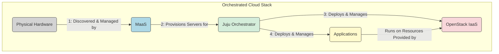

Welcome! 👋

Ever looked at the public cloud giants and thought, "Could I build something like that myself?"

Maybe you're driven by specific needs like data control, unique performance requirements, or simply the desire to truly *understand* the nuts and bolts beneath the slick cloud dashboards.

Building your own on-premise cloud or data centre might seem daunting, but with the right tools and approach, it's achievable and incredibly rewarding.

This post kicks off **"**[**Metal to Cloud: Your On-Prem Journey with MaaS, OpenStack & Juju**](https://blog.faizahmed.in/series/metal-to-cloud-on-prem-data-center)**"**, a series where I'll document my process of building a modern, automated on-prem cloud infrastructure from scratch.

We'll cover everything from selecting hardware and designing networks to deploying and managing cloud services.

But first, let's tackle the big question: *Why* go through the effort in 2025?

## The On-Prem Advantage: Why Not Just Use Public Cloud? 🤔

Public clouds (AWS, Azure, GCP) offer incredible convenience and scale. So why consider building your own? Several compelling reasons remain:

1. **Control & Customization:** You dictate the hardware, network architecture, security policies, and software stack. No vendor lock-in, no opaque infrastructure – just complete control over your environment.
    
2. **Cost Predictability (TCO):** While initial hardware investment is significant, operating costs can be more predictable and potentially lower over the long term compared to consumption-based public cloud billing, especially for stable, high-utilization workloads. You're trading CapEx for potentially lower OpEx.
    
3. **Data Sovereignty & Compliance:** For sensitive data or industries with strict regulations (like finance, healthcare, government), keeping data within your physical premises or geographic boundaries isn't just preferable – it's often mandatory. On-prem gives you clear data locality.
    
4. **Performance & Latency:** For applications requiring ultra-low latency (e.g., industrial IoT, real-time processing, high-frequency trading), having compute resources physically close to the data source or end-users can be a significant advantage.
    
5. **Learning & Skill Development:** Let's be honest – building and running your own cloud is an unparalleled learning experience! You gain deep insights into networking, storage, virtualization, automation, and system integration.
    

Of course, it's not without challenges – complexity, upfront cost, and the need for operational expertise are real. But the right tools can dramatically lower the barrier to entry.

## Meet the Toolkit: Our Weapons of Choice 🛠️

To tackle the complexity, we're relying on a powerful trio of open-source tools, largely fostered by Canonical (the company behind Ubuntu):

1. **MaaS (Metal as a Service): The Bare Metal Magician ✨**
    
    * **What it solves:** Manually installing operating systems and configuring servers one-by-one is slow, error-prone, and doesn't scale.
        
    * **What it does:** MaaS automates the entire physical server lifecycle. It discovers hardware (using network boot/PXE and BMCs), inventories components, performs testing, deploys operating systems (like Ubuntu), and manages IP addresses. It essentially turns your collection of bare metal servers into a flexible, cloud-like pool of physical resources ready for consumption.
        
    * Think of it as: *IaaS for your physical hardware.*
        
2. **OpenStack: Your Private IaaS Cloud ☁️**
    
    * **What it solves:** We need a layer above the bare metal OS to provide actual cloud services – virtual machines, virtual networks, block/object storage, etc. – that users can request and manage via an API or dashboard.
        
    * **What it does:** OpenStack is a vast collection of interrelated services (Nova for compute, Neutron for networking, Cinder for block storage, Glance for images, Keystone for identity, and many more) that collectively form a cloud operating system. It provides the Infrastructure-as-a-Service layer.
        
    * Think of it as: *The engine powering your private cloud.*
        
3. **Juju: The Service Orchestration Maestro 🎶**
    
    * **What it solves:** Deploying, configuring, integrating, scaling, and upgrading complex distributed systems like OpenStack (which has dozens of components) or applications running *on* OpenStack is incredibly complex. Manual configuration or basic scripts quickly become unmanageable.
        
    * **What it does:** Juju uses a model-driven approach with reusable operators called "Charms." Charms encapsulate the operational knowledge needed to deploy, manage, and relate services. Juju automates the entire lifecycle – not just initial deployment ("Day 0/1"), but also scaling, configuration changes, upgrades, and managing relationships between services ("Day 2" operations).
        
    * Think of it as: *The conductor ensuring all parts of your cloud and applications work together harmoniously.*
        

## Understanding the Synergy: How They Work Together 🤝

**Understanding the Flow:**

1. **Hardware to MaaS:** MaaS discovers and manages the physical hardware (servers, network interfaces, storage).
    
2. **MaaS to Juju:** MaaS provides OS-provisioned servers ready for use. Juju requests these servers from MaaS as needed for deployment.
    
3. **Juju to OpenStack:** Juju uses specialized charms to deploy, configure, integrate, and manage all the different services that make up the OpenStack IaaS layer on the MaaS-provisioned servers.
    
4. **Juju to Applications:** Juju also uses charms (application charms this time) to deploy, configure, and manage the actual applications and workloads that will run *on* the OpenStack cloud.
    
5. **Applications on OpenStack:** The deployed applications utilize the virtual resources (VMs, virtual networks, block/object storage) provided by the OpenStack IaaS layer.
    

This powerful combination allows for true infrastructure-as-code and automation, from the physical layer right up to the applications your users consume.

## Our Journey Ahead: What to Expect 🗺️

Over the next posts in this series, we'll dive deep into the practical steps:

* **Part 2:** Planning Your Playground - Hardware & Network Design
    
* **Part 3:** Laying the Foundation - Installing and Configuring MaaS
    
* **Part 4:** Taming the Metal - Commissioning Servers with MaaS
    
* **Part 5:** Enter the Orchestrator - Setting up Juju
    
* **Part 6:** Deploying OpenStack via Juju - The Control Plane & HA Core
    
* **Part 7:** Building Resilient Storage - Deploying Ceph for OpenStack via Juju
    
* **Part 8:** Enabling Virtual Machines - Deploying OpenStack Compute Nodes via Juju
    
* **Part 9:** Weaving the Virtual Network Fabric - Deploying OVN via Juju
    
* **Part 10:** Adding Network Services - Deploying LBaaS (Octavia) & DNSaaS (Designate) via Juju
    
* **Part 11:** Access and Interaction - The Horizon Dashboard & Your First VM
    
* **Part 12:** Keeping Watch - Deploying OpenStack Telemetry & Secrets via Juju
    
* **Part 13:** Beyond Infrastructure - Deploying Applications (like Kubernetes) via Juju
    
* **Part 14:** Day 2 and Beyond - Operations, Maintenance, and Wrap-up
    

## Ready to Build?

Building your own cloud is a significant undertaking, but it's an incredibly valuable one. By leveraging tools like MaaS, OpenStack, and Juju, we can automate much of the complexity and create a robust, flexible, and powerful on-premise environment.

I'm excited to share this journey with you! Follow along, ask questions in the comments, and let's turn metal into a functioning cloud together. Stay tuned for Part 2, where we'll get into the nitty-gritty of hardware planning and network design.