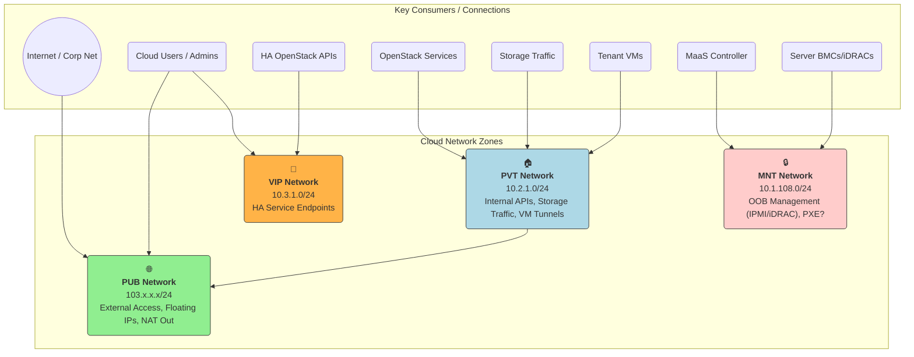

Welcome back to our "Metal to Cloud" journey!

In Part 1, we discussed *why* building an on-prem cloud can be beneficial and introduced our core toolkit: **MaaS**, **OpenStack**, and **Juju**.

Now, before we install a single package, we need to lay the foundation.

Just like building a house requires a solid blueprint and foundation, our cloud needs careful planning of its physical components: the hardware and the network. Getting this right is critical for stability, performance, and manageability down the road.

## Hardware Selection Philosophy: Choosing Your Building Blocks 🧱

The hardware you choose will directly impact your cloud's capabilities and cost. While specific choices depend on budget and workload, here are key considerations for a MaaS/OpenStack/Juju setup:

1. **Servers - The Workhorses:**
    
    * **CPU:** Look for modern server-grade processors with sufficient cores and clock speed. Crucially, ensure they support hardware virtualization extensions (Intel VT-x or AMD-V) – essential for KVM, the high-performance hypervisor OpenStack typically uses. (We'll revisit the `virt-type` setting later, but planning for KVM is ideal).
        
    * **RAM:** Don't skimp here! OpenStack control plane services, Ceph (if used for storage), and especially the virtual machines themselves consume significant memory. Aim for generous amounts per node (e.g., 64GB, 128GB, or more depending on density goals).
        
    * **Storage:**
        
        * *OS Drives:* Relatively small, fast drives (SSDs preferred) for the operating system on each node.
            
        * *Data Storage:* For a setup like ours using Ceph, dedicated storage nodes are best. These need multiple drive bays. Consider a mix of SSDs (for performance tiering/caching/journals) and larger HDDs (for capacity) depending on your performance needs and budget. Ensure appropriate HBAs (Host Bus Adapters) if needed, often flashed to "IT mode" for Ceph.
            
    * **Networking (NICs):** At least two physical NIC ports per server are recommended for redundancy and network separation. Speed matters: 1Gbps might work for a small lab, but 10Gbps, 25Gbps, or faster is highly recommended for storage traffic (Ceph!) and VM traffic, especially on storage and compute nodes.
        
    * **Baseboard Management Controller (BMC):** This is **non-negotiable** for MaaS. A dedicated management controller (like Dell's iDRAC, HP's iLO, or generic IPMI-compliant controllers) with its own network port allows MaaS to control power, monitor hardware, and access the console remotely, even when the server OS is off. We're using Dell servers, so iDRAC is our BMC.
        
2. **Server Roles:** Our plan involves distinct server roles, influencing hardware choices:
    
    * *Storage Nodes (*`x4`): Need lots of drive bays, good NICs, decent RAM/CPU for Ceph OSDs/MONs.
        
    * *Compute Nodes (*`x18`): Need strong CPU and ample RAM for hosting VMs, plus fast NICs.
        
    * *Control/Misc Nodes (*`x3`): Need good RAM and decent CPU for running OpenStack control services (often in LXD containers), plus reliable NICs.
        
    * *MaaS/Juju Nodes (*`x4`): Moderate specs are often sufficient, but reliability is key.
        
3. **Network Switches:** You'll need managed switches capable of handling VLANs (Virtual LANs) – essential for network segmentation. Ensure enough ports for all server NICs (including BMCs!) and sufficient backplane bandwidth (especially if using 10Gbps+ NICs). Consider redundant switches for higher availability.
    

## Network Design: Why Segmentation is King 👑

Throwing everything onto a single, large, flat network might seem simple initially, but it's a recipe for disaster in any non-trivial environment. Here's why we *must* segment our network:

* **Security:** Your BMC/iDRAC ports provide deep hardware access. They absolutely *must* be on a separate, highly restricted network (the MNT network) inaccessible from regular user or VM traffic. Similarly, separating internal management traffic from external traffic reduces the attack surface.
    
* **Performance:** Storage traffic (like Ceph replication or iSCSI) can be very bandwidth-intensive. Letting it contend directly with VM traffic or API calls on the same network leads to congestion and poor performance for everyone. Segmentation isolates different traffic types.
    
* **Broadcast Control:** Large flat networks suffer from excessive broadcast traffic, which can consume significant bandwidth and CPU on all connected devices. VLANs create smaller broadcast domains.
    
* **Manageability:** Separate networks make troubleshooting easier and network policy implementation cleaner.
    

## Our Network Architecture: The Logical Zones 🗺️

We'll implement network segmentation using VLANs on our managed switches. Here are the logical networks we've designed, based on the principles above and using the specific IP ranges for our deployment:

**Breaking Down the Zones:**

1. **MNT (Management Network):** `10.1.108.0/24` 🔒
    
    * **Purpose:** Out-of-Band (OOB) management ONLY. This network connects directly to the server BMCs (our iDRACs). MaaS uses this to power servers on/off, monitor hardware, and potentially provide remote console. PXE booting *might* also use this network, or MaaS might need access to another network where PXE happens.
        
    * **Critical Rule:** This network MUST be isolated and secured. Only MaaS controllers and necessary admin access should be allowed.
        
2. **PVT (Private Network):** `10.2.1.0/24` 🏠
    
    * **Purpose:** The internal workhorse network. In our current design, it carries multiple traffic types:
        
        * OpenStack internal API communication (services talking to each other).
            
        * Storage traffic (Ceph replication/client access).
            
        * VM Tunnel traffic (the underlay for OVN's overlay network).
            
    * **Consideration:** Combining these *can* work for smaller setups, but be mindful of potential bottlenecks. For larger scale or higher performance, splitting PVT further (e.g., dedicated Storage VLAN, dedicated Tunnel VLAN) is often recommended. We're starting combined but acknowledge a potential future split.
        
    * **Internet Access:** Devices on this network needing outbound internet access (e.g., for updates) will typically be routed/NAT'd via the PUB network gateway.
        
3. **VIP (High Availability Network):** `10.3.1.0/24` 🚦
    
    * **Purpose:** Dedicated network for the Virtual IP addresses used by our highly available OpenStack services (Keystone, Nova API, etc., as seen in our `config.yaml`). When a service runs on multiple nodes (e.g., our `os-misc` nodes), the VIP provides a single, consistent endpoint that floats between active nodes.
        
    * **Requirement:** Nodes participating in HA for a given service need connectivity on this network.
        
4. **PUB (Public Network):** `103.x.x.x/24` 🌐
    
    * **Purpose:** The gateway to the outside world (Internet or corporate network). Its main roles in OpenStack are:
        
        * Providing the pool of Floating IPs that can be assigned to VMs for external ingress traffic.
            
        * Hosting externally accessible API endpoints (often via load balancers/proxies).
            
        * Acting as the gateway for NAT'd outbound traffic originating from the PVT network.
            

**Implementation:** On our switches, we'll configure VLANs corresponding to these logical networks. Server NICs will then be configured either as access ports (belonging to a single VLAN, e.g., BMC ports on MNT) or trunk ports (carrying tagged traffic for multiple VLANs, e.g., primary data ports carrying PVT, VIP, and potentially PUB traffic).

## Next Steps

With a clearer picture of our hardware requirements and a segmented network design, we've established the physical and logical blueprint for our cloud. This careful planning minimizes surprises and sets us up for a smoother deployment.

In Part 3, we'll finally start getting our hands dirty by installing and configuring MaaS – the tool that will bring our bare metal servers under automated control. Stay tuned!