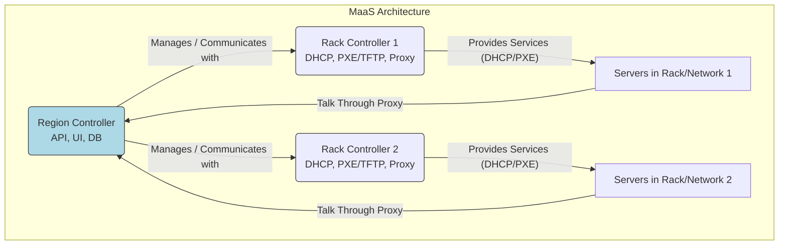
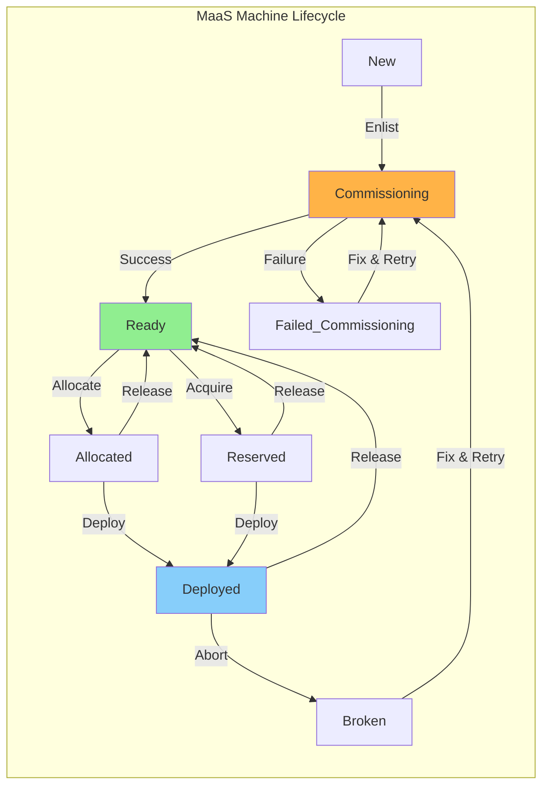

In Part 2, we meticulously planned our hardware and designed our segmented network.

With the blueprint ready, it's time to install the first cornerstone of our automated cloud: **MaaS (Metal as a Service)**.

## Why MaaS?

### The Power of Automated Provisioning ⚡

Imagine manually installing Ubuntu Server on dozens (or hundreds!) of machines, configuring networking, users, and partitions each time. It's tedious, error-prone, and simply doesn't scale.

This is the problem MaaS solves. It provides:

* **Automated OS Deployment:** Installs operating systems unattended over the network (PXE).
    
* **Hardware Inventory & Testing:** Discovers and records hardware details during "commissioning."
    
* **IP Address Management (IPAM):** Manages IP allocation on configured subnets.
    
* **Dynamic Allocation:** Treats physical servers like a cloud resource pool – allocate, deploy, release.
    
* **API & UI:** Allows programmatic and web-based control over your bare metal.
    

Essentially, MaaS transforms your physical servers from static liabilities into a dynamic, automated fleet, ready for Juju and OpenStack.

## MaaS Architecture:

### Region & Rack Controllers 🏛️

MaaS typically operates with two main components:

1. **Region Controller:** The central brain. It hosts the PostgreSQL database, the main API, the web UI, and manages all data about machines, subnets, images, etc. You usually have only one Region Controller per MaaS instance.
    
2. **Rack Controller(s):** Provide rack-local services. They act as a proxy for the Region Controller's API and manage local network services like DHCP, TFTP (for PXE booting), and HTTP (for images/files). You typically deploy at least one Rack Controller per physical rack or network segment needing these services.
    



In our deployment:

* `i41` will host the **Region Controller**.
    
* `i42` and `i43` will host **Rack Controllers**.
    

## Installation:

### Region Controller (`i41`) 🧠

*(Assumption: You've already installed a base Ubuntu Server LTS (e.g., 22.04 Jammy or 24.04 Noble) on node* `i41` with network connectivity.)

1. **Install MaaS Packages:** MaaS packages are typically in the main Ubuntu archives.
    
    ```bash
    sudo snap install maas --channel 3.4/stable
    ```
    
    *(This single* `maas` package usually pulls in both `maas-region-controller` and `maas-rack-controller`. Since `i41` will *also* likely serve the network it's directly connected to, having both is often fine. You could install only `maas-region-controller` if desired.)
    
2. **Initialize the Region & Database:** This step configures the region controller, sets up the PostgreSQL database (internally by default), and generates necessary secrets.
    
    ```bash
    sudo maas init region --database-uri "postgres://$DBUSER:$DBPASS@$HOSTNAME/$DBNAME"
    ```
    
    * *Follow the prompts. It will ask about the MaaS URL if different from the default guess. It does not handles creating the DB user and database, you’d need to create a PostgreSQL DB before you run the above mentioned command.*
        
    * ```bash
        sudo apt install -y postgresql
        sudo -i -u postgres psql -c "CREATE USER \"$DBUSER\" WITH ENCRYPTED PASSWORD '$DBPASS'"
        sudo -i -u postgres createdb -O "$DBUSER" "$DBNAME"
        ```
        
    * *Note: For external PostgreSQL or HA setups, the* `--database-uri` would point elsewhere.
        
    * *Goto \`*`/etc/postgresql/14/main/pg_hba.conf`*, and add a line for the newly created database —*
        
    * ```bash
        host    $MAAS_DBNAME    $MAAS_DBUSER    0/0     md5
        ```
        
3. **Create MaaS Admin User:**
    
    ```bash
    sudo maas createadmin
    ```
    
    * Follow the prompts to set the username, password, and optionally add SSH keys.
        
4. **Access the Web UI:** Open your browser and navigate to `http://<IP_of_i41>:5240/MAAS/`. Log in with the admin credentials you just created.
    
5. **Optimise:** I had to update "node\_timeout" to 120. It is a time, in minutes, until the node times out during commissioning, testing, deploying, or entering rescue mode. These all stages set a timeout when beginning. If MAAS does not hear from the node within the specified number of minutes the node is powered off and set into a failed status.
    
    ```bash
    # login into maas cli
    maas login maas-one http://10.3.1.10:5240/MAAS
    
    # get default node_timeout
    maas maas-one maas get-config name=node_timeout
    
    # set node_timeout
    maas maas-one maas set-config name=node_timeout value=120
    ```
    

### Rack Controllers (`i42`, `i43`) ⚙️

*(Assumption: Base Ubuntu Server LTS installed on* `i42` and `i43`.)

1. **Install Rack Controller Package:**
    
    ```bash
    # Run on i42 and i43
    sudo snap install maas --channel 3.4/stable
    ```
    
2. **Register Rack with Region:** Each Rack Controller needs to register itself with the Region Controller. You'll need the MaaS URL and the secret key from the Region Controller.
    
    * **Create the Secret:** On the Region Controller (`i41`):
        
        ```bash
        # Creates an admin user
        sudo maas createadmin --username admin --email admin@example.com
        ```
        
    * **Register (on each Rack Controller):**
        
        ```bash
        # Run on i42 (replace with actual secret and i41 IP)
        sudo maas init rack --maas-url http://<IP_of_i41>:5240/MAAS/ --secret $SECRET
        
        # Run on i43 (replace with actual secret and i41 IP)
        sudo maas init rack --maas-url http://<IP_of_i41>:5240/MAAS/ --secret $SECRET
        ```
        
3. **Authorize in UI:** After registering, the new Rack Controllers will appear in the MaaS Web UI under the "Controllers" tab, possibly needing authorization by the MaaS admin. Check the UI and authorize them if required.
    
4. **Get the RACK INIT from UI**: With latest versions of MaaS, you can get the rack controller register command from the UI under the "Controllers" tab.
    

## Initial Web UI Configuration ⚙️

With the controllers installed and registered, let's perform essential initial setup via the Web UI (`http://<IP_of_i41>:5240/MAAS/`):

1. **Settings:** Review basic settings under the "Settings" tab. You might want to give your MaaS instance a descriptive name.
    
2. **Images:** Navigate to the "Images" tab. By default, it might be empty.
    
    * Select the Ubuntu releases you need (e.g., `22.04 LTS Jammy`, `24.04 LTS Noble`).
        
    * Select the architecture (likely `amd64`).
        
    * Click "Import images". MaaS will start downloading them in the background (this can take time and bandwidth!). You need at least one image before you can deploy anything.
        
3. **Networking (Subnets & IP Ranges):** This is crucial. Go to the "Subnets" tab.
    
    * MaaS will automatically discover subnets connected to its controllers' interfaces.
        
    * Review each discovered subnet. You'll likely see subnets corresponding to your MNT (`10.1.108.0/24`), PVT (`10.2.1.0/24`), etc.
        
    * **Configure Each Subnet:** Click on a subnet to configure it.
        
        * Assign it a **Name** (e.g., "MNT\_Network", "PVT\_Network").
            
        * Assign it to a **Fabric** and **Space** (Logical network groupings in MaaS - you can often start with the `default` space or create new ones).
            
        * Define **Reserved Ranges:** VERY IMPORTANT! Tell MaaS which IP addresses within the subnet it *can* dynamically allocate, and which ranges it should *not* touch (e.g., for static IPs like controllers, routers, VIPs). Add ranges for dynamic allocation and potentially reserved ranges for static assignments.
            
4. **DHCP Configuration:** MaaS can manage DHCP for networks to enable PXE booting.
    
    * On the "Subnets" tab, click a subnet, and find the VLAN associated with it.
        
    * Click the VLAN name (often `untagged` initially unless you've configured VLANs on the MaaS interfaces).
        
    * Find the **DHCP** section. You can choose to enable MaaS-managed DHCP here.
        
    * **Critical Decision:** Only enable MaaS DHCP on the VLAN/subnet(s) where your servers will PXE boot *and* where a MaaS Rack Controller is present. Often, this is the MNT network (`10.1.108.0/24`). *Be careful not to run multiple DHCP servers on the same network segment unless they are configured for HA.*
        
    * If you enable DHCP, ensure the Rack Controller serving that VLAN is selected as the "Relay agent" (even if not relaying, it provides the DHCP service). Configure DHCP snippets if advanced options are needed. MaaS can run DHCP HA if multiple Rack Controllers are on the same VLAN.
        

## Core MaaS Concepts (Quick Glossary) 📖

* **Nodes / Devices / Machines:** Different terms MaaS uses for physical (or virtual) hardware it manages. They go through states: New -&gt; Commissioning -&gt; Ready -&gt; Allocated -&gt; Deployed -&gt; Released.
    
* **Controllers:** Region (central brain) vs. Rack (local services).
    
* **Fabrics / Spaces / Subnets / VLANs:** How MaaS models and organizes network resources.
    
* **Images:** Bootable OS images MaaS downloads and deploys.
    
* **Availability Zones:** Logical groupings of nodes, often mapping to physical racks or failure domains. Helps MaaS place machines intelligently.
    



## Next Steps

We've successfully installed the MaaS Region and Rack controllers, connected them, imported OS images, and performed initial network configuration. Our bare-metal automation foundation is now in place!

In Part 4, we'll cover the exciting process of configuring our actual servers (BMC/iDRAC settings, BIOS boot order) so MaaS can discover, enlist, and commission them, truly bringing our hardware fleet under automated control.