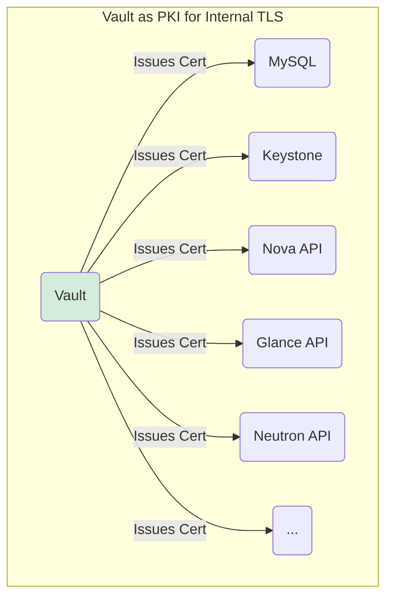

In the previous post, we successfully set up Juju, bootstrapped its controller onto machine `i44` via MaaS, and created our `openstack` model.

Juju is now ready and waiting to orchestrate our cloud deployment.

In this post, we'll deploy the essential "brain" of OpenStack – the core control plane services responsible for identity, databases, messaging, and managing compute, network, and image APIs.

## Strategy: LXD Containers & High Availability (HA)

Instead of deploying these control services directly onto bare metal machines, we'll leverage Linux Containers (LXD) managed by Juju. This provides lightweight isolation, efficient resource usage, and simplifies management. Juju will automatically create and manage these LXD containers on designated bare-metal machines provisioned by MaaS.

Based on our plan and commands:

* We first add the bare-metal machines `i45`, `i46`, `i47` (Machine IDs `5`, `6`, `7` in MaaS/Juju) to our `openstack` model. These will host the LXD containers.
    
* Many core services (Database, Message Queue, Compute Controller) will be deployed with multiple units (`-n 3`) across these machines (`--to lxd:5,lxd:6,lxd:7`) for High Availability (HA).
    
* We'll use Virtual IPs (VIPs) defined in our `config.yaml` (discussed in Part 2) so users and other services have a single, highly available endpoint to talk to, managed via the `hacluster` charm (often related implicitly).
    

```bash
# Make sure you're in the right Juju model
juju switch maas-controller:openstack

# Add the machines designated for control plane containers
# (These should be 'Ready' in MaaS with tag 'openstack-miscellaneous')
juju add-machine -n 3 --constraints tags="openstack-miscellaneous"
# Note the machine IDs assigned (e.g., 5, 6, 7)
```

## Foundation: HA Database & Message Queue

Almost all OpenStack services need a database and a message queue to communicate. We deploy these first.

1. **Database (MySQL InnoDB Cluster):** Provides data persistence.
    
    ```bash
    # Deploy 3 units across our 3 misc machines inside LXD
    juju deploy -n 3 --to lxd:5,lxd:6,lxd:7 --channel 8.0/stable mysql-innodb-cluster mysql-innodb-cluster
    # Note: We'd typically apply '--config mysql-config.yaml' here
    # containing the tuning options like pool size from our main config.yaml
    ```
    
2. **Message Queue (RabbitMQ):** Facilitates communication between services.
    
    ```bash
    # Deploy 3 units across our 3 misc machines inside LXD
    juju deploy -n 3 --to lxd:5,lxd:6,lxd:7 --channel 3.9/stable rabbitmq-server rabbitmq-server
    # Note: We'd typically apply '--config rabbitmq-config.yaml' here
    # containing clustering options from our main config.yaml
    ```
    

## Vault: Secrets Management & Internal PKI 🔑

Modern deployments require secure handling of passwords, keys, and especially TLS certificates for internal communication. Vault is our tool for this.

1. **Deploy Vault & Router:**
    
    ```bash
    # Deploy Vault itself into LXD on machine 5
    juju deploy --to lxd:5 --channel 1.8/stable vault vault
    # Deploy a MySQL router for Vault's backend storage (optional, depends on charm)
    juju deploy --channel 8.0/stable mysql-router vault-mysql-router
    ```
    
2. **Integrate Vault's Router:**
    
    ```bash
    juju integrate vault-mysql-router:db-router mysql-innodb-cluster:db-router
    # Relation for Vault's own data storage if needed by the charm
    juju integrate vault-mysql-router:shared-db vault:shared-db
    ```
    
3. **CRITICAL: Initialize & Unseal Vault (Manual Steps):** The Vault service starts in a *sealed* state for security. You MUST manually initialize and unseal it. **The keys and token generated here are extremely sensitive - store them securely! The examples below are for illustration ONLY.**
    
    * **Install Vault CLI (on your workstation/management node):** Bash
        
        ```bash
        sudo snap install vault
        ```
        
    * **Set Vault Address (Find Vault unit's IP using** `juju status vault`):
        
        ```bash
        # Replace <vault_unit_ip> with the actual IP shown in juju status
        export VAULT_ADDR="http://<vault_unit_ip>:8200"
        ```
        
    * **Initialize Vault:**
        
        ```bash
        vault operator init -key-shares=5 -key-threshold=3
        # !!! SAVE THE 5 UNSEAL KEYS AND THE INITIAL ROOT TOKEN SECURELY !!!
        # Example Output (YOURS WILL BE DIFFERENT):
        # Unseal Key 1: Nb8VLbPmNlqkKfWpojH9lJ2EccXuVS0ZBlHRD+LCF5Q9
        # ... (Keys 2-5) ...
        # Initial Root Token: s.tvHFWsbnDSCWBbbyN6A8Iolm
        ```
        
    * **Unseal Vault (using 3 of the 5 keys):**
        
        ```bash
        vault operator unseal <paste_unseal_key_1_here>
        vault operator unseal <paste_unseal_key_2_here>
        vault operator unseal <paste_unseal_key_3_here>
        ```
        
        *(Vault should now report itself as unsealed).*
        
    * **Authorize Juju Charm:** Juju needs permission to interact with Vault. Generate a temporary token and pass it to the charm:
        
        ```bash
        # Use the Initial Root Token you saved
        export VAULT_TOKEN="<paste_initial_root_token_here>"
        # Create a short-lived token for Juju
        vault token create -ttl=10m
        # Copy the 'token' value from the output (e.g., s.M8vYOcaz8PRrPSFqjO26RGPT)
        # Authorize the charm using the leader unit
        juju run vault/leader authorize-charm token="<paste_short_lived_token_here>"
        ```
        
4. **Configure Vault as Internal CA:** Now, tell Vault to generate a Root CA and integrate it with MySQL for TLS.
    
    ```bash
    juju run vault/leader generate-root-ca
    # Integrate Vault's PKI with MySQL cluster
    juju integrate mysql-innodb-cluster:certificates vault:certificates
    ```
    
    Vault will now be able to issue TLS certificates for secure internal communication between OpenStack services!
    



## Deploying Core APIs (Using Juju & Integrating)

Now we deploy the main OpenStack API services, integrating them with our foundation (DB, MQ, Vault) and each other. Each typically requires its own MySQL router instance managed by Juju.

1. **Keystone (Identity):** Authentication, authorization, service catalog.
    
    ```bash
    juju deploy --to lxd:6 --channel 2023.2/stable keystone keystone
    juju deploy --channel 8.0/stable mysql-router keystone-mysql-router
    juju integrate keystone-mysql-router:db-router mysql-innodb-cluster:db-router
    juju integrate keystone-mysql-router:shared-db keystone:shared-db
    juju integrate keystone:certificates vault:certificates
    ```
    
2. **Placement (Resource Tracking):** Tracks resource provider inventories.
    
    ```bash
    juju deploy --to lxd:7 --channel 2023.2/stable placement placement
    juju deploy --channel 8.0/stable mysql-router placement-mysql-router
    juju integrate placement-mysql-router:db-router mysql-innodb-cluster:db-router
    juju integrate placement-mysql-router:shared-db placement:shared-db
    juju integrate placement:identity-service keystone:identity-service
    juju integrate placement:certificates vault:certificates
    ```
    
3. **Glance (Image Service API):** Stores and serves VM images.
    
    ```bash
    juju deploy --to lxd:6 --channel 2023.2/stable glance glance
    juju deploy --channel 8.0/stable mysql-router glance-mysql-router
    juju integrate glance-mysql-router:db-router mysql-innodb-cluster:db-router
    juju integrate glance-mysql-router:shared-db glance:shared-db
    juju integrate glance:identity-service keystone:identity-service
    juju integrate glance:certificates vault:certificates
    # We'll integrate Glance with Ceph storage in Part 7
    ```
    
4. **Neutron (Network Service API):** Manages virtual networks.
    
    ```bash
    # We apply config using '--config neutron.yaml' containing VIP etc.
    juju deploy --to lxd:5 --channel 2023.2/stable --config neutron.yaml neutron-api
    juju deploy --channel 8.0/stable mysql-router neutron-api-mysql-router
    juju integrate neutron-api-mysql-router:db-router mysql-innodb-cluster:db-router
    juju integrate neutron-api-mysql-router:shared-db neutron-api:shared-db
    juju integrate neutron-api:identity-service keystone:identity-service
    juju integrate neutron-api:amqp rabbitmq-server:amqp
    juju integrate neutron-api:certificates vault:certificates
    # OVN plugin deployment and integrations deferred to Part 9
    ```
    
5. **Nova (Compute Service Controller):** Manages VM lifecycle (API and scheduler parts).
    
    ```bash
    # We apply config using '--config ncc.yaml' containing VIP etc.
    juju deploy -n 3 --to lxd:5,lxd:6,lxd:7 --channel 2023.2/stable --config ncc.yaml nova-cloud-controller
    juju deploy --channel 8.0/stable mysql-router ncc-mysql-router
    juju integrate ncc-mysql-router:db-router mysql-innodb-cluster:db-router
    juju integrate ncc-mysql-router:shared-db nova-cloud-controller:shared-db
    juju integrate nova-cloud-controller:identity-service keystone:identity-service
    juju integrate nova-cloud-controller:amqp rabbitmq-server:amqp
    juju integrate nova-cloud-controller:placement placement:placement # Integrate with Placement
    juju integrate nova-cloud-controller:neutron-api neutron-api:neutron-api
    juju integrate nova-cloud-controller:image-service glance:image-service # Needs Glance
    juju integrate nova-cloud-controller:certificates vault:certificates
    # Integration with nova-compute nodes deferred to Part 8
    # Integration with nova-cell-controller deferred to Part 9
    ```
    
6. **Horizon (Dashboard):** The Web UI.
    
    ```bash
    # We apply config using '--config horizon.yaml' containing VIP etc.
    juju deploy --to lxd:5 --channel 2023.2/stable --config openstack-dashboard.yaml openstack-dashboard
    juju deploy --channel 8.0/stable mysql-router dashboard-mysql-router
    juju integrate dashboard-mysql-router:db-router mysql-innodb-cluster:db-router
    juju integrate dashboard-mysql-router:shared-db openstack-dashboard:shared-db
    juju integrate openstack-dashboard:identity-service keystone:identity-service
    juju integrate openstack-dashboard:certificates vault:certificates
    ```
    
7. **Barbican (Secrets Management):** For storing secrets like TLS certs used by Octavia.
    
    ```bash
    juju deploy --to lxd:5 --channel 2023.2/stable barbican barbican
    juju deploy --channel 8.0/stable mysql-router barbican-mysql-router
    juju deploy --channel 2023.2/stable barbican-vault # Subordinate charm
    
    juju integrate barbican-mysql-router:db-router mysql-innodb-cluster:db-router
    juju integrate barbican-mysql-router:shared-db barbican:shared-db
    juju integrate barbican:certificates vault:certificates
    juju integrate barbican:identity-service keystone:identity-service
    juju integrate barbican:amqp rabbitmq-server:amqp
    juju integrate barbican-vault:secrets barbican:secrets
    juju integrate barbican-vault:secrets-storage vault:secrets
    ```
    
    *(Note: Deployment of Heat & Magnum from your config requires similar* `deploy` and `integrate` steps, omitted here for brevity but would follow the same pattern).
    

## Checking the Status

After running these commands, Juju works in the background. Check progress with:

```bash
juju status --relations
```

This command shows the deployed applications, their units, IP addresses, agent status, workload status, and the relations between them. Initially, some services might show as "blocked" or "waiting" if they depend on relations not yet established (like Cinder needing Ceph, or Neutron needing OVN fully configured). This is normal at this stage.

## Conclusion ✅

We've just deployed the core brain and nervous system of our OpenStack cloud!

Using Juju, we deployed highly available databases, message queues, identity services, APIs for compute, network, image management, the dashboard, secrets management, and set up Vault as our internal Certificate Authority, all primarily within isolated LXD containers.

We also tackled the essential manual steps for Vault initialization.

While not all relations are complete yet, the control plane foundation is laid. In Part 7, we'll deploy the powerful Ceph storage cluster using Juju, providing the resilient backend for our images and block storage.