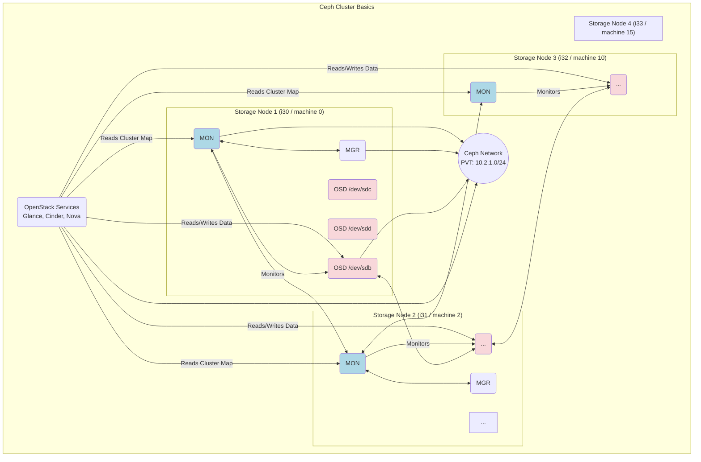
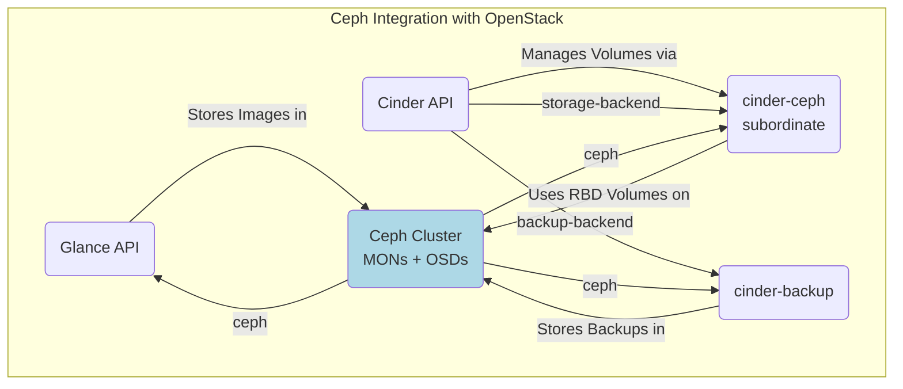

In Part 6, we successfully deployed the core OpenStack control plane services using Juju, including identity, databases, messaging, and API endpoints.

However, a cloud isn't much use without robust storage for VM images and persistent volumes.

It's time to build that foundation using **Ceph**, orchestrated by Juju.

## Why Ceph? The Software-Defined Storage Powerhouse 🐙

Ceph is a popular choice for OpenStack storage (and beyond) for several reasons:

* **Software-Defined:** It runs on commodity hardware (like our `os-storage` nodes `i30`\-`i33`), turning standard servers and disks into an intelligent, distributed storage system.
    
* **Scalable:** You can start with a few nodes and scale out capacity and performance simply by adding more servers/disks. Ceph automatically rebalances data.
    
* **Resilient:** It has no single point of failure. Data is automatically replicated (or erasure-coded) across multiple disks and nodes, and Ceph can self-heal by recovering data from failed drives/nodes onto remaining ones.
    
* **Unified:** Ceph can provide block storage (RBD - RADOS Block Device, for Cinder volumes), object storage (RGW - RADOS Gateway, S3/Swift compatible, for Glance images or general use - RGW deployed later), and file storage (CephFS).
    

Deploying and managing Ceph manually can be complex, but Juju and the Ceph charms make it dramatically simpler.

## Ceph Components Overview 🏗️

A Ceph cluster involves several key daemon types:

* **OSD (Object Storage Daemon):** The workhorse. One OSD runs for each physical disk dedicated to Ceph (in our case, `/dev/sdb`, `/dev/sdc`, `/dev/sdd` on each of the 4 storage nodes). They store data, handle replication, report health, etc.
    
* **MON (Monitor):** Maintains the crucial "cluster map" – the authoritative state of which OSDs are in the cluster, the data placement map (CRUSH map), and overall cluster health. MONs require quorum (a majority must be running), so an odd number (typically 3 or 5) is best practice. We are deploying 3.
    
* **MGR (Manager):** Provides helper services, including the Ceph Dashboard (a web UI for monitoring), REST APIs, and interfaces for monitoring tools like Prometheus. The `ceph-mon` charm we use typically includes/manages the MGR daemons as well.
    



*(Note: Diagram shows MONs/MGRs colocated with OSDs, fitting our deployment onto storage nodes).*

## Deploying Ceph with Juju 🚀

Let's deploy the OSDs (onto bare metal) and MONs (into LXD on the storage nodes).

1. **Deploy Ceph OSDs:** We target our 4 storage nodes (`i30`\-`i33`, tagged `openstack-storage`) and tell the charm which disks to use via configuration.
    
    ```bash
    # Ensure ceph-osd.yaml exists with osd-devices config
    # Example ceph-osd.yaml:
    # application: ceph-osd
    # options:
    #   osd-devices: /dev/sdb /dev/sdc /dev/sdd
    #   source: distro # Use Ubuntu's Ceph Quincy packages
    
    juju deploy -n 4 --channel quincy/stable --config ceph-osd.yaml \
        --constraints tags="openstack-storage" ceph-osd
    ```
    
    * Juju tells MaaS to allocate the 4 tagged machines.
        
    * MaaS deploys Ubuntu onto them.
        
    * Juju installs the `ceph-osd` charm, which then prepares the specified disks (`/dev/sdb`, `sdc`, `sdd`) and starts the OSD daemons.
        
2. **Deploy Ceph Monitors:** We deploy 3 MONs into LXD containers hosted on the first 3 storage nodes (machines `0`, `2`, `10`).
    
    ```bash
    # Ensure ceph-mon.yaml exists with monitor-count etc.
    # Example ceph-mon.yaml:
    # application: ceph-mon
    # options:
    #   monitor-count: 3
    #   # This tells MONs how many OSDs to initially wait for before declaring the cluster healthy.
    #   # Our 4 nodes * 3 disks/node = 12 OSDs total. Setting this accurately helps.
    #   # The value '3' from the user's config seems low, potentially just for initial cluster formation.
    #   # Let's assume the config file correctly sets it, maybe higher like 10 or 12.
    #   expected-osd-count: 12 # Or adjust based on your actual config value
    #   source: distro
    
    juju deploy -n 3 --to lxd:0,lxd:2,lxd:10 --channel quincy/stable \
        --config ceph-mon.yaml ceph-mon
    ```
    
    * Juju creates LXD containers on the specified bare-metal machines.
        
    * The `ceph-mon` charm installs Ceph Monitor and Manager daemons inside the containers.
        
    * The `monitor-count: 3` ensures Juju maintains quorum. The `expected-osd-count` influences when Ceph reports `HEALTH_OK` initially.
        
3. **Integrate MONs and OSDs:** Tell the Monitors and OSDs about each other to form the cluster.
    
    ```bash
    juju integrate ceph-mon:osd ceph-osd:mon
    ```
    
    * Juju facilitates the exchange of keys and configuration needed for them to communicate securely.
        

## Integrating Ceph with OpenStack Services 🔗

Now, let's connect our deployed Glance and Cinder services (from Part 6) to use this Ceph cluster.

1. **Glance Integration:** Tell Glance to use Ceph for storing VM images.
    
    ```bash
    juju integrate ceph-mon:client glance:ceph
    ```
    
    * The `ceph-mon` charm provides Ceph configuration details (monitor addresses, keys) to the `glance` charm, which configures its backend accordingly.
        
2. **Cinder Integration:** Tell Cinder to use Ceph RBD for providing block storage volumes.
    
    * **Deploy Cinder-Ceph Charm:** This subordinate charm modifies the main Cinder service.
        
        ```bash
        juju deploy --channel 2023.2/stable cinder-ceph
        ```
        
    * **Integrate:**
        
        ```bash
        # Connect cinder-ceph to the main cinder service
        juju integrate cinder-ceph:storage-backend cinder:storage-backend
        # Provide Ceph cluster details to cinder-ceph
        juju integrate cinder-ceph:ceph ceph-mon:client
        ```
        
    * Juju configures Cinder to use RBD as its storage backend.
        
3. **Cinder Backup Integration (Optional but Recommended):** Configure Cinder Backup to potentially store volume backups within Ceph itself.
    
    ```bash
    juju deploy cinder-backup --channel 2023.2/stable
    juju integrate cinder-backup:backup-backend cinder:backup-backend
    juju integrate cinder-backup:ceph ceph-mon:client
    ```
    



## Verifying Ceph Health ✅

After the integrations settle, check if the Ceph cluster is healthy. You can run Ceph commands via the `ceph-mon` leader unit:

```bash
# Run health check via Juju action (safer)
juju run ceph-mon/leader health detail

# Or SSH into a monitor unit and run directly (requires knowing unit name)
# juju ssh ceph-mon/0 'sudo ceph -s'
```

Look for `health: HEALTH_OK` (or `HEALTH_WARN` initially if OSD count is still low or data is rebalancing). You should see your MONs have quorum and the expected number of OSDs (12 in our case: 4 nodes \* 3 disks) listed as `up` and `in`.

## Conclusion 💪

We've successfully deployed a resilient, scalable Ceph storage cluster using Juju, leveraging our dedicated storage hardware.

Crucially, we integrated it with Glance and Cinder, providing the backend for VM images and persistent block volumes.

Juju automated the complex setup and integration, ensuring our OpenStack control plane services know how to use Ceph.

With storage in place, the next logical step is to deploy the compute nodes that will actually run the VMs using this infrastructure.

In Part 8, we'll deploy `nova-compute` using Juju and connect it to the rest of our cloud.