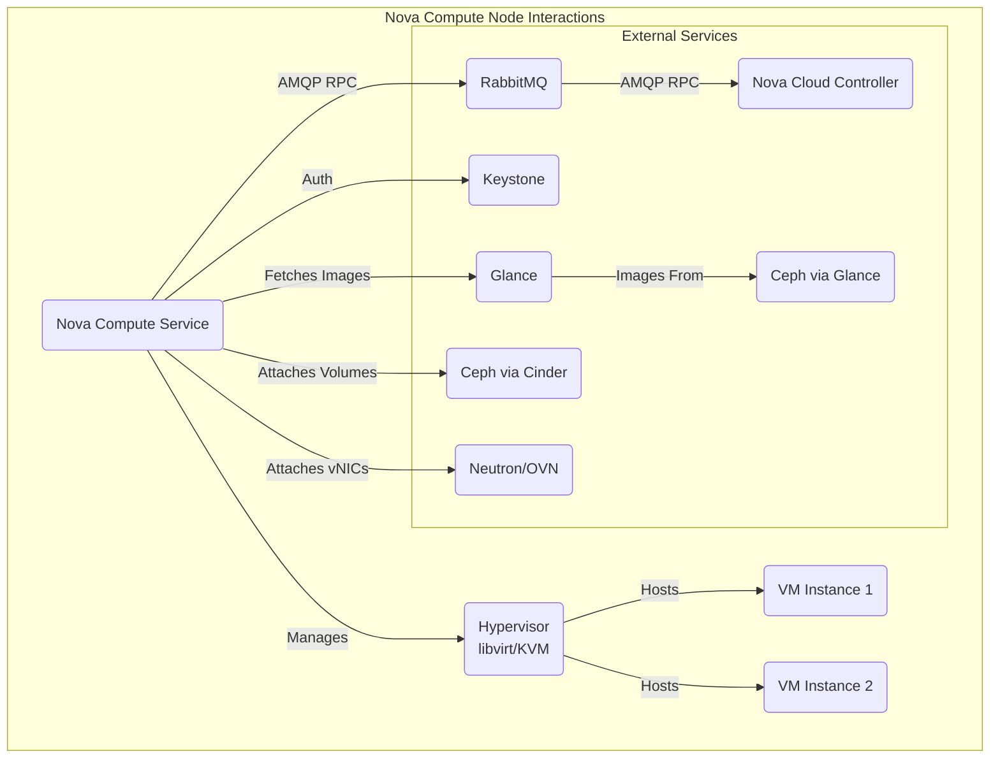

In Part 7, we established our robust Ceph storage backend, integrated with Glance for images and Cinder for volumes.

Now, we need the actual hypervisors – the nodes that will run our Virtual Machines (VMs). This is the role of the **Nova Compute** service in OpenStack.

## The Role of Nova Compute ⚙️

`nova-compute` is the service that runs on every physical server designated as a hypervisor in your OpenStack cloud. Its main responsibilities include:

* **Managing VM Lifecycle:** Starting, stopping, pausing, migrating, and terminating VMs on the host it manages.
    
* **Interfacing with Hypervisor:** Communicating with the underlying hypervisor software (typically KVM via libvirt) to perform VM operations.
    
* **Connecting Resources:** Attaching storage volumes (from Cinder/Ceph) and virtual network interfaces (managed by Neutron/OVN) to the VMs.
    
* **Reporting State:** Communicating with the central `nova-cloud-controller` (via RabbitMQ) to report the state of VMs and the hypervisor itself.
    

Essentially, `nova-compute` is the engine that brings your IaaS compute capabilities to life on each hypervisor node.



## Deployment with Juju 🚀

We'll deploy the `nova-compute` charm onto the bare-metal servers we designated as compute nodes (tagged `openstack-compute` in MaaS – this includes our large pool `i53`\-`i70` and potentially others like `i48`\-`i52` based on our architecture map). Juju handles requesting these machines from MaaS and installing/configuring the service.

1. **Deploy** `nova-compute` Charm: Your command list showed deploying 2 units initially, likely onto `i48`, `i49`. You can deploy to all nodes tagged `openstack-compute` at once, or start small and scale out later using `juju add-unit`. Let's show deploying 2 initially as per your commands, but targeting the general tag:
    
    ```bash
    # Ensure nova-compute.yaml exists with relevant config
    # Example nova-compute.yaml (subset of main config.yaml):
    # application: nova-compute
    # options:
    #   config-flags: default_ephemeral_format=ext4
    #   enable-resize: true
    #   enable-live-migration: true
    #   migration-auth-type: ssh
    #   virt-type: qemu ## CRITICAL - See discussion below!
    
    juju deploy -n 2 --constraints tags="openstack-compute" \
        --channel 2023.2/stable --config nova-compute.yaml nova-compute
    ```
    
    * `-n 2`: Deploy two initial units. Juju will ask MaaS for two available machines with the tag `openstack-compute`.
        
    * `--constraints tags="openstack-compute"`: Targets the right machines in MaaS.
        
    * `--config nova-compute.yaml`: Applies our specific settings.
        
2. **CRITICAL Config:** `virt-type` (KVM vs QEMU)! Our `config.yaml` (and thus `nova-compute.yaml`) specified `virt-type: qemu`. **This needs careful consideration.**
    
    * `kvm` (Kernel-based Virtual Machine): Uses hardware virtualization extensions (Intel VT-x / AMD-V, which we enabled in the BIOS in Part 4). This provides near native performance for VMs. **This is almost always what you want in production.**
        
    * `qemu`: Provides pure software emulation. It does *not* use hardware virtualization and results in **significantly slower** VM performance. It's typically only used for development, testing on hardware without virtualization support, or specific nested virtualization scenarios.
        
    
    **Recommendation:** Unless you have a very specific reason for `qemu`, **you should switch to** `kvm`. Assuming your hardware supports it (which most modern servers do), performance will be drastically better. You can change this *after* deployment using:
    
    ```bash
    # Check current setting
    juju config nova-compute virt-type
    
    # Change to KVM
    juju config nova-compute virt-type=kvm
    ```
    
    Verify the change takes effect by monitoring `juju status` and potentially checking libvirt configuration on the compute nodes later.
    

## Core Integrations for Compute Nodes 🔗

For `nova-compute` to function, it needs to connect to several other services we've already deployed. Juju makes this straightforward:

1. **Connect to Nova Controller:** Allows scheduling and management commands.
    
    ```bash
    juju integrate nova-cloud-controller:cloud-compute nova-compute:cloud-compute
    ```
    
2. **Connect to Message Queue:** For asynchronous communication.
    
    ```bash
    juju integrate rabbitmq-server:amqp nova-compute:amqp
    ```
    
3. **Connect to Identity Service:** For authentication/authorization. *(This is essential but was missing from the initial command list)*.
    
    ```bash
    juju integrate keystone:identity-credentials nova-compute:identity-credentials
    ```
    
4. **Connect to Image Service:** To fetch VM images from Glance (backed by Ceph).
    
    ```bash
    juju integrate glance:image-service nova-compute:image-service
    ```
    
5. **Connect to Ceph (via Glance relation & Cinder relation):**
    
    * Allow `nova-compute` direct read access to Ceph images managed by Glance:
        
        ```bash
        juju integrate ceph-mon:client nova-compute:ceph
        ```
        
    * Allow `nova-compute` access to attach Ceph RBD volumes managed by Cinder (via the `cinder-ceph` subordinate deployed in Part 7):
        
        ```bash
        juju integrate cinder-ceph:ceph-access nova-compute:ceph-access
        ```
        
6. **Connect to Vault (Optional but Recommended for TLS):** If internal endpoints are secured with TLS certificates from Vault.
    
    ```bash
    juju integrate vault:certificates nova-compute:certificates
    ```
    

*(Note: Integrations for Networking (*`ovn-chassis`) and Telemetry (`ceilometer-agent`) are essential but will be done in Parts 9 and 12 respectively, once those components are deployed/configured.)

## Verification ✅

Monitor `juju status nova-compute`. The units should transition from `waiting` to `active`. Once active:

* **Check Hypervisors in OpenStack:** Run via Juju on the `nova-cloud-controller`:
    
    ```bash
    # Find a leader unit first if needed: juju status nova-cloud-controller
    juju run nova-cloud-controller/leader 'openstack hypervisor list'
    ```
    
    You should see your newly added compute nodes listed with `State: up` and `Status: enabled`.
    
* **Check Service on Node:** You can SSH into a compute node via Juju to check the service status directly:
    
    ```bash
    # Replace nova-compute/0 with an actual unit name from 'juju status'
    juju ssh nova-compute/0 'systemctl status nova-compute.service'
    ```
    

## Conclusion ✨

Our cloud now has its muscle! We've deployed the `nova-compute` service onto our designated hypervisor nodes using Juju, configured it (critically reviewing the `virt-type`), and integrated it with the core control plane, image service, and storage backend. While networking integration is still pending, the foundation for running VMs is now firmly in place.

In Part 9, we'll tackle the crucial step of configuring the virtual networking layer using OVN, connecting everything together so our future VMs can actually communicate.