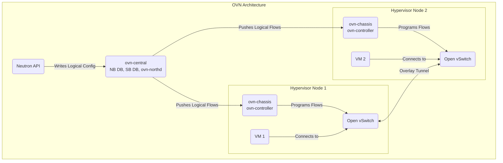

In Part 8, we deployed the `nova-compute` service, giving our cloud the ability to run VMs.

However, those compute nodes and the VMs they host are still effectively isolated. We need a robust and flexible networking layer to connect everything – allowing VMs to talk to each other, access storage, and reach the outside world.

This is where Neutron (OpenStack's networking service) and its powerful backend, OVN (Open Virtual Network), come in, orchestrated by Juju.

## Why SDN and OVN? 🤔

Traditional networking using only VLANs can become complex and limiting in a cloud environment, especially with many tenants needing isolated networks (the 4094 VLAN limit can be a real constraint!). Software-Defined Networking (SDN) offers a more scalable and automated approach:

* **Centralized Control:** Network logic is managed centrally, not on individual switches.
    
* **Automation:** Network creation and policy enforcement are driven by software (Neutron API).
    
* **Network Virtualization:** Creates virtual networks (often using overlay protocols like Geneve or VXLAN) that are independent of the underlying physical network fabric.
    

**OVN (Open Virtual Network)** is a mature, feature-rich SDN solution built on top of Open vSwitch (OVS). It's designed for cloud environments and integrates tightly with OpenStack Neutron, providing logical switches, routers, security groups, DHCP, and more.

## OVN Architecture Basics 🏗️

OVN has two main parts:

1. **Central Components (**`ovn-central` charm\*\*)\*\*:
    
    * **Northbound Database (NB DB):** Stores the desired logical network configuration (switches, routers, ACLs) as defined by Neutron.
        
    * **Southbound Database (SB DB):** Stores translated logical flows and physical network information.
        
    * `ovn-northd`: Translates the logical configuration from the NB DB into logical flows in the SB DB.
        
    * *Runs centrally*, typically in HA mode (on our `os-misc` nodes `5, 6, 7` in LXD).
        
2. **Chassis Components (**`ovn-chassis` charm\*\*)\*\*:
    
    * Runs on each **hypervisor** (`nova-compute` nodes) and any dedicated network gateways.
        
    * `ovn-controller`: Connects to the SB DB, retrieves relevant logical flows, and translates them into actual OpenFlow rules for the local Open vSwitch instance.
        
    * **Open vSwitch (**`ovs-vswitchd`, `ovsdb-server`): The virtual switch that handles packet forwarding based on the flows programmed by `ovn-controller`.
        



## 🧵 Adding `br-ex` to a MAAS-Managed Machine

In our previous discussions, we've set up the foundational network components for our OpenStack deployment.

However, a crucial element that enables external network access for instances is the `br-ex` bridge. Let's delve into how to configure this bridge on a machine managed by MAAS.

### Why `br-ex` Matters

The `br-ex` bridge serves as the gateway between your OpenStack environment and the external network. It's essential for facilitating floating IPs and ensuring that instances can communicate outside the private cloud.

### Configuring `br-ex` via the MAAS UI

1. **Navigate to the Machine's Network Interfaces:**
    
    * In the MAAS web interface, go to the **Machines** tab.
        
    * Select the machine you wish to configure.
        
    * Click on the **Network** tab to view its interfaces.
        
2. **Create the Open vSwitch Bridge:**
    
    * Identify the physical interface connected to your external network (e.g., `enp1s0`).
        
    * Click the checkbox next to this interface.
        
    * From the actions dropdown, select **Create bridge**.
        
    * In the dialog that appears:
        
        * Set the **Bridge name** to `br-ex`.
            
        * Choose **Open vSwitch** as the bridge type.
            
        * Ensure the selected interface is added to the bridge.
            
        * Configure IP settings as required (static or DHCP).
            
    * Click **Save interface** to apply the changes.
        
3. **Deploy the Machine:**
    
    * With the bridge configured, you can now deploy the machine.
        
    * MAAS will apply the network configuration during deployment.
        

*Note:* If you're using MAAS version 3.2 or later, the hardware sync feature ensures that manual network configurations are accurately reflected in the MAAS UI .

### Configuring `br-ex` via Netplan

For those who prefer manual configurations or need to script deployments, Netplan offers a straightforward method:

1. **Edit the Netplan Configuration:**
    
    * Locate the Netplan configuration file, typically found at `/etc/netplan/01-netcfg.yaml`.
        
2. **Define the Bridge Configuration:**
    
    ```yaml
    network:
      version: 2
      ethernets:
        enp1s0:
          dhcp4: no
      bridges:
        br-ex:
          interfaces: [enp1s0]
          dhcp4: yes
          parameters:
            stp: false
            forward-delay: 0
    ```
    
    * Replace `enp1s0` with the appropriate interface name if different.
        
    * Adjust `dhcp4` settings based on your network requirements.
        
3. **Apply the Configuration:**
    
    * Run `sudo netplan apply` to activate the new network settings.
        

*Note:* Ensure that the interface names match those recognized by your system. You can verify interface names using the `ip link` command.

### Verifying the Bridge

After configuration:

* Use `ip a` to confirm that `br-ex` has the expected IP address.
    
* Run `ovs-vsctl show` to verify that `br-ex` is correctly set up as an Open vSwitch bridge.
    

By integrating the `br-ex` bridge into your MAAS-managed machines, you establish the necessary pathway for external network access, completing the network setup for your OpenStack deployment.

## Deploying OVN with Juju 🛠️

Let's deploy the OVN components and integrate them with Neutron and Nova.

1. **Deploy OVN Central (HA):** Runs in LXD on our control plane nodes.
    
    ```bash
    juju deploy -n 3 --to lxd:5,lxd:6,lxd:7 --channel 23.09/stable ovn-central
    # Integrate with Vault for TLS certificates
    juju integrate ovn-central:certificates vault:certificates
    ```
    
2. **Deploy & Integrate Neutron OVN Plugin:** This subordinate charm links Neutron API to OVN.
    
    ```bash
    juju deploy --channel 2023.2/stable neutron-api-plugin-ovn
    # Integrate with Neutron API
    juju integrate neutron-api-plugin-ovn:neutron-plugin neutron-api:neutron-plugin-api-subordinate
    # Integrate with OVN Central database
    juju integrate neutron-api-plugin-ovn:ovsdb-cms ovn-central:ovsdb-cms
    ```
    
3. **Deploy & Configure OVN Chassis:** This subordinate runs on the hypervisors (alongside `nova-compute`) and manages the local Open vSwitch (OVS) instance to implement the virtual networks.
    
    ```bash
    # Deploy using config from neutron.yaml (contains bridge mappings)
    juju deploy --channel 23.09/stable --config neutron.yaml ovn-chassis
    ```
    
    **Connecting Virtual to Physical (Bridge Mappings):** A critical piece of configuration applied to `ovn-chassis` (via our `neutron.yaml` or main `config.yaml`) tells OVN how to connect the virtual network to your physical network (our PUB network) for things like Floating IPs and external access. We configure two key options:
    
    * `bridge-interface-mappings`: We set this to `br-ex:eno2`. This essentially links a specific physical network card on the compute node (`eno2` in our case) to an Open vSwitch bridge named `br-ex`.
        
    * `ovn-bridge-mappings`: We set this to `physnet1:br-ex`. This tells Neutron and OVN that the logical "provider network" (which we've named `physnet1`) should use the `br-ex` OVS bridge to reach the physical network.
        
    
    You don't need to create the `br-ex` OVS bridge manually.
    
    The `ovn-chassis` Juju charm (along with its dependencies) automatically handles installing Open vSwitch, creating the necessary bridges (`br-ex`, `br-int`), and connecting the specified physical NIC (`eno2`) based on this configuration.
    
    This ensures the crucial link between the virtual and physical networks is correctly established via Juju automation.
    
    **Integrate OVN Chassis:** Now, connect the chassis to the central components and the compute service:
    
    ```bash
    # Integrate chassis with OVN Central database
    juju integrate ovn-chassis:ovsdb ovn-central:ovsdb
    # Integrate chassis with Nova Compute (telling Nova how networking works)
    juju integrate ovn-chassis:nova-compute nova-compute:neutron-plugin
    # Integrate with Vault for TLS certificates
    juju integrate ovn-chassis:certificates vault:certificates
    ```
    
4. **Deploy Nova Cell Controller:** This component helps manage communication within a Nova compute cell, especially important for networking and other interactions. We deploy it HA in LXD containers.
    
    ```bash
    juju deploy -n 3 --to lxd:5,lxd:6,lxd:7 nova-cell-controller --channel 2023.2/stable
    juju deploy --channel 8.0/stable mysql-router nova-cell-controller-mysql-router
    
    # Integrate Nova Cell Controller
    juju integrate nova-cell-controller-mysql-router:db-router mysql-innodb-cluster:db-router
    juju integrate nova-cell-controller-mysql-router:shared-db nova-cell-controller:shared-db
    juju integrate nova-cloud-controller:nova-cell nova-cell-controller:nova-cell # Link to main controller
    juju integrate rabbitmq-server:amqp nova-cell-controller:amqp # Link to MQ
    juju integrate vault:certificates nova-cell-controller:certificates # Link to Vault
    juju integrate keystone:identity-credentials nova-cell-controller:identity-credentials
    juju integrate keystone:identity-service nova-cell-controller:identity-service
    juju integrate nova-compute:nova-cell nova-cell-controller:nova-cell # Link compute nodes
    ```
    
5. **Configure Neutron Provider Network:** Ensure Neutron API knows about `physnet1` which we mapped via `ovn-chassis`. This might already be set via the main `config.yaml`/`neutron.yaml` used during `neutron-api` deployment.
    
    ```bash
    # Verify or set the flat network provider config
    # juju config neutron-api flat-network-providers # Check current value
    juju config neutron-api flat-network-providers=physnet1
    # Also ensure other relevant Neutron ML2 settings are correct (port security, qos etc)
    # juju config neutron-api enable-ml2-port-security=true enable-qos=true
    ```
    

## Verification ✅

After the deployments and integrations settle (`juju status`), things should be connected.

* **Check OVN:**
    
    ```bash
    juju run ovn-central/leader 'ovn-sbctl show'
    # Look for Chassis entries corresponding to your compute nodes.
    ```
    
* **Check Neutron Agents:**
    
    ```bash
    juju run neutron-api/leader 'openstack network agent list'
    # You should see OVN related agents listed and 'UP'.
    ```
    

## Conclusion 🕸️

The virtual network fabric is now woven!

By deploying OVN Central, integrating it with Neutron via the plugin, and deploying OVN Chassis to our compute nodes (configured with the crucial bridge mappings, handled by the charm), we've established our SDN foundation. We also deployed the `nova-cell-controller` to facilitate communication.

Our compute nodes are now fully integrated participants in the virtual network, capable of hosting VMs that can communicate securely and potentially reach the external network via `physnet1`.

In Part 10, we'll enhance our network capabilities further by adding Load Balancer as a Service (Octavia) and DNS as a Service (Designate) using Juju.