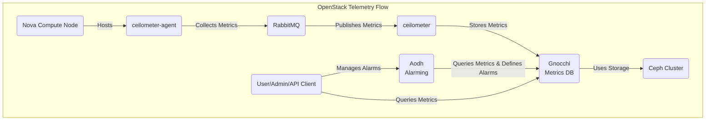
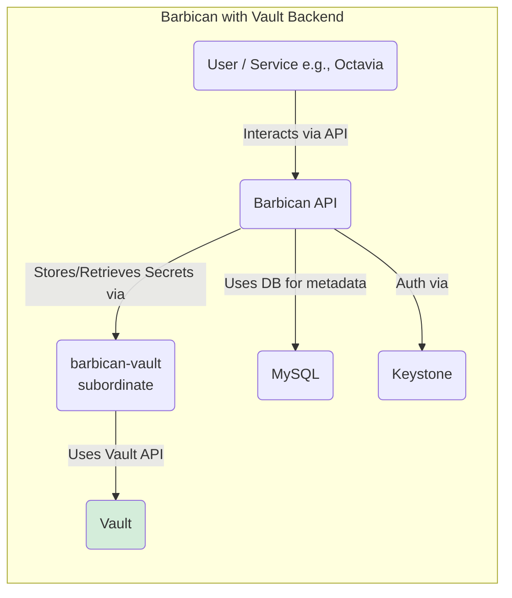

In Part 11, we successfully interacted with our newly built cloud via the Horizon dashboard, launching a VM and validating the core compute, storage, and networking functionality.

Our cloud *works*! But how do we know if it's *healthy*? How do we track resource usage? How are sensitive secrets managed?

This is where the OpenStack Telemetry stack and services like Barbican come in.

## Why Monitor Your Cloud? 👀

Operating a cloud without visibility is like flying blind. Monitoring and telemetry are essential for:

* **Performance Tracking:** Identify bottlenecks, understand resource utilization trends.
    
* **Capacity Planning:** Forecast future hardware needs based on actual usage.
    
* **Troubleshooting:** Quickly pinpoint issues by correlating events and metrics.
    
* **Billing/Showback:** Track resource consumption per project or user.
    
* **Automation:** Trigger actions (like scaling or alerts) based on specific metric thresholds.
    

## The OpenStack Telemetry Stack: Ceilometer, Gnocchi & Aodh 📊

OpenStack provides a suite of services working together for telemetry:

1. **Ceilometer:** The data collection service. It uses agents (`ceilometer-agent`) running on compute nodes (and potentially other places) to gather metrics (CPU usage, disk I/O, network traffic, etc.) and events. It typically pushes this data onto the RabbitMQ message bus.
    
2. **Gnocchi:** A specialized time-series database. It efficiently stores and indexes the vast amounts of metric data collected by Ceilometer, providing an API for querying this data. We configured Gnocchi to use our resilient Ceph cluster as its storage backend.
    
3. **Aodh:** The alarming service. It defines and evaluates rules against metrics stored in Gnocchi. When a rule's threshold is breached (e.g., CPU &gt; 90% for 5 minutes), Aodh triggers defined actions, such as sending notifications or potentially invoking other OpenStack services like Heat for auto-scaling.
    



## Deploying Telemetry with Juju ⚙️

Let's deploy these components using Juju, following the targets from our command list where available.

1. **Deploy Memcached (Gnocchi Dependency):**
    
    ```bash
    juju deploy --to lxd:6 memcached memcached
    ```
    
2. **Deploy Gnocchi (Metrics DB):**
    
    ```bash
    # Deploy Gnocchi API/Metricd services
    # '--config gnocchi.yaml' contains VIP etc.
    juju deploy --to lxd:5 --channel 2023.2/stable --config gnocchi.yaml gnocchi
    juju deploy --channel 8.0/stable mysql-router gnocchi-mysql-router
    
    # Integrate Gnocchi
    juju integrate gnocchi-mysql-router:db-router mysql-innodb-cluster:db-router
    juju integrate gnocchi-mysql-router:shared-db gnocchi:shared-db
    juju integrate gnocchi:identity-service keystone:identity-service
    juju integrate gnocchi:amqp rabbitmq-server:amqp
    juju integrate gnocchi:coordinator-memcached memcached:cache
    juju integrate gnocchi:certificates vault:certificates
    
    # Integrate with Ceph for metric storage backend
    juju integrate gnocchi:storage-ceph ceph-mon:client
    ```
    
3. **Deploy Aodh (Alarming):**
    
    ```bash
    # Deploy Aodh API/Evaluator/Notifier services
    # '--config aodh.yaml' contains VIP etc.
    juju deploy --to lxd:7 --channel 2023.2/stable --config aodh.yaml aodh
    juju deploy --channel 8.0/stable mysql-router aodh-mysql-router
    
    # Integrate Aodh
    juju integrate aodh-mysql-router:db-router mysql-innodb-cluster:db-router
    juju integrate aodh-mysql-router:shared-db aodh:shared-db
    juju integrate aodh:identity-service keystone:identity-service
    juju integrate aodh:amqp rabbitmq-server:amqp
    # Aodh implicitly uses Gnocchi via Keystone service catalog endpoint typically
    ```
    
4. **Deploy Ceilometer (Collection API/Notification Listener):**
    
    ```bash
    # Deploy Ceilometer API service
    # '--config ceilometer.yaml' contains VIP etc.
    juju deploy --to lxd:7 --channel 2023.2/stable --config ceilometer.yaml ceilometer
    
    # Integrate Ceilometer
    juju integrate ceilometer:certificates vault:certificates
    juju integrate ceilometer:metric-service gnocchi:metric-service # Link to Gnocchi
    juju integrate ceilometer:amqp rabbitmq-server:amqp
    juju integrate ceilometer:identity-service keystone:identity-service
    juju integrate ceilometer:identity-notifications keystone:identity-notifications # Listen for events
    juju integrate ceilometer keystone:identity-credentials # Allow auth
    ```
    
5. **Deploy Ceilometer Agent (Collectors):** Runs alongside `nova-compute`.
    
    ```bash
    juju deploy ceilometer-agent --channel 2023.2/stable
    
    # Integrate Agent
    juju integrate ceilometer-agent nova-compute # Deploy agent to compute nodes
    juju integrate ceilometer-agent:amqp rabbitmq-server:amqp
    
    # Link agent to API
    juju integrate ceilometer:ceilometer-service ceilometer-agent:ceilometer-service
    ```
    
6. **Run Ceilometer Database Migrations/Upgrades:** A necessary step after deployment/upgrades.
    
    ```bash
    juju run ceilometer/leader ceilometer-upgrade
    ```
    

## Watcher: Cloud Optimization Service (Briefly) 🤖

Watcher analyzes cloud usage (using data from Gnocchi) and provides recommendations or even triggers actions to optimize resource allocation (e.g., consolidating VMs onto fewer hosts during low load).

1. **Deployment:** *(Inferring command as it wasn't in the list)*
    
    ```bash
    # Deploy Watcher API/Engine services
    # Assume deployment to LXD on machine 7, apply config from watcher.yaml
    juju deploy --to lxd:7 --channel 2023.2/stable --config watcher.yaml watcher
    # Deploy MySQL Router if needed by charm (check charm docs)
    ```
    
2. **Configuration:** Ensure the `watcher.yaml` config specifies Gnocchi as the datasource and includes your desired planner weights (as shown in your `config.yaml`).
    
3. **Integrations:** (Inferring typical relations)
    
    ```bash
    # juju integrate watcher-mysql... # If needed
    juju integrate watcher:identity-service keystone:identity-service
    juju integrate watcher:amqp rabbitmq-server:amqp
    juju integrate watcher:compute-service nova-cloud-controller:compute-service # To interact with Nova
    # Gnocchi integration is often via config/service catalog lookup
    ```
    

## Revisiting Barbican: Secure Secrets Management 🔐

We deployed Barbican back in Part 6, integrated with Vault via the `barbican-vault` subordinate charm. Let's recap its role:

* **Purpose:** Barbican provides a secure API for storing and managing secrets like TLS keys/certificates, symmetric keys, and other sensitive data.
    
* **Importance:** Services like Octavia (for TLS termination on load balancers), Cinder (for volume encryption keys), and potentially users/apps need a central, secure place for secrets.
    
* **Vault Backend:** By integrating with Vault, we ensure Barbican's secrets are ultimately stored in our highly secure, initialized Vault instance, rather than just in the OpenStack database.
    



## Verification ✅

Check the status of the newly added telemetry and optimization services:

```bash
juju status gnocchi aodh ceilometer ceilometer-agent watcher barbican
```

You can also check the OpenStack service catalog for the new endpoints:

```bash
juju run keystone/leader 'openstack service list'
# Look for 'metric' (Gnocchi), 'alarming' (Aodh), 'key-manager' (Barbican) etc.
```

Querying metrics might take some time to populate, but you could try a basic Gnocchi check:

```bash
juju run gnocchi/leader 'openstack metric list'
```

## Conclusion 🔭

Our cloud is now equipped with a comprehensive telemetry stack (Ceilometer, Gnocchi, Aodh) providing vital monitoring and alarming capabilities, along with Watcher for potential optimization. We also revisited Barbican's role in securing secrets, backed by Vault.

This significantly enhances the operational visibility and maturity of our platform.

With the infrastructure, core services, networking, and monitoring in place, what's next?

In Part 13, we'll demonstrate the *real* payoff by deploying complex applications, like a Kubernetes cluster, onto our newly built OpenStack cloud using Juju.