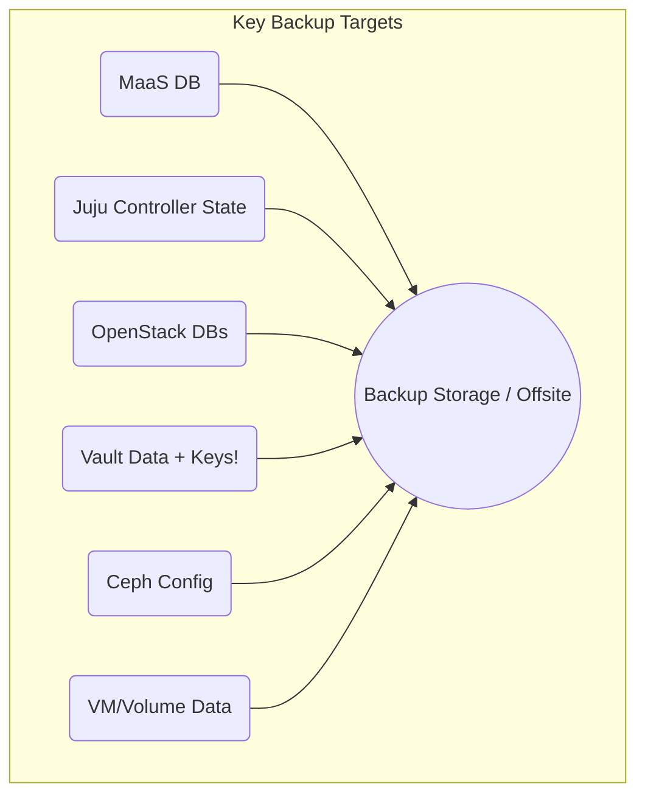

Welcome to the final installment of **"Metal to Cloud: Your On-Prem Journey with MaaS, OpenStack & Juju"**!

In Part 13, we saw the culmination of our efforts as we deployed applications like Kubernetes and WordPress onto the OpenStack cloud we built. But deploying the cloud ("Day 1") is just the beginning.

The real work, and where the value truly lies, is in the ongoing operation, maintenance, and evolution of the platform ("Day 2").

In this concluding post, we'll discuss essential Day 2 operations: monitoring, backups, scaling, and upgrades, highlighting how Juju continues to assist. We'll also recap our journey and suggest next steps.

## Keeping Your Cloud Healthy: Monitoring Approaches 🩺

Continuous monitoring is crucial for understanding performance, identifying issues, and planning capacity. We have several layers of monitoring in our setup:

1. **OpenStack Telemetry (Part 12 Recap):**
    
    * **Ceilometer, Gnocchi, Aodh:** Provide metrics and alarming specifically related to OpenStack resources and usage (VM CPU/disk/network, API calls, etc.). This is great for cloud-level insights and potentially triggering internal actions (like autoscaling via Heat if configured).
        
2. **External Monitoring (Zabbix):** Our architecture map included Zabbix (running on `i61`, possibly with agents elsewhere). Zabbix complements the OpenStack telemetry by monitoring the *underlying* infrastructure:
    
    * **Hardware:** Server health via IPMI/iDRAC (temperature, fans, power supplies).
        
    * **Host OS:** Physical node metrics (CPU, RAM, disk space, network IO on `i41`\-`i76`).
        
    * **Service Checks:** Basic reachability checks for critical endpoints (MaaS UI, OpenStack APIs via VIPs).
        
    * **Integration:** Consider sending critical Zabbix alerts to a central dashboard or notification system.
        
3. **Infrastructure Documentation (Netbox):** We also noted Netbox (on `i30`). While not strictly monitoring, it acts as our **Source of Truth** for infrastructure data: rack layouts, server models/serials, interface connections, IP address management (IPAM), VLANs. Keeping Netbox accurate provides essential context for troubleshooting and planning, complementing the dynamic information in MaaS and Juju.
    

A robust monitoring strategy combines insights from all these layers.

## Backup Strategies: Your Cloud's Safety Net 🛡️

**Backups are non-negotiable.** Hardware fails, software has bugs, humans make mistakes. Without reliable backups and tested restore procedures, your cloud (and its data) is at serious risk. Here's a breakdown of what needs backing up:

* **MaaS Database:** Contains *all* hardware inventory, network config, machine states. Losing this means MaaS forgets your hardware! Use standard PostgreSQL tools (`pg_dump`) to back up the `maasdb` database regularly. Store securely off-host.
    
* **Juju Controller State:** Holds all model information, application states, configurations, and relations. Use Juju's built-in backup command: `juju backup create`. Download the resulting archive and store it securely off the controller machine. Test restores periodically (to a non-production controller if possible).
    
* **OpenStack Databases (MySQL Cluster):** Stores critical state for Keystone, Nova, Glance, Cinder, Neutron, etc. Use standard MySQL backup tools (`mysqldump`, Percona XtraBackup) or cluster-aware snapshot mechanisms. Ensure backups are consistent across the cluster.
    
* **Vault:** **EXTREMELY CRITICAL.** Losing Vault data *and* the unseal keys/root token can make encrypted data permanently inaccessible. Follow Vault's official backup procedures for its storage backend (which might be its internal storage, Consul, or potentially even our MySQL cluster depending on the charm config). **Securely store unseal keys and the root token offline and in multiple locations.**
    
* **Ceph Cluster Configuration:** While Ceph *data* is resilient, backing up the cluster's configuration (monitor maps, `ceph.conf`, keys – often managed within `/etc/ceph` on MON nodes or retrievable via commands) is prudent for disaster recovery.
    
* **Tenant Data (VMs & Volumes):** Ultimately, the data *inside* tenant VMs and volumes is often the most critical. Strategies include:
    
    * **In-Guest Backups:** Traditional backup agents running inside VMs.
        
    * **Volume Snapshots:** Using Cinder snapshots (leveraging Ceph RBD snapshots). These are point-in-time and useful, but often best complemented by full backups.
        
    * **VM Snapshots:** Nova can snapshot VMs (may or may not include volumes depending on config).
        
    * **Dedicated Backup Solutions:** Tools like TrilioVault integrate with OpenStack APIs to provide comprehensive VM and volume backup/restore capabilities.
        

**Key Backup Principles:** Follow the 3-2-1 rule (3 copies, 2 different media, 1 offsite). Define RPO/RTO.

**TEST YOUR RESTORE PROCESS REGULARLY!**



## Scaling Your Cloud with Juju 📈

As demand grows, Juju makes scaling straightforward:

* **Adding Compute Nodes:**
    
    1. Rack new hardware.
        
    2. Configure BMC/BIOS, cable it (including MNT network).
        
    3. Commission the server in MaaS (Part 4), assigning the `openstack-compute` tag.
        
    4. Tell Juju to deploy another `nova-compute` unit, constraining it to the appropriate tag: Bash
        
        ```bash
        # Example: Add one more compute node
        juju add-unit nova-compute --constraints tags=openstack-compute
        ```
        
        Juju automatically handles requesting the machine from MaaS, deploying the OS (if needed), installing the charm, and configuring all necessary integrations (MQ, Keystone, Ceph, OVN, etc.).
        
* **Scaling Control Plane Services (if charm supports HA):**
    
    ```bash
    # Example: Scale Keystone from 2 units to 3 (if supported)
    # juju scale-application keystone --units 3
    ```
    

## Upgrading the Stack with Juju ⬆️

Upgrades are another area where Juju shines, automating complex workflows.

* **Charm Upgrades:** Update the charm's operational logic or a minor application version.
    
    ```bash
    # Check available upgrades for a charm
    # juju status --format=yaml | grep <charm_name> -A 10 # Look for 'channel'
    
    # Upgrade to a different channel (e.g., from stable to edge, or newer track)
    juju upgrade-charm <application_name> --channel <new_channel>
    
    # Or refresh to the latest revision in the current channel
    juju refresh <application_name>
    ```
    
    Juju typically performs rolling upgrades across units where possible.
    
* **OpenStack Release Upgrades:** These are major undertakings (e.g., upgrading from `2023.2` based charms to `2024.1`). They involve upgrading multiple charms across the model in a **specific, documented sequence**. Always follow the official Charmed OpenStack upgrade documentation for your target release *meticulously*. Juju upgrade mechanisms (`upgrade-charm`, specific Juju actions provided by charms) are used extensively in these procedures.
    

## Series Recap: From Metal to Cloud 🏁

Over these 14 posts, we've journeyed from planning to a fully operational private cloud:

1. **Why & What:** Understood the rationale for on-prem and our MaaS, OpenStack, Juju toolkit.
    
2. **Blueprint:** Planned hardware and designed our crucial segmented network.
    
3. **MaaS Install:** Set up the bare-metal provisioning foundation.
    
4. **MaaS Commissioning:** Brought physical servers under automated control.
    
5. **Juju Intro:** Set up the orchestrator and understood its model-driven approach.
    
6. **Core Control Plane:** Deployed essential HA services (DB, MQ, Keystone, APIs) & Vault using Juju/LXD.
    
7. **Ceph Storage:** Built a resilient storage backend with Juju.
    
8. **Compute Nodes:** Deployed hypervisors integrated with storage and control plane.
    
9. **OVN Networking:** Established the SDN fabric connecting compute nodes.
    
10. **Network Services:** Added LBaaS (Octavia), DNSaaS (Designate), and Object Storage (RGW).
    
11. **First Interaction:** Used Horizon to launch a VM, validating the end-to-end workflow.
    
12. **Monitoring & Secrets:** Deployed the telemetry stack and reviewed Barbican/Vault.
    
13. **Application Deployment:** Showcased Juju deploying Kubernetes and web apps *onto* our cloud.
    
14. **Day 2 Operations:** Discussed monitoring, backups, scaling, and upgrades (this post!).
    

We've seen how combining MaaS for hardware automation, OpenStack for the IaaS layer, and Juju for model-driven orchestration of both infrastructure and applications creates an incredibly powerful and manageable platform.

## Where To Go From Here? Further Learning 🚀

Our journey built a solid foundation, but the cloud world is vast! Consider exploring:

* **Security Hardening:** Implement stricter firewall policies, network policies (e.g., Calico if using K8s), enable TLS encryption everywhere, refine Keystone access controls, conduct vulnerability scanning.
    
* **Advanced High Availability:** Deeper dives into MySQL clustering, RabbitMQ tuning, load balancing API endpoints, Ceph resilience options.
    
* **Performance Tuning:** Optimize Ceph performance (CRUSH rules, cache tiering), Nova scheduler hints, network performance tuning (MTU, offloads).
    
* **More OpenStack Services:** Explore Manila (File Shares as a Service), advanced Octavia features, Heat (Orchestration) templates, Magnum (Container Orchestration Engine) details.
    
* **Community:** Engage with the MaaS, Juju, OpenStack, and Ceph communities – mailing lists, forums, IRC/Matrix – they are invaluable resources.
    

## Final Thoughts

Building and operating your own cloud is challenging but immensely rewarding.

Hopefully, documenting this journey has demystified the process and demonstrated the power of automation with tools like MaaS, Juju, and OpenStack.

Congratulations on reaching the end of this series!

Now, go forth and build! 🎉