## Introduction: Is Node.js Really Leaking Memory?

Have you ever noticed your Node.js app using more and more memory over time — even when it *seems* like nothing is wrong? You’re not alone.

Memory leaks and confusing garbage collection behavior often lead developers to believe Node.js is the problem. But in most cases, the real cause is subtle: a lingering reference, a never-cleared timer, or a quiet EventEmitter listener.

In this post, we’ll break down:

* How garbage collection works in Node.js
    
* What typically causes memory leaks
    
* How to detect and fix them with the right tools
    

## How Garbage Collection Works in Node.js (V8)

Node.js is powered by **Google’s V8 engine**, which has a highly optimized garbage collector.

This shows how **V8’s garbage collector** handles object lifecycles across its **young** and **old** generations.

```mermaid
graph TD
  A[New Object Created] --> B[Allocated in Young Generation]
  B --> C{Survives GC Cycle?}

  C -- No --> D[🧹 Collected]
  C -- Yes --> E[Promoted to Old Generation]

  E --> F{Still Reachable?}
  F -- No --> G[✅ Collected Later]
  F -- Yes --> H[♻️ Retained in Memory]
```



> Figure: Memory leaks happen when objects stay referenced unnecessarily

### Key Concepts:

* **Automatic memory management**: You don’t `free()` memory like in C or C++.
    
* **Reachability-based GC**: If an object is no longer reachable (via variables, closures, globals), it’s eligible for garbage collection.
    
* **Generational GC**:
    
    * **Young Generation**: Short-lived objects are collected quickly.
        
    * **Old Generation**: Long-lived objects (like cached data) are collected more slowly.
        

### Example:

```javascript
let user = { name: "Alice" };
user = null; // Now eligible for garbage collection
```

💡 Garbage collection only works when we let go of objects. If we *accidentally* hold references, the GC can’t help us.

## Common Causes of Memory Leaks in Node.js (And How to Fix Them)

## **Let’s Visualize Memory Leak Lifecycle in Node.js**

This diagram visualizes how **memory leaks** occur when objects stay "reachable" due to poor cleanup or design choices.

```mermaid
flowchart TD
  A[Object Created in App] --> B{Still Referenced?}

  B -- No --> C[✅ GC Reclaims Memory]
  B -- Yes --> D[♻️ Object Stays in Memory]

  D --> E{Why Still Referenced?}

  E --> F[Held by Global or Static Variable]
  E --> G[Captured in Closure]
  E --> H[Stored in Cache/Map]
  E --> I[Attached to EventEmitter]
  E --> J[Uncleared setInterval/setTimeout]

  F --> K[⚠️ Memory Leak Risk]
  G --> K
  H --> K
  I --> K
  J --> K

  K --> L[Memory Usage Grows Over Time]
```



> Figure: V8’s GC works in generations — long-lived objects live longer, but must still be released to be collected.

Even experienced developers can run into these:

### 1\. **Global or Static References**

**The problem:** Declaring large objects or caches on `global`, `module.exports`, or top-level scope that never get cleared.

```javascript
global.myCache = {}; // Stays alive for the life of the app
```

**✅ Solution:** Use **scoped caches** or implement **manual expiration** logic:

```javascript
const cache = new Map();

function storeWithTTL(key, value, ttl = 60000) {
  cache.set(key, value);
  setTimeout(() => cache.delete(key), ttl);
}
```

Or use `WeakMap` if the reference should be GC’d automatically when keys disappear:

```javascript
const weakCache = new WeakMap();
```

### 2\. **Growing Arrays or Maps Unbounded** Without Cleanup

**The problem:**  
Large in-memory collections that grow indefinitely with no cap.

```javascript
const cache = {};
function store(key, value) {
  cache[key] = value; // Grows forever if not cleaned up
}
```

**✅ Solution:** Limit memory usage with:

* **Size caps**
    
* **LRU strategies**
    
* **Eviction policies**
    

Example using `lru-cache`:

```javascript
jsCopyEditconst LRU = require('lru-cache');
const cache = new LRU({ max: 1000 }); // only stores 1000 items
```

### 3\. **EventEmitter Listeners** That Aren’t Removed

**The problem:** Listeners accumulate over time and are never removed, especially in dynamic contexts.

```javascript
emitter.on('data', () => {}); // Never removed
```

> Too many listeners can also trigger the "MaxListenersExceededWarning" error.

**✅ Solution:**

* Use `.once()` if only needed once
    
* Track and remove listeners when done
    
* Or use cleanup functions:
    

```javascript
function onData(data) { /* ... */ }
emitter.on('data', onData);

// Later...
emitter.removeListener('data', onData);
```

🧠 Bonus: Set `emitter.setMaxListeners(n)` to avoid warnings (but don't suppress blindly).

### 4\. **Closures That Hold Onto Big Objects**

**The problem:** Closures accidentally retain large objects by referencing them inside long-lived functions.

```javascript
function outer() {
  const bigData = { /* ...large object... */ };
  return function inner() {
    console.log(bigData); // Closure keeps bigData alive
  };
}
```

**✅ Solution:**

* Avoid capturing unnecessary data in closures
    
* Extract logic to use only what’s needed
    
* Consider functional patterns that limit lifespan
    

Example:

```javascript
function logField({ name }) {
  console.log(name); // Avoid referencing full object
}
```

### 5\. **Uncleared Intervals and Timeouts**

**The problem:** Timers keep running even after a request or component is done.

```javascript
setInterval(() => {
  // logic
}, 1000); // Will run forever unless cleared
```

**✅ Solution:** Always store the ID and clear it during teardown:

```javascript
const intervalId = setInterval(doStuff, 1000);

// On shutdown or cleanup
clearInterval(intervalId);
```

For long-running servers, clean up inside lifecycle events:

```javascript
server.on('close', () => clearInterval(intervalId));
```

## How to Detect and Debug Memory Leaks

### 1\. **Using** `process.memoryUsage()`

Quick way to track memory usage:

```javascript
console.log(process.memoryUsage());
```

* `rss`: Total memory allocated for the process
    
* `heapUsed`: Actual memory used by JS objects
    
* `heapTotal`: Total allocated heap
    

### 2\. **Using Chrome DevTools + Heap Snapshots**

1. Run your app with:  
    `node --inspect server.js`
    
2. Open Chrome → `chrome://inspect`
    
3. Take snapshots over time and **compare retained objects**
    

### 3\. **Use** `clinic.js`, `heapdump`, or `memwatch-next`

These tools can help visualize memory growth and locate leaks:

* [`clinic.js`](https://clinicjs.org/)
    
* `heapdump`: Generates heap snapshots from running processes
    
* `memwatch-next`: Emits events on memory leaks
    

## How to Prevent Memory Leaks in Node.js

Use this checklist to stay clean:

* ✅ Avoid storing large data in global or static variables
    
* ✅ Remove event listeners when done: `emitter.removeListener()`
    
* ✅ Clear timeouts and intervals in `onClose`, `onExit`, or `finally` blocks
    
* ✅ Use `WeakMap` or `WeakSet` for objects that should not prevent GC
    
* ✅ Monitor memory regularly (especially for long-running services)
    

## Node.js Isn't the Problem — It's the Patterns

Node.js and V8 do a great job at memory management — *when we write code that plays nice with GC*.

If you’re:

* Holding on to data forever
    
* Not cleaning up listeners
    
* Growing caches unbounded
    

…you’re unintentionally *preventing* the GC from doing its job. The goal isn’t to fight the GC, but to **write code that makes garbage collection easy**.

## Conclusion: Own Your Memory

Memory leaks are a natural challenge in long-running Node.js applications — but they’re entirely avoidable.

**Takeaways:**

* Understand how V8's GC works
    
* Know where leaks come from
    
* Use the right tools to monitor and fix them
    

Start by adding `process.memoryUsage()` to your logs. Take snapshots. Watch for growth. And clean up what you don’t need.

> The best memory leak is the one you prevent from ever happening.

## 📣 Want More?

Up next: we’ll explore real-world memory debugging with `clinic.js` and how to use `heap snapshots` to find hidden object references.