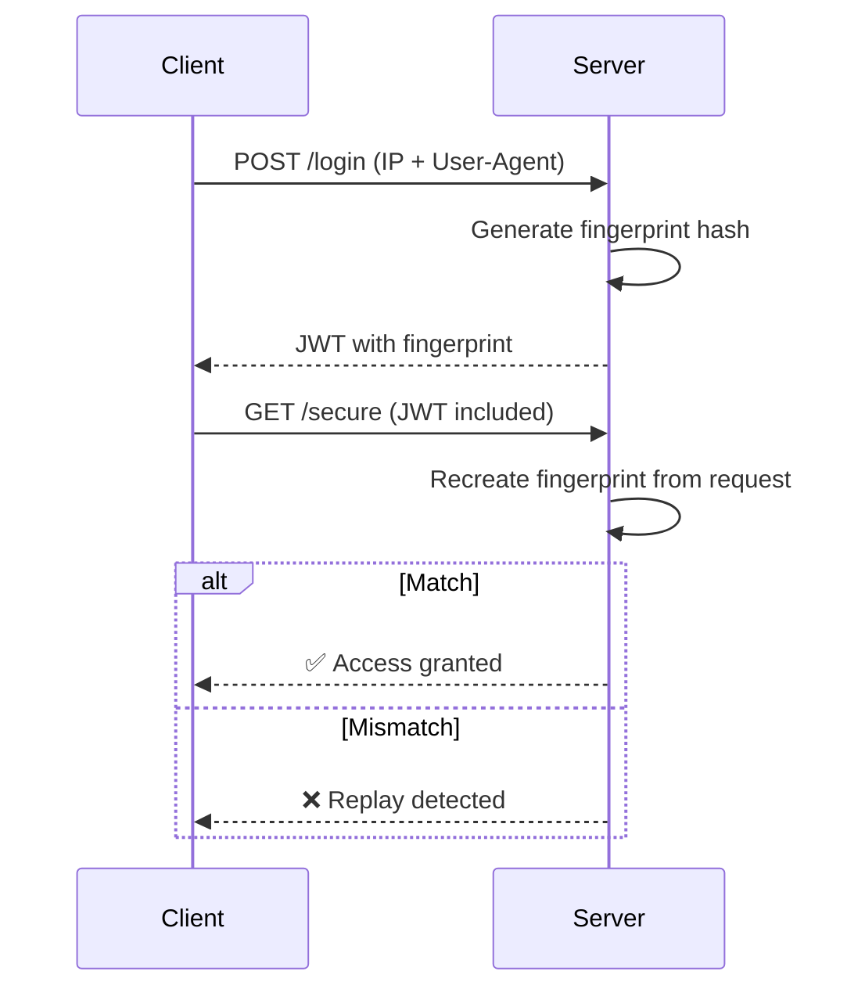

In this post, we’ll explore what replay attacks are, how JWS and JWE differ, and how to generate + validate session fingerprints using Node.js to stop these attacks in real-time.

## What is a Replay Attack?

A **replay attack** occurs when an attacker **captures a valid token** and **reuses it** to impersonate a user, even though the token is technically still valid and signed.

### Real-World Example:

1. User logs in and receives a JWT
    
2. Attacker steals the token (via XSS, insecure storage, etc.)
    
3. Attacker replays the token from a different browser, device, or network
    
4. Server trusts the token — because the signature is valid!
    

## JWS vs JWE: What's the Difference?

| **Spec** | **Purpose** | **Protects** | **Can Prevent Replay?** |
| --- | --- | --- | --- |
| **JWS** (JSON Web Signature) | Verifies authenticity | Integrity (not confidentiality) | ❌ No |
| **JWE** (JSON Web Encryption) | Encrypts content | Confidentiality & integrity | ❌ No |

### Key Insight:

* **JWS** prevents tampering, not reuse.
    
* **JWE** protects payload visibility, but replay is still possible if the attacker has the token.
    

Replay protection needs to come from **external context** like **where** the token is used (IP, device, session).

## Strategy: Fingerprint the Request

We can bind tokens to users more securely by:

* Capturing unique request traits (like **IP** and **User-Agent**)
    
* Creating a **SHA-256 fingerprint**
    
* Embedding that fingerprint into the JWT during issuance
    
* Validating the fingerprint with every incoming request
    

## Node.js App: Generating and Validating Fingerprints

### Dependencies

```bash
npm install express jsonwebtoken crypto
```

### App Code

```javascript
const express = require('express');
const jwt = require('jsonwebtoken');
const crypto = require('crypto');

const app = express();
app.use(express.json());

const SECRET = 'super_secret_key';
const TOKEN_EXPIRY = '5m';

// Generate fingerprint from IP + User-Agent
function generateFingerprint(req) {
  const ip = req.headers['x-forwarded-for'] || req.socket.remoteAddress;
  const userAgent = req.headers['user-agent'] || '';
  const raw = `${ip}:${userAgent}`;
  return crypto.createHash('sha256').update(raw).digest('hex');
}

// Login endpoint
app.post('/login', (req, res) => {
  const fingerprint = generateFingerprint(req);

  const payload = {
    sub: 'user123',
    fp: fingerprint, // Embed fingerprint in token
  };

  const token = jwt.sign(payload, SECRET, { expiresIn: TOKEN_EXPIRY });
  res.json({ token });
});

// Protected route
app.get('/secure', (req, res) => {
  const authHeader = req.headers['authorization'];
  const token = authHeader?.split(' ')[1];

  if (!token) return res.status(401).json({ error: 'No token provided' });

  try {
    const decoded = jwt.verify(token, SECRET);
    const requestFp = generateFingerprint(req);

    if (decoded.fp !== requestFp) {
      return res.status(403).json({ error: 'Replay attack detected (fingerprint mismatch)' });
    }

    res.json({ message: 'Secure access granted', user: decoded.sub });
  } catch (err) {
    res.status(401).json({ error: 'Invalid or expired token' });
  }
});

app.listen(3000, () => {
  console.log('Server running on http://localhost:3000');
});
```

## Breakdown

| 🔧 Component | 📋 Explanation |
| --- | --- |
| **Fingerprint** | Combines IP + User-Agent and hashes it |
| **Login route** | Generates fingerprint and embeds it in JWT |
| **Secure route** | Recomputes fingerprint and compares it with token's `fp` field |
| **Mismatch** | Request is blocked — possible token misuse detected |

## Replay Protection Flow



## Best Practices for Production

| **Practice** | **Why It Helps** |
| --- | --- |
| Use `https` everywhere | Prevents sniffing tokens via network |
| Store refresh tokens in `HttpOnly` cookies | Prevents token theft via XSS |
| Add `jti` to track usage or blacklist tokens | Enables invalidation control |
| Use short `access` token lifetimes (e.g., 5 min) | Reduces reuse window |
| Use fingerprint checks only for **sensitive endpoints** | Don’t break valid multi-device access |

## Summary

JWTs solve authentication — but not everything. To **prevent replay attacks**, you need to:

* Bind tokens to a **fingerprint**
    
* Validate that fingerprint on every sensitive action
    
* Combine with best practices like token rotation, refresh flows, and session handling
    

> A signed token isn’t enough. Make sure it’s also being used by the right device, under the right conditions.

## Call to Action

Have you implemented fingerprinting or anti-replay measures in your own apps? Got a war story or tip?  
Let’s talk in the comments 👇