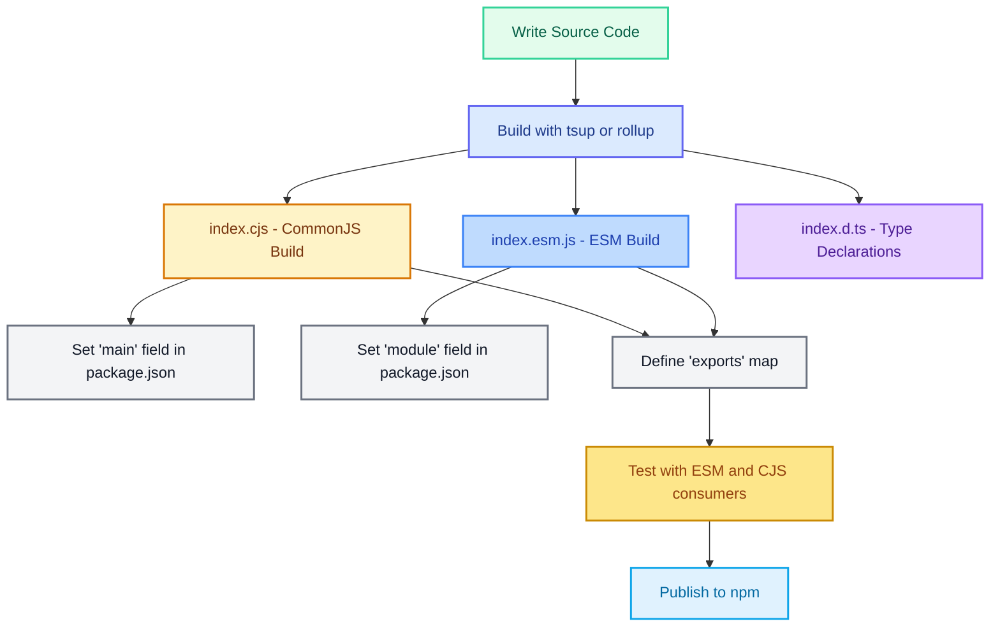

*This blog gives us —-- pending!*

## Why Packaging Still Breaks in 2025?

Despite being two decades into Node.js, **publishing a library that works across CommonJS (CJS), ECMAScript Modules (ESM), TypeScript, and bundlers is still confusing**.

Why? Because:

* Node.js evolved from CJS to ESM gradually
    
* Bundlers (Vite, Webpack, Rollup) behave differently
    
* Developers mix TS, `.mjs`, `.cjs`, and `.js` in weird ways
    
* Package consumers have wildly different expectations
    

So let’s break it down - cleanly and practically - to ship libraries that don’t break.

## CommonJS vs ESM: Know the Difference

| **Feature** | **CommonJS** | **ECMAScript Modules (ESM)** |
| --- | --- | --- |
| Import syntax | `require()` | `import` / `export` |
| Export syntax | `module.exports` / `exports` | `export default` / `export` |
| File extension | `.js` (default) | `.mjs` or `"type": "module"` |
| Synchronous | Yes | No (top-level `await` allowed) |
| Used in | Legacy Node.js, most tooling | Modern projects, Deno, browser-native |

**Interop Problems**:

* ESM can't `require()` CJS modules directly if they use `module.exports`
    
* CJS can't use `import` unless you compile it
    
* Some bundlers resolve `"main"` and `"module"` fields inconsistently
    

## package.json Fields That Matter

Your `package.json` tells the outside world **how to load your code**. Here's what matters:

```json
{
  "name": "my-lib",
  "main": "dist/index.cjs",      // CommonJS entry
  "module": "dist/index.esm.js", // ESM entry for bundlers
  "exports": {
    ".": {
      "require": "./dist/index.cjs",
      "import": "./dist/index.esm.js"
    }
  },
  "types": "dist/index.d.ts"
}
```

### Field Breakdown:

* `"main"`: default for Node (CommonJS)
    
* `"module"`: used by bundlers like Rollup, Vite (ESM)
    
* `"exports"`: modern standard to declare per-import conditions
    
* `"types"`: entry point for TypeScript declarations
    

## Dual Publishing: Support CJS + ESM

If you want your library to work in **both ecosystems**, publish both builds.

### 📂 Example:

```bash
/dist
  ├── index.cjs      ← CommonJS
  ├── index.esm.js   ← ES Module
  ├── index.d.ts     ← TypeScript types
```

Use a bundler like `tsup`, `rollup`, or `unbuild` to output both formats cleanly:

```bash
tsup src/index.ts --format cjs,esm --dts
```

## Should You Pre-Bundle?

✅ Pre-bundling is helpful when:

* You ship multiple files
    
* You use dependencies that might break interop
    
* You want fast cold-starts or browser builds
    

❌ Don’t pre-bundle if:

* Your library is dead simple (1 file)
    
* You want tree-shaking to be fully consumer-controlled
    

👉 If unsure, use [tsup](https://tsup.egoist.dev/) — it’s fast, ESM-aware, and minimal config.

## Testing Your Package as a Consumer

Test it **as your users would**:

* Import into ESM-only projects
    
* Require from legacy CommonJS
    
* Build with `vite`, `webpack`, `rollup`, and even `node --experimental-loader`
    

Use real-world tools like:

```bash
npm init vite@latest
npm i your-lib
# Try importing and running
```

## Common Pitfalls

* ❌ Top-level `await` in ESM without proper Node flag
    
* ❌ Missing `"exports"` field breaks bundlers
    
* ❌ Default exports in CJS confuse ESM importers
    
* ❌ Mixing `.js`, `.ts`, `.mjs`, `.cjs` without clear build strategy
    

## Bonus: When to Use `.cjs` and `.mjs`

If your `package.json` does **not** specify `"type": "module"`:

* Use `.cjs` for CommonJS
    
* Use `.mjs` for ESM
    

If it **does** specify:

```json
"type": "module"
```

Then:

* Use `.js` for ESM
    
* Use `.cjs` for legacy interop (only when needed)
    

## Packaging Workflow



## Summary: Ship Libraries That Just Work

| **What to do** | **Why it matters** |
| --- | --- |
| Build both CJS + ESM | Maximum compatibility |
| Use `exports` in `package.json` | Precise interop, future-proofing |
| Include `.d.ts` types | TypeScript + IntelliSense friendly |
| Test across environments | No surprises for consumers |

## Want Examples or a Minimal Boilerplate?

I’ve skipped code/config samples here intentionally.

**Got questions or stuck on a setup?** Drop them in the comments — happy to help with real-world fixes.