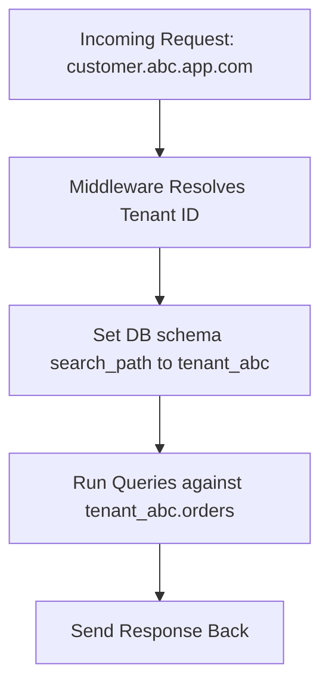

In the world of SaaS, designing for scale starts with multi-tenancy done right.

## Why Multi-Tenant Architecture Matters

SaaS is all about shared infrastructure. Whether you’re serving 5 customers or 5,000, you need to:

* Isolate customer data securely
    
* Scale efficiently without ballooning costs
    
* Keep deployments sane
    

Multi-tenancy lets you do all of that - *when designed correctly*.

## Multi-Tenancy Models: Which One?

| **Model** | **Description** | **Pros** | **Cons** |
| --- | --- | --- | --- |
| **Shared DB, Shared Tables** | All tenants share the same schema | Easiest to manage | Risk of accidental leakage, hard to scale |
| **Shared DB, Separate Schemas** | One DB, one schema per tenant | Good balance of isolation and performance | Slightly more infra overhead |
| **Separate DB per Tenant** | One DB per tenant | Max isolation and flexibility | Complex infra, costly at scale |

**We’ll focus on schema-based multi-tenancy**, it’s a sweet spot for SaaS products targeting SMBs to mid-market.

## PostgreSQL Multi-Tenancy Strategy

### Schema-Per-Tenant

Each customer gets their own schema:

```pgsql
public.users        → shared
tenant_abc.orders   → tenant-specific
tenant_xyz.orders   → tenant-specific
```

### Security with RLS

Use **Row-Level Security (RLS)** in public/shared tables:

```pgsql
CREATE POLICY tenant_isolation
  ON public.users
  USING (tenant_id = current_setting('app.current_tenant'));
```

And set this in every DB connection via middleware:

```pgsql
SET app.current_tenant = 'tenant_abc';
```

### Connection Pooling Tips —

* Use **pgbouncer** in transaction pooling mode
    
* For AWS, consider **RDS Proxy** with connection pinning (for long sessions)
    

## Backend Design with Node.js

### Middleware-Based Tenant Resolution

```javascript
app.use((req, res, next) => {
  const subdomain = req.hostname.split('.')[0];
  req.tenantId = resolveTenant(subdomain); // resolve to `tenant_abc`
  next();
});
```

### Request-Scoped DB Access

Using a `dbForTenant(tenantId)` helper to inject the right connection:

```javascript
const db = dbForTenant(req.tenantId);
const orders = await db('orders').select('*');
```

Or with ORMs like Prisma or MikroORM:

* Generate client instances dynamically
    
* Use schema switch or connection pool keying
    

## Infra & Operational Considerations

* **Migrations per schema** using tools like [node-pg-migrate](https://github.com/salsita/node-pg-migrate)
    
* **Backup strategies** to snapshot all schemas
    
* **Rate limiting** by tenant key
    
* **Audit logging** per tenant using middleware hooks
    

## End-to-End Flow



## Real-World Lessons

* Avoid hardcoding tenant logic — use context-injected data
    
* Monitor schema bloat over time
    
* Start with fewer shared tables — easier to migrate than split later
    
* Automate tenant provisioning (create schema + seed data)
    

## Conclusion

Multi-tenancy isn’t a feature, it’s a *foundation*.

With PostgreSQL schemas and clean Node.js abstractions, you can scale from one tenant to thousands *without rewriting your stack*.

### Got questions about your SaaS backend?

Drop a comment or DM me.

Always happy to help troubleshoot, scale, or design multi-tenant platforms with you.