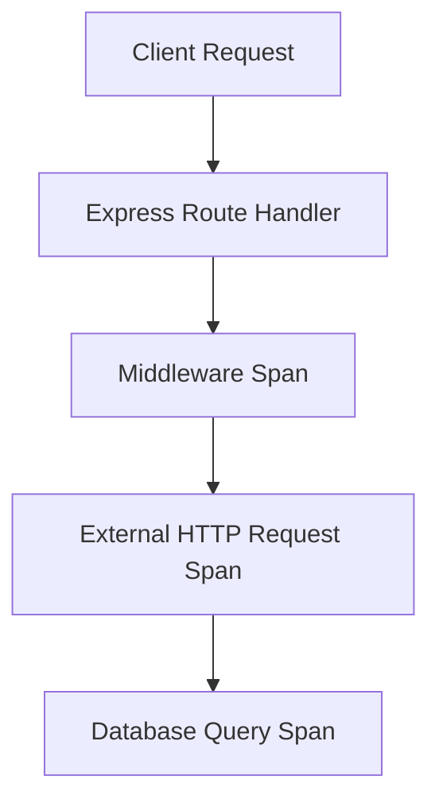

**Observability isn't just about logs anymore.**

In 2025, understanding how your API *behaves* under load, in production, across services is critical.

That’s where **OpenTelemetry** shines.

* Unified logs, traces, and metrics
    
* Framework-agnostic setup
    
* Vendor-neutral exporting (Prometheus, Jaeger, Datadog...)
    

## Why Observability Matters

Your API might return a 200 OK. But is it slow? Is it retrying upstream services? Did something silently fail inside a nested call? Observability helps answer these questions.

Unlike simple logging or error tracking, observability enables a *holistic understanding* of your system's behavior, across multiple dimensions:

* **Logs**: Human-readable event history
    
* **Traces**: Distributed timing across systems
    
* **Metrics**: Numeric signals to track system health
    

## Introducing OpenTelemetry

[OpenTelemetry](https://opentelemetry.io/) is an open standard for collecting telemetry data (logs, traces, metrics) from your application, and exporting them to any backend (e.g. Jaeger, Prometheus, New Relic, AWS X-Ray).

It’s supported across all major languages, and backed by CNCF.

## Core Concepts

* **Tracer**: Creates spans (units of work) with timing context
    
* **Span**: A single operation with a start & end time, metadata, and optional parent span
    
* **Context Propagation**: Tracks request across services
    
* **Exporter**: Sends data to backends
    

## Setup OpenTelemetry in Node.js

### 1\. Install Required Packages

```bash
npm install @opentelemetry/api \
  @opentelemetry/sdk-node \
  @opentelemetry/instrumentation-http \
  @opentelemetry/instrumentation-express \
  @opentelemetry/exporter-trace-otlp-http
```

### 2\. Configure SDK

```javascript
// tracing.js
const { NodeSDK } = require('@opentelemetry/sdk-node');
const { OTLPTraceExporter } = require('@opentelemetry/exporter-trace-otlp-http');
const { ExpressInstrumentation } = require('@opentelemetry/instrumentation-express');
const { HttpInstrumentation } = require('@opentelemetry/instrumentation-http');

const sdk = new NodeSDK({
  traceExporter: new OTLPTraceExporter({
    url: 'http://localhost:4318/v1/traces',
  }),
  instrumentations: [new HttpInstrumentation(), new ExpressInstrumentation()],
});

sdk.start();
```

### 3\. Start Tracing Early

```javascript
// index.js
require('./tracing');

const express = require('express');
const app = express();

app.get('/hello', (req, res) => {
  res.send('Hello, observability!');
});

app.listen(3000);
```

## Visualizing Traces



Each span can include custom metadata (e.g. `user.id`, `status`, `retryCount`).

## Exporting to a Backend

* Use **Jaeger** or **Tempo** for tracing
    
* **Prometheus + Grafana** for metrics
    
* Combine logs via **OTel Log API** or sidecars
    

You can also stream all to observability platforms like:

* Grafana Cloud
    
* Honeycomb
    
* Datadog
    
* AWS X-Ray / CloudWatch
    

## Pro Tips

* Sample aggressively in dev, reduce volume in prod
    
* Use semantic conventions (`http.route`, `db.statement`, etc.)
    
* Avoid sensitive data in span attributes
    
* Always isolate observability config (e.g. `tracing.js`)
    
* Propagate context in HTTP headers for distributed systems
    

## Conclusion

OpenTelemetry gives you the power to see into your API's behavior without vendor lock-in. Whether you're debugging latency or investigating failed requests, logs alone aren't enough.

Start with tracing, and evolve into full observability.