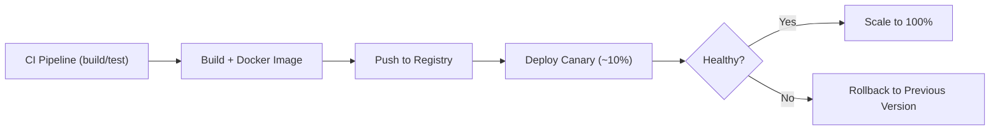

> “It’s 3 AM. The system’s live. You push an update and suddenly traffic falls off a cliff.”
> 
>   
> That’s the moment teams stop being heroes. Zero-downtime deployments let you ride out updates in production—*without the drama*.

This post gives you actionable insights, backed by examples and sources - no distractions, just substance.

## Why Downtime Still Hurts

Even seconds of downtime can cost teams user trust or revenue. In Node.js, crashes often come from abrupt shutdowns, unhandled errors, or long-running connections being cut mid-flight. Ensuring high availability is now table stakes in production environments.

## What Goes Wrong?

| **Failure Scenario** | **Impact on Users** | **Fix Strategy** |
| --- | --- | --- |
| Terminating the server mid-connection | Dropped WebSocket / HTTP requests | Implement graceful shutdown |
| Database migrations that aren’t backward-compatible | Crashes or bad data | Expand → migrate → contract approach |
| Faulty load balancer config (e.g. missing health checks, no draining) | Routing to dead nodes — 502 responses | Configure LB health checks and draining |

Graceful shutdown is key. Node apps must stop accepting new traffic but finish in-flight requests in a controlled manner.

## Proven Deployment Strategies

### Blue–Green Deployments

Two parallel environments (Blue = live, Green = staging). once Green is healthy, flip traffic instantly.

* **Pros:** Instant rollback, reliable release
    
* **Cons:** Twice the infrastructure cost; databasing across environments is tricky
    

### Canary Releases

Roll out new version to a fraction of users (e.g., 10%), monitor, then expand.

* **Pros:** Safe rollouts, anomaly detection
    
* **Cons:** Requires feature flags, can be complex to orchestrate
    

### Rolling Updates

Replace nodes one by one behind your load balancer - maintaining availability.

* **Pros:** Efficient use of resources
    
* **Cons:** Possible mixed-version traffic unless health checks and probing are solid
    

### Feature Flags / Dark Launches

Deploy code in production, but only activate features via runtime toggles.

* **Pros:** Feature control, experiment safely
    
* **Cons:** Requires disciplined flag hygiene and oversight. Often paired with Canary to minimise user exposure
    

## Node.js Best Practices

### Graceful Shutdown Example

```javascript
const server = app.listen(PORT);
let shuttingDown = false;

process.on('SIGTERM', () => {
  shuttingDown = true;
  server.close(() => process.exit(0));
});

app.use((req, res, next) => {
  if (shuttingDown) {
    res.set('Connection', 'close');
    return res.status(503).send('Server shutting down');
  }
  next();
});
```

* Signals stop accepting requests
    
* Closes open connections cleanly before exit
    

### Auto Reloads with PM2

```bash
pm2 start app.js --name api -i max
pm2 gracefulReload api
```

Cluster mode ensures rolling restarts with no downtime as long as at least one worker stays live.

## Infrastructure Essentials

* **Load Balancers** (NGINX, ALB, Traefik): support health checks and can gracefully drain traffic
    
* **Kubernetes**: use readiness/liveness probes and terminationGracePeriodSeconds to ensure safe pod removal
    
* **Monitoring & Rollback Triggers**: Prometheus, Datadog, or CloudWatch can detect latency spikes or error rates and auto-trigger rollbacks or alerts
    

## Deployment Flow



## What Strategy Works for You?

| **Team Size** | **Cost Sensitivity** | **Risk Tolerance** | **Recommendation** |
| --- | --- | --- | --- |
| Startup (1–5) | High | Moderate | Rolling updates + PM2 |
| SMB (5–50) | Moderate | Moderate | Canary + feature flags |
| Enterprise (&gt;50) | Lower priority | Low | Blue-Green with CI/CD and InfrastructureAudits |

## Final Thoughts

Zero-downtime isn’t a buzzword - it’s a competitive advantage.

For Node.js shops:

* Always implement graceful shutdown
    
* Use load balancers with draining enabled
    
* Automate your deployment with structured canary or blue-green release patterns
    
* Monitor performance and rollback on performance regressions
    

Deployments should be invisible to users not anxiety-inducing. Need help specifying a CI/CD pipeline or Kubernetes rollout script? I’d be happy to co-design it with you.