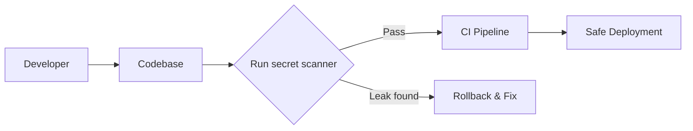
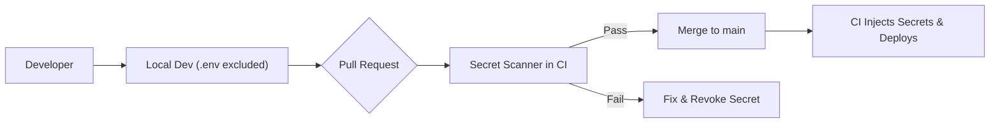

If a credential can be found in your code base, CI logs, or Slack archive — it’s not just a secret; it’s a risk.

By 2025, leaked credentials have reached 23.8 million across public repos, with 35% of private repos also containing sensitive data like AWS keys or DB passwords.

Despite scanning tools and push protections, 70% of leaked secrets remain valid days after detection, leaving your systems exposed.

Secrets sprawl happens when developers take the “easy way” ie. hardcoding tokens in `.env` files, Slack chats, CI logs, or even internal documentation. These crumbs spread across systems, expanding the attack surface at every access point.

## How Secrets Leak in Node.js Projects?

| **Source** | **How Sprawl Happens** |
| --- | --- |
| `.env` files checked in | Sudden leak through Git, build artifacts |
| Code or config | API keys or secrets hardcoded for quick use |
| CI/CD logs | Secrets inadvertently printed or stored |
| Collaboration tools | Pasted or screenshot tokens in Slack, Jira, etc. |

These patterns are common and often silent — until it’s too late.

## Detection Tools: What Really Works?

Tool Comparison from GitGuardian’s 2023 Study —

| **Tool** | **Precision** | **Recall** |
| --- | --- | --- |
| GitHub Scanner | ~75% | Moderate |
| Gitleaks | ~46% | ~88% |
| SpectralOps | Moderate | ~67% |

Precision vs recall matters. Gitleaks finds most leaks; GitHub scanner has fewer false positives; SpectralOps balances both with enterprise features.

Common tools:

* **Gitleaks**: CLI-based scanner for Git history
    
* **Detect‑Secrets**: Baseline first; scan only new commits → reduces noise
    
* **GitHub Advanced Secret Scanning**: Real-time push protection for GitHub Enterprise users
    

## Mitigation Workflow: From Detection to Prevention

> ### **Detection → Prioritization → Remediation**

* **Detect** using CI integration (e.g., Gitleaks, GitHub push protection)
    
* **Prioritize** using risk-based scoring (e.g., RiskHarvester helps flag secrets tied to valuable assets like DB hosts)
    
* **Mitigate** by rotating and revoking leaked keys not just deleting Git history
    
* **Prevent** via secrets injection: use tools like AWS Secrets Manager, Vault, Doppler, or SOPS to avoid storing secrets in code
    

## Developer Workflows to Stop Sprawl

* Integrate scanner in pre-commit hooks or CI pipelines
    
* Use baselines to ignore pre-existing secrets and prevent new ones from entering code
    
* Enforce push-protection: GitHub will block secret-containing commits before they land
    
* Train developers: never hardcode credentials in code, config, or docs
    

## Visual Workflow: How To Stop Sprawl

**Commit → scan → fail/build-block → rotate secret → merge clean → deploy safely.**

### Real-World Cases & Impact

GitGuardian’s research shows only **2.6% of secrets are revoked within one hour** of detection, while most remain valid after 5 days making them “zombie tokens” that risk ongoing exploitation.

GitHub (public repos) notified over **1.9M secret leaks** in 2022 alone, and GitHub’s secret scanning now automatically flags many patterns but teams still need to remediate actively.

## How to Prevent Secret Sprawl Across Staging & Production

### 1\. Centralize Secrets, Don’t Duplicate Them

* Use secret management systems such as **AWS Secrets Manager**, **HashiCorp Vault**, **Doppler**, or **SOPS** instead of `.env` files. These systems support lifecycle operations like rotation, audit, and scoped access control.
    
* **Avoid storing secrets in code, images, or multiple env files**; centralization keeps secrets discoverable and manageable.
    

### 2\. Inject Secrets at Runtime Into the Process

* Never bake secrets into Docker images or bundles. Use **runtime injection** such as:
    
    * `doppler run npm start`
        
    * Environment variables set by CI or orchestrator (like AWS ECS task definitions or Kubernetes Secrets).
        
* Developers should use the same injection mechanism locally as in CI and production to avoid drift and accidental commits.
    

### 3\. Enforce Least Privilege & Scoped Access

* Set strict IAM policies that grant staging access only to staging secrets, and production access only to production secrets. No cross-environment IAM roles.
    
* For teams using Vault or Conjur, apply declarative policies so each environment only sees its own secrets.
    

### 4\. Integrate Secret Scanning in CI/CD Pipelines

* Every commit or merge request should trigger a scan using tools like **Gitleaks**, **SpectralOps**, or **GitHub Advanced Secret Scanning**.
    
* Block the merge or push if a secret is detected (regardless of environment), and require rotation.
    
* Use **baselines** to ignore previously-known and rotated secrets; block only new additions.
    

### 5\. Rotate and Revoke Leaked Secrets Immediately

* If a secret ever leaks (in staging logs, PR comments, Docker image tags), don’t just delete it.
    
* Implement scheduled rotation (30–90 days) or event-based rotation whenever roles change.
    

### 6\. Maintain Auditability & Team Training

* Enable **audit logs** in secrets storage systems or CI/CD pipeline that record who accessed what, when, and from where.
    
* Regularly train developers and DevOps on these workflows:
    
    * Never commit secrets
        
    * Use the approved injection method
        
    * Escalate and rotate leaked credentials immediately
        
    * Validate push triggers before release pipelines activate
        

### Summary: Staging & Production Secrets Protection Table

| **Environment** | **Access Level** | **Injection Method** | **Rotation Frequency** |
| --- | --- | --- | --- |
| Local/Dev | Developer access only | Doppler CLI or `.env` (ignored in Git) | No rotation needed |
| Staging | CI role or staging IAM only | Secrets Manager or Vault via CI runtime | On leak or scheduled |
| Production | Production IAM + CI only | Secrets injected via orchestrator runtime | Strict rotation cycle |

### Developer Flow: Preventing Secrets Sprawl

Unified flow ensures **no secret ever lives in Git**, whether staging or production.

### Why it Works

* Central secret vaults: consistent reference without duplication
    
* Runtime injection: no secret persistence in code or images
    
* CI-enforced scanning: blocks new leaks early
    
* Strict access boundaries: no cross-environment exposure
    
* Immediate rotation and audit logs: reduce risk window
    

## TL;DR: Real Steps You Can Take Today

* GitGuardian reports **23.8 million** secrets leaked publicly in 2024. A 25% increase from the prior year, with **70% remaining active** after detection.
    
* Secrets often spread via `.env` files, hardcoded config, CI logs, or team chat tools.
    
* Use tools like **Gitleaks**, **GitHub push protection**, and **RiskHarvester** to detect and prioritize credential removal.
    
* Prevent leakage by centralizing secrets using **Vault, AWS Secrets Manager, Doppler, or SOPS**, and injecting them at runtime not baking into code or images.
    
* Enforce strict environment boundaries: staging secrets isolated from production, with rotated credentials and least-privilege access controls.
    

## Want Customized Fixes?

Drop a comment with your stack:

> *"We’re using GitHub, Node.js, AWS Lambda, and Docker - how do we prevent secret sprawl across staging and prod?"*

I’ll help build a tailored strategy for scanning, rotating, and preventing sprawl in your environment.