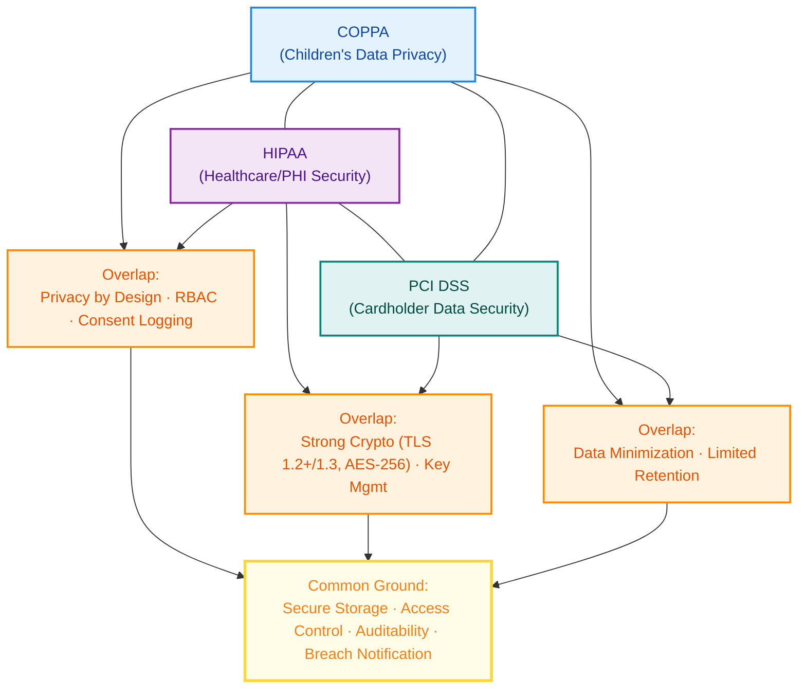

*Stop reading legal PDFs. Start building systems that pass audits.*

As engineers, compliance often feels like a legal minefield.

COPPA, HIPAA, and PCI DSS all demand strict security, but each has its own rules, penalties, and best practices.

In this post, we’ll break these frameworks down into **actionable development steps**, show where they overlap, and provide visual guides so you can architect compliance into your systems from day one.

### **1\. Quick Definitions for Developers**

| **Standard** | **Covers** | **Common in** | **Data Type** |
| --- | --- | --- | --- |
| **COPPA** | Protects data of children under 13 | Games, EdTech, Kid Social | Name, email, location |
| **HIPAA** | Protects PHI (Protected Health Information) | Telehealth, EMR, Healthcare SaaS | Medical history, billing |
| **PCI DSS** | Protects cardholder data | E-commerce, Wallets, Payment APIs | PAN, CVV, expiry date |

### **2\. Core Implementation Requirements**

**COPPA**

* Age-gating & parental consent flows
    
* Minimal data collection
    
* Clear deletion and parental dashboard access
    

**HIPAA**

* Encryption at rest & in transit
    
* Role-based access control (RBAC)
    
* Immutable audit logs
    

**PCI DSS**

* Tokenization of card data
    
* Segmentation of the Cardholder Data Environment (CDE)
    
* Secure key management & rotation
    

### **3\. Overlaps & Differences (Mermaid Diagram)**

### **4\. The “Hardening Path” for Compliant Data Flows**

## **Let’s wrap up…**

Compliance isn’t a roadblock.

Compliance is a **design constraint that makes systems more secure**.

By aligning your architecture early with COPPA, HIPAA, or PCI DSS, you’ll avoid expensive retrofits, reduce breach risks, and pass audits with confidence.

Our next blogs will dive deeper into **AWS architectures for each framework** so you can go from checklists to deployable infrastructure.