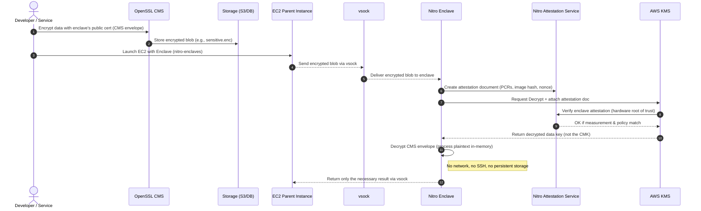

> We encrypt data.  
> We store it in S3.  
> We feel secure.
> 
> But when that data comes back for decryption - how do you *know* who’s asking for the key?
> 
> That’s where **remote attestation** walks in like a quiet bouncer checking IDs at the door.

Traditional encryption protects your data at rest and in transit but not while it’s being processed.

In this article, we explore how **AWS Nitro Enclaves** and **Remote Attestation** bring verifiable trust to runtime environments.

You’ll learn how **AWS KMS** validates enclave identity before releasing keys, and how **OpenSSL CMS** can be used to encrypt data for secure decryption inside attested workloads.

A practical, story-driven guide to understanding **confidential computing** the AWS way.

## Encryption Isn’t Enough Anymore

Most systems today proudly claim *“we encrypt everything.”*  
That’s great but encryption alone doesn’t guarantee security.

There are three common protection layers in cloud systems:

1. **At rest** — when data sits in a disk or database.
    
2. **In transit** — when data moves across the network (HTTPS, TLS).
    
3. **In use** — when data is being processed in memory.
    

> The third one — “**in use**” is often ignored.

If an attacker gains access to your EC2 instance or container, encryption at rest or in transit means nothing. They can just dump your memory and see decrypted data.

Read more — [AWS Encryption Best Practices](https://docs.aws.amazon.com/prescriptive-guidance/latest/encryption-best-practices/general-encryption-best-practices.html)

## The Hidden Problem: Runtime Trust

The missing piece is **runtime trust**. Can we *trust the environment* where our code is running?

Even if you use perfect cryptography, once the data reaches an untrusted runtime, all bets are off.  
Imagine handing your keys to someone who “promises” they’ll only use them responsibly.  
That’s basically how most cloud runtimes work today.

To solve this, the industry moved toward [**Confidential Computing**](https://confidentialcomputing.io/), protecting data *even while it’s being processed*.

## Enter AWS Nitro Enclaves

AWS’s answer to confidential computing is **Nitro Enclaves**, isolated compute environments inside your EC2 instances.

Here’s what makes them special:

* **No network access**
    
* **No SSH or user login**
    
* **No persistent storage**
    
* **Hardware-backed isolation**
    

They communicate only via a special socket interface called [**vsock**](https://docs.aws.amazon.com/enclaves/latest/user/nitro-enclave-concepts.html#term-socket), a one-way door for your main instance to talk to the enclave.

Think of Nitro Enclaves as **a locked glass box** inside your EC2 instance, you can see what it does, but you can’t touch what’s inside.

## Remote Attestation: Proof of Identity

Isolation alone isn’t enough.  
What if an attacker replaces your enclave code with something else?  
That’s where **remote attestation** steps in.

Attestation is a cryptographic proof, a signed statement from AWS hardware that says:

> “This code, with this hash, is running inside this verified enclave.”

Every Nitro Enclave can generate an **attestation document**, which includes:

* **PCRs (Platform Configuration Registers)** — system measurements
    
* **Enclave Image Digest** — hash of your code
    
* **Nonce** — to prevent replay attacks
    
* **AWS Signature** — from the Nitro Hypervisor’s root key
    

AWS and other services can then verify this signature using the [**AWS Nitro Attestation Service**](https://docs.aws.amazon.com/enclaves/latest/user/nitro-enclave.html).

It’s like showing your passport to AWS KMS, except the passport is signed by AWS’s own hardware.

## Where AWS KMS Comes In

[AWS Key Management Service (KMS)](https://docs.aws.amazon.com/kms/latest/developerguide/cryptographic-attestation.html) is the vault that holds your encryption keys.  
Normally, it’ll decrypt data for any client with permission.  
But with Nitro Enclaves, it gets smarter.

When an enclave requests a decryption:

1. It includes its **attestation document** in the request.
    
2. KMS verifies that document’s authenticity and integrity.
    
3. If everything checks out, **KMS releases the decrypted key**, only to that enclave.
    

Here’s the typical flow in action:

```bash
aws kms decrypt \
  --ciphertext-blob fileb://secret.enc \
  --encryption-context "purpose=payments" \
  --grant-tokens $(cat attestation.json | base64)
```

If the attestation hash doesn’t match what KMS expects, the operation fails.  
No trust, no key.

## Using OpenSSL CMS for Secure Data Exchange

Before the enclave ever asks for a key, you might want to **encrypt data for it** and that’s where `openssl cms` shines.

CMS stands for **Cryptographic Message Syntax**, an envelope format that defines how to encrypt, sign, and verify data (think of it as S/MIME’s backbone).

You can encrypt a file for the enclave’s public certificate:

```bash
# Encrypt data for the enclave
openssl cms -encrypt -in sensitive.json -out sensitive.enc -outform DER enclave.crt
```

Then, only the enclave — after passing attestation — can decrypt it using the key released from KMS:

```bash
# Inside the enclave
openssl cms -decrypt -in sensitive.enc -out output.json -inkey kms-key.pem
```

CMS ensures data confidentiality; attestation ensures **execution trust**.

## The Zero-Trust Equation

Let’s simplify what’s happening:

| **Layer** | **What It Protects** | **Example** |
| --- | --- | --- |
| **Encryption** | Data | S3 bucket, database |
| **TLS** | Transport | HTTPS, APIs |
| **Attestation** | Runtime | AWS Nitro Enclaves |

Together, they create **Zero-Trust Encryption** data that can *only* be decrypted in verified, isolated environments.

If you’re curious, this maps beautifully to [NIST’s Zero Trust Architecture](https://csrc.nist.gov/pubs/sp/800/207/final) philosophy — *“Never trust, always verify.”*

## Why This Actually Matters

You might be thinking, *“This sounds cool, but who really needs it?”*  
Short answer: **anyone dealing with sensitive workloads.**

Real-world use cases:

* **Fintech**: Decrypt payment data only in attested enclaves.
    
* **Healthcare**: Process medical records under HIPAA with runtime integrity.
    
* **AI Models**: Run inference securely on private data.
    
* **Multi-tenant SaaS**: Guarantee data isolation for every customer.
    

For compliance nerds:

* PCI DSS → [https://www.pcisecuritystandards.org](https://www.pcisecuritystandards.org/)
    
* HIPAA → [https://www.hhs.gov/hipaa/index.html](https://www.hhs.gov/hipaa/index.html)
    
* GDPR → [https://gdpr.eu](https://gdpr.eu/)
    

## Wrapping Up

Encryption protects your **data**.  
Remote attestation protects your **truth**.

AWS Nitro Enclaves + AWS KMS + OpenSSL CMS together give you **verifiable runtime security** something most systems still ignore.

> In a world where “trust” is often assumed, remote attestation makes it **provable**.

### TL;DR

* **Encryption ≠ Trust.**
    
* **Remote Attestation = Verified Execution.**
    
* Together, they give you **Confidential Computing**, AWS-style.
    

## Sequence Diagram

Here’s a clean **Mermaid diagram** show casing the flow:



The mermaid diagram is actually not showcasing the sequences, please copy+paste the below content in [mermaid.live](https://mermaid.live/)’s website to preview the above diagram in detail.

```plaintext
sequenceDiagram
    autonumber
    actor Dev as Developer / Service
    participant CMS as OpenSSL CMS
    participant S3 as Storage (S3/DB)
    participant EC2 as EC2 Parent Instance
    participant VS as vsock
    participant ENC as Nitro Enclave
    participant ATS as Nitro Attestation Service
    participant KMS as AWS KMS
    Dev->>CMS: Encrypt data with enclave's public cert (CMS envelope)
    CMS->>S3: Store encrypted blob (e.g., sensitive.enc)
    Dev->>EC2: Launch EC2 with Enclave (nitro-enclaves)
    EC2-->>VS: Send encrypted blob via vsock
    VS-->>ENC: Deliver encrypted blob to enclave
    ENC->>ATS: Create attestation document (PCRs, image hash, nonce)
    ENC->>KMS: Request Decrypt + attach attestation doc
    KMS->>ATS: Verify enclave attestation (hardware root of trust)
    ATS-->>KMS: OK if measurement & policy match
    KMS-->>ENC: Return decrypted data key (not the CMK)
    ENC->>ENC: Decrypt CMS envelope (process plaintext in-memory)
    Note right of ENC: No network, no SSH, no persistent storage
    ENC-->>EC2: Return only the necessary result via vsock
```